# 课前须知

> [课程主页](https://faculty.ustc.edu.cn/kpxue/zh_CN/zhym/108944/list/index.htm)

- [x] 课程安排：50学时授课+6学时研讨+2学时复习
- [x] 成绩评定：
  > - 期末考试60%
  > - 平时作业25% (Project 15%，各章节作业10%)
  > - 课堂等平时表现5%+课堂测试10%(2-3次)

# 第一章：网络安全综述 

## 1.1 网络安全概述

### 网络安全事件举例

- [x] 网络监听

  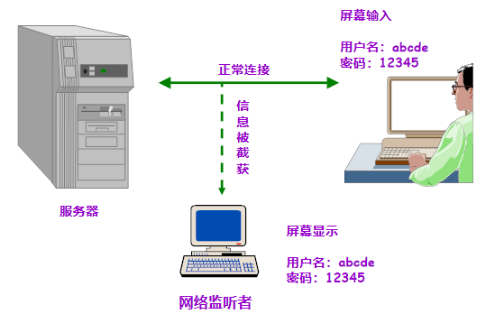
  

   网络监听
  

- [x] 假冒站点phishing

  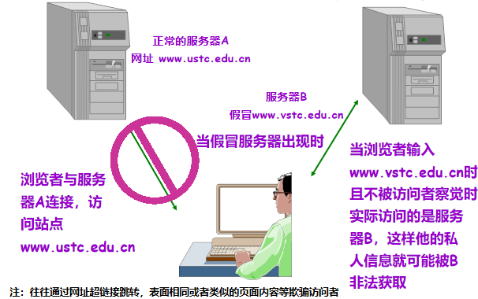
  

   假冒站点phishing
  

- [x] 不安全Email

  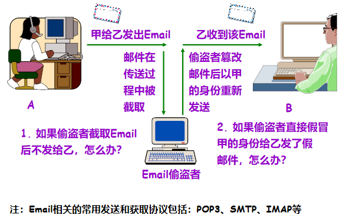
  

   不安全Email
  

- [x] 抵赖

  
  

   抵赖
  

### 网络安全概述

- [x] 网络安全的重要性
  > - 政务、商务、金融、军事等

- [x] 网络安全是一个跨多门学科的综合性科学
  > - 包括：通信技术、网络技术、计算机软件、硬件设计技术、应用密码学、密码学数学基础等
  > - 在理论上，网络安全是建立在 `密码学以及协议设计` 的基础上的
  > - 从技术上，网络安全取决于两个方面：网络设备的硬件和软件的安全，以及设备的访问控制

### 常见的不安全因素

- [x] 物理因素：设备在物理防护上不安全，电磁波泄漏等

- [x] 系统因素：系统软、硬件漏洞，病毒感染，漏洞入侵

- [x] `网络因素` ：网络协议流程漏洞，会话劫持，数据篡改，故意的网络拥塞，(分布式)拒绝服务

- [x] 管理因素：(管理员)安全意识淡漠，误操作

### 导致不安全的原因

- [x] `自身的缺陷` ： ***系统软硬件缺陷、网络协议的缺陷等***
- [x] `开放性`
  > - **系统开放** ：计算机及计算机通信系统是根据行业标准规定的接口建立起来的。
  > - **标准开放** ：网络运行的各层协议是开放的，并且标准的制定也是开放的。
  > - **业务开放**：用户可以根据需要开发新的业务。
- [x] `黑客攻击`
  > - **基于兴趣的入侵 (传统意义上的Hacker)**
  > - **基于利益的入侵**
  > - **国与国、企业与企业之间的信息战**

### 六大网络安全的特征

- [x] `机密性Confidentiality` 信息不泄漏给非授权的用户、实体或者过程的特性。

- [x] `完整性Integrity`  数据未经授权不能进行改变的特性，即信息在存储或传输过程中保持不被修改、不被破坏的特性

- [x] `可用性Availability` 可被授权实体访问并按需求使用的特性，即当需要时应能存取所需的信息，也包括引入的安全功能不能明显影响用户对服务的使用

- [x] `可认证性Authenticity` 与完整性存在关联，要求数据来自所声称的实体，或者合法用户

- [x] `不可否认性Non-repudiation` 做过的行为和接受过的信息不能抵赖，该能力有时又被称为 `可审计性Accountability` ，要求可事后追溯，不可否认

- [x] `可控性Controllability`  对网络信息的传播及内容具有控制能力(也就是在信息发生冲突或者矛盾时，信息源可以各抒己见)

> 前三种特征是公认的( `CIA` )，后三个是根据不同教材有不同的说法。

### 常见攻击手段

- [x] `社会工程Social Engineering` 攻击者可通过各种社交渠道获得有关目标的结构、使用情况、安全防范措施等有用信息从而提高攻击成功率。

- [x] `口令破解password cracking` 攻击者可通过获取口令文件，然后运用口令破解工具获得口令，也可通过猜测或窃听等方式获取口令

- [x] `地址欺骗IP Spoofing` 攻击者可通过伪装成被信任的IP 地址，邮件地址等方式来骗取目标的信任

- [x] `会话劫持Session Hijacking` 在合法的通信连接建立后，攻击者通过阻塞或摧毁通信的一方来接管已经过认证建立起来的连接，从而假冒被接管方与对方通信

- [x] `网络窃听Network Eavesdropping` 网络的开放性使攻击者可通过直接或间接窃听获取所需信息

- [x] `数据篡改Data Tampering` 攻击者可通过截获并修改数据或重放数据等方式破坏数据的完整性

- [x] `恶意扫描Malicious scan` 攻击者可编制或使用现有扫描工具发现目标的漏洞，进而发起攻击

- [x] `基础设施破坏Infrastructure destruction` 攻击者可通过破坏DNS 或路由信息等基础设施，使目标陷于孤立

- [x] `数据驱动攻击Data-driven attack` 攻击者可通过施放病毒、特洛伊木马、数据炸弹等方式破坏或遥控远程目标

- [x] `拒绝服务Deny of Service` 攻击者可直接发动攻击，也可通过控制其它主机发起攻击，使目标瘫痪，如发送大量的数据洪流阻塞目标

#### 常见攻击小结

- [x] $\text{中断(Interruption)} \leftarrow \rightarrow \text{可用性(Availability)}$

- [x] $\text{窃听(Interception)} \leftarrow \rightarrow \text{机密性(Confidentiality)}$

- [x] $\text{修改(Modification)} \leftarrow \rightarrow \text{完整性(Integrity)}$

- [x] $\text{伪造(Fabrication)} \leftarrow \rightarrow \text{可认证性(Authenticity)}$

  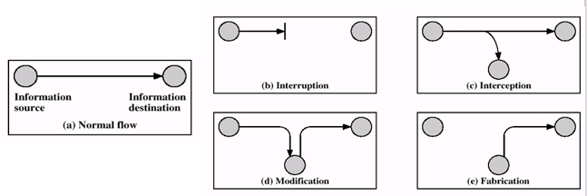
  

   常见攻击小结
  

### 信息安全分类

  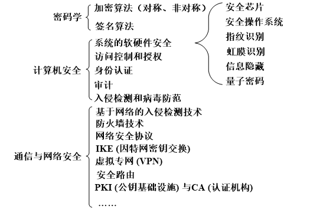
  

   信息安全分类
  

### 网络安全的主要任务

- [x] 保障网络与系统
  > - 安全、可靠、高效、可控、持续地运行和被访问

- [x] 保障信息
  > - 机密、完整、可认证、不可否认地传输和使用

### 需要保护的对象

- [x] 硬件
  > - 服务器、路由器、用户终端、物联网设备等

- [x] 软件
  > - 操作系统、应用软件等

- [x] 数据
  > - 电子商务、电子政务、电子邮件、信息发布、社交媒体等场景下的可能导致隐私泄露的敏感数据

## 1.2 网络参考模型与安全模型

- [x] 网络的体系结构
  > - 采用分层原则
  > - 分层、协议与接口的集合

- [x] 网络参考模型
  > - ISO - OSI (国际标准化组织-开放系统互连)模型
  > - TCP/IP模型(IETF)

- [x] 安全体系结构：ITU-T的X.800(ISO安全框架)和IETF的RFC2828
  > - 安全攻击 Security Attacks
  > - 安全机制 Security Mechanisms
  > - 安全服务 Security Services

- [x] 安全模型
  > - `网络安全模型Model for Network Security` : 涉及信息在网络传输中的安全(公网上的私有性保护)
  > - `网络访问安全模型Network Access Security Model` ：涉及网络或者系统本身的安全(访问控制)

### ISO-OSI模型

  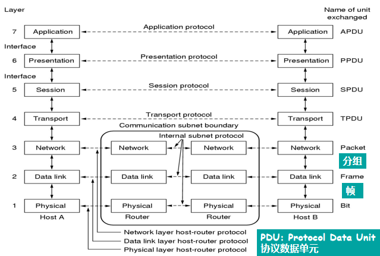
  

   ISO-OSI模型
  

- [x] 1. 物理层：缆线，信号的编码，网络接插件的电、机械接口

- [x] 2. 数据链路层：成帧，差错控制、流量控制，物理寻址，媒体访问控制

- [x] 3. 网络层：路由、转发，拥塞控制

- [x] 4. 传输层：为会话层提供与下面网络无关的可靠消息传送机制

- [x] 6. 表示层：在两个应用层之间的传输过程中负责数据的表示语法

- [x] 7. 应用层：处理应用进程之间所发送和接收的数据中包含的信息内容。

### 数据的封装

  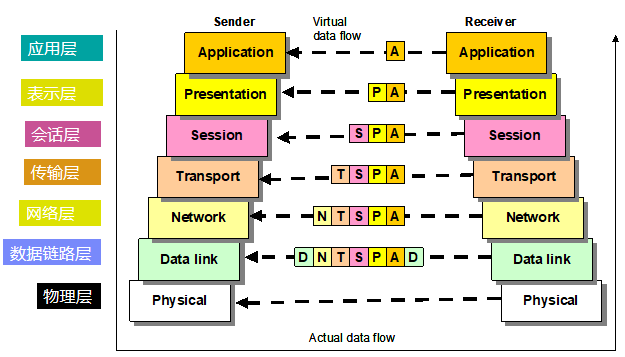
  

   数据的封装
  

### TCP/IP模型

  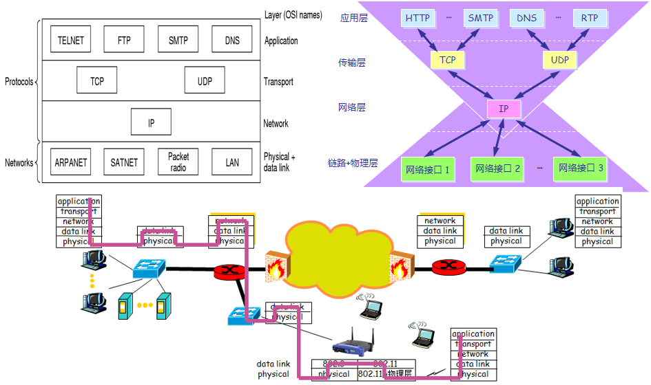
  

   TCP/IP模型
  

### OSI与TCP/IP模型的比较

- [x] 相同点：
  > - 1. 都是基于独立的协议栈概念。
  > - 2. 两者都有功能相似的应用层、传输层、网络层(后者是前者的协议基础上总结出来的)。

- [x] 不同点：
  > - 1. 在OSI模型中，严格地定义了服务、接口、协议；在TCP/IP模型中，并没有严格区分服务、接口与协议。
  > - 2. OSI模型支持非连接和面向连接的网络层通信，但在传输层只支持面向连接的通信；TCP/IP模型只支持非连接的网络层通信，但在传输层有支持非连接和面向连接的两种协议可供用户选择。(对于电信ATM结构模型我国当前使用OSI模型，互联网一般都是TCP/IP模型，所以如果手机打电话由4G转为2G，也是因为语音通信为2G技术所以会回退)
  > - 3. TCP/IP模型中不区分、甚至不提起物理层和数据链路层。

### 安全体系结构

- [x] RFC 2828 (Internet Security Glossary)
- [x] X.800 (Security Architecture for OSI)
  > - `安全攻击Security Attacks` 损害机构所拥有信息的安全的任何行为
  > - `安全服务Security Services` 系统提供的对资源进行特殊保护的进程或者通信服务
  > - `安全机制Security Mechanisms` 设计用于检测、预防安全攻击或者恢复系统的机制
- [x] 用一种或多种 $\underline{安全机制}$ 来实现 $\underline{安全服务}$ ， $\underline{安全服务}$ 致力于抵御 $\underline{安全攻击}$ 。

### 安全体系结构————安全攻击

- [x] `主动攻击(active attack)` : 更改数据流, 或伪造假的数据流(相比被动攻击而言，主动攻击更容易被检测和监察)。
  > - 伪装 Masquerade
  > - 重放Replay
  > - 篡改Modification
  > - 拒绝服务Denial of Service

  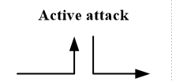
  

   主动攻击
  

- [x] `被动攻击(passive attack)` : 对传输进行偷听与监视, 获得传输信息, 但不对通信和数据做任何修改(有时候可以通过某些方法，将被动攻击变为主动攻击，比如在量子信道中窃听攻击为主动攻击)。
  > - 窃听攻击Eavesdrop
  > - 流量分析Traffic analysis
  > - 破解弱加密的数据流cracking of weakly-encrypted data streams

  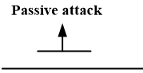
  

   被动攻击
  

### 安全体系结构————安全机制

- [x] 特定的安全机制(8种)
  > - `加密Encipherment` 用加密算法对信息加密, 保护信息的机密性
  > - `数字签名Digital Signature` 用签名算法对信息进行计算, 计算结果附加于信息单元。用于身份认证、数据完整性和非否认服务
  > - `访问控制Access Control` 用于实施资源访问权限的机制
  > - `数据完整性Data Integrity` 用于确保信息的完整性
  > - `认证交换Authentication Exchange` 确保信息交换的实体是所声称的实体，通过信息交换以确保实体身份，包括公知密码、特征、位置信息等
  > - `流量填充Traffic Padding` 填充信息，防止流量分析
  > - `路由控制Route Control` 能够为特定数据选择特定基于路由的安全通道
  > - `公证Notarization` 采用可信任的第三方以确保一些信息交换的属性

- [x] 另外有其他5种普通的安全机制
  > - 可信功能Trusted Functionality、安全标记Security Label、事件检测Event Detection、安全审计跟踪Security Audit Trail、安全恢复Security Recovery。

### 安全体系结构————安全服务

  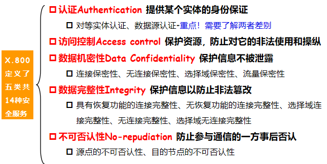
  

   安全体系结构————安全服务
  

> 对等实体认证是指两个人回话之间彼此对对方的身份的认证，数据源认证是对信息来源单方确认

### 基本的安全设计准则

- [x] 主要准则
  > - 机制的经济性：安全机制设计简单和短小，便于测试和验证
  > - 故障安全默认：基于许可而不是排除
  > - 完整的监察：根据访问控制机制进行检查
  > - 开放的设计：安全机制的设计公开而不是保密
  > - 权限分离：多个权限属性来实现对首先资源的访问，例如，多因素用户认证
  > - 最小权限：每个进程或者使用者执行任务所需的最小权限集。例如，基于角色的访问控制
  > - 隔离、封装、分层、模块化

### 安全服务与攻击的关系

  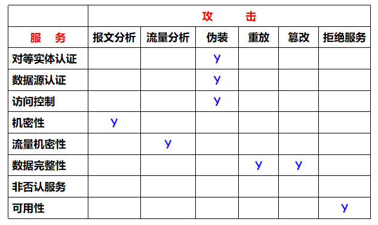
  

   安全服务与攻击的关系
  

### 安全服务与机制的关系

  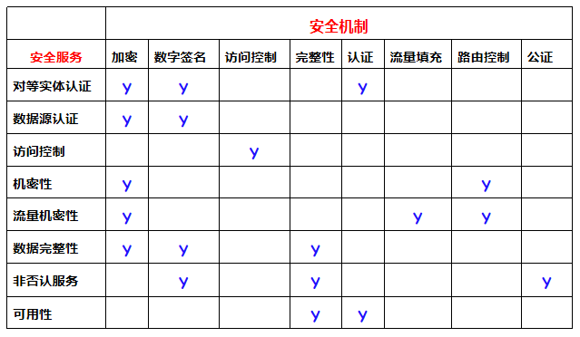
  

   安全服务与机制的关系
  

### 网络安全模型：实现端到端的安全通信

  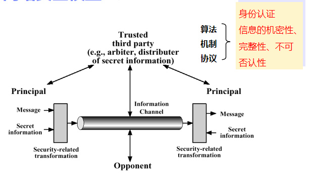
  

   网络安全模型
  

> - 数字信封：使用对端秘钥对会话密钥进行加密
> - 端到端安全通信
> > - 可信第三方制定规则约束信息发送接收和传输
> > - 信息通过安全可靠的方式进行转化后传输
> > - 保证身份认证, 信息机密性, 完整性, 不可否认性
> > - 双向认证

### 网络访问安全模型：保护信息系统免遭恶意访问

  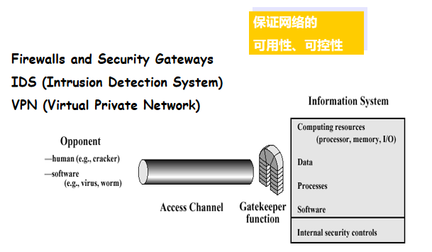
  

   网络访问安全模型
  

> - 保护信息系统免遭恶意访问
> > - 防火墙和安全网关
> > - 入侵检测系统
> > - 虚拟专用网
> > - 保证可用性, 可控性
> > - 强调用户这端的认证，淡化基站和服务器端的认证

## 1.3 网络各层的相关安全协议

- [x] 链路层：链路隧道协议, 加密技术

- [x] 网络层：包过滤机制, NAT, IPSec协议, VPN

- [x] 传输层：SSL/TLS 协议

- [x] 应用层：HTTPS, PGP, S/MIME, DNSSEC等

  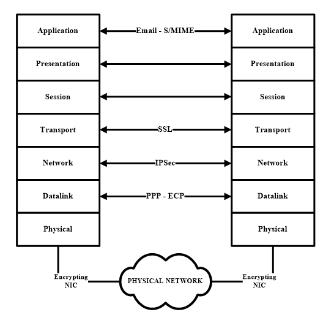
  

   网络各层的相关安全协议
  

  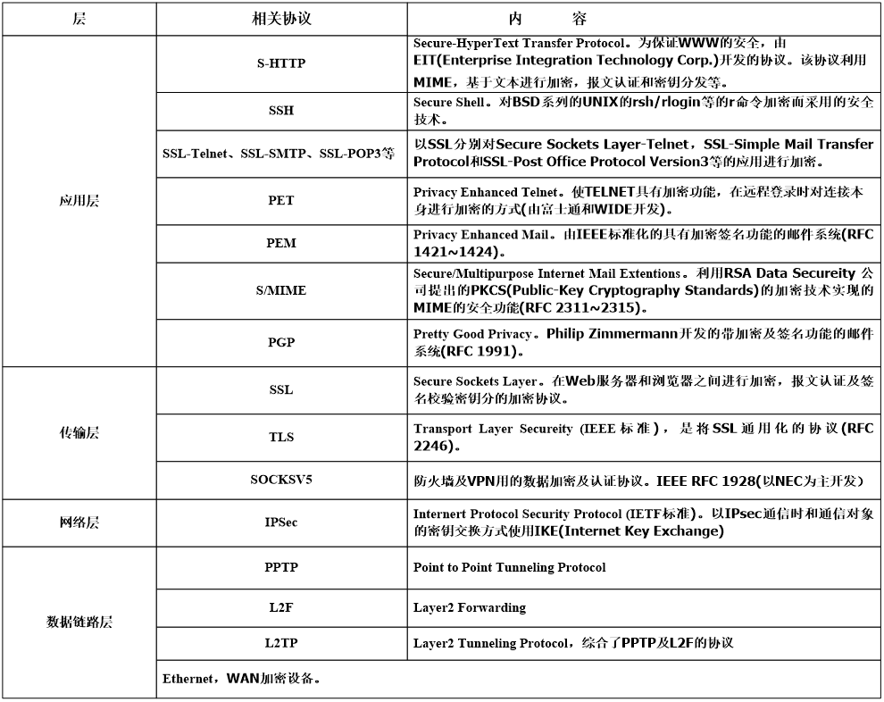
  

   网络各层的相关安全协议
  

## 1.4 密码学基础知识

### 1. 密码学分类

- [x] 按发展进程或体制分
  > -  `古典密码Classical Cipher` 基于字符替换的密码，现在已很少使用了，但是它代表了密码的起源
  > -  `对称密钥体制Symmetric-Key System` 加密密钥和解密密钥相同，这些算法也叫作单钥密码体制(one-key system)
  > -  `非对称密钥体制Asymmetric-Key System` 加密密钥和解密密钥不同，也叫公钥密码体制(public key system)或双钥密码体制(two-key system)

- [x] 按加密模式分
  > -  `序列密码Stream cipher` 序列密码 $\underline{按位或字节加密}$ , 也可以称为流密码, 序列密码是手工和机械密码时代的主流。
  > -  `分组密码block cipher` 分组密码将明文分成 $\underline{固定长度的组}$ , 用同一密钥和算法对每一块加密, 输出也是固定长度的密文。

### 2. 古典密码

- [x] DES(数据加密标准，Data Encryption Standard) 
  > - 背景
  > > - 1973年，NBS(后来的NIST, National Institute of Standards and Technology)美国国家标准局 `征集数据加密标准方案`
  > > - 1974年，IBM的Tuchman和Meyers发明Luciffer加密算法, NBS公布了IBM公司提供的该密码算法，以标准建议的形式在全国范围内征求意见
  > > - 1977年1月15日, DES正式颁布，供商业界和非国防性政府部门使用，同年7月15日生效
  > 
  > - DES是一种对二元数据进行加密的算法，数据分组长度为 `64位` ，密文分组长度也是 `64位` ，使用的密钥为 `64位` ，有效密钥长度为 `56位` ，有 `8位` 用于奇偶校验，解密时的过程和加密时相似，但密钥的顺序正好相反，DES的整个体制是公开的，系统的安全性完全靠密钥的保密。

  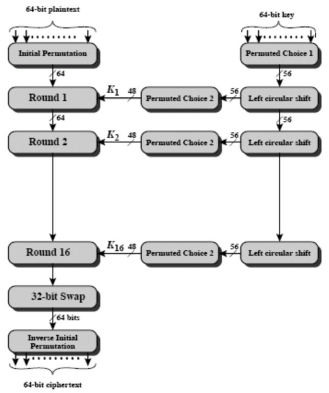
  

   DES算法流程
  

  
  

   Single Round of DES Algorithm
  

#### DES算法的破解

- [x] DES使用了近 25年时间，它具有很强的抗密码分析能力，但它的密钥长度只有 $56比特$ ， $56-bit$ 密钥有 $2^{56} = 72,057,584,037,927,936 ≈ 7.2亿亿$ 之多，随着计算机运算能力的增加，56比特长度的密码系统显得不安全了。

- [x] 1997年，RSA公司发起破译RC4、RC5、MD2、MD5，以及DES的活动，破译DES奖励10000美金。
  > - 由Roche Verse牵头的工程小组动用了70000多台通过因特网连接起来的 计算机系统，花费了96天找到了密钥。
  > - 1998年7月，电子前沿基金会花费25万美圆制造的一台机器在不到3天的时间里攻破了DES。
  > - 1999年在超级计算机上只要22小时！

#### 对称密码的性能

- [x] 安全性能
  > - 密钥长度
  > - 分组长度
  > - 轮数
  > - 密钥编排函数
  > - 对密码分析的抵抗能力

- [x] 实现性能
  > - 计算开销
  > - 内存利用

#### 对加密系统的攻击

- [x] 未知算法攻击：算法未知，仅从密文进行破译

- [x] 仅知密文攻击(Ciphtext Only Attack，COA)：根据加解密算法和密文进行破译

- [x]  `已知明文攻击(Known Plaintext Attack，KPA)` ：攻击者拥有部分密文和对应的明文，根据算法寻找密钥

- [x]  `选择明文攻击(Chosen Plaintext Attack，CPA)` ：有选择地使用任意明文和与之对应的密文信息，根据算法寻找密钥

- [x]  `选择密文攻击(Chosen Ciphertext Attack，CCA)` ：具有CPA的能力之外，还可以有选择地使用密文和与之对应的明文信息，根据算法寻找密钥

#### 其他算法

- [x] 三重DES
  > - 使用三个密钥对数据块进行三次DES操作，三重DES有四种模型：
  > > - DES-EEE3 使用三个不同密钥顺序进行三次加密变换
  > > - **DES-EDE3** 使用三个不同密钥依次进行加密-解密-加密变换 ( **3DES标准，兼容性考虑** )
  > > - DES-EEE2 其中密钥K1=K3 顺序进行三次加密变换
  > > - DES-EDE2 其中密钥K1=K3 依次进行加密-解密-加密变换

- [x] 3DES问题所在
  > - 算法开销
  > - 采用64bits分组长度

- [x] AES的出现
  > - 1997年NIST征集高级加密标准
  > > - 要求与3DES等同或者更高的安全强度，且效率显著提高。要求块长度为 `128位` ，密钥长度可以是 `128、192、256位`
  > 
  > -2001年，两轮评估，最终选择比利时密码学家提出的Rijndael算法，成为正式标准。

- [x] IDEA
  > - IDEA是国际数据加密算法(International Data Encryption Algorithm)的缩写，是1990年由瑞士联邦技术学院X.J.Lai(来学嘉)和Massey提出的建议标准算法，称作PES(Proposed Encryption Standard)，Lai 和Massey 在1992 年进行了改进，强化了抗差分分析的能力，改称为IDEA ，它也是对 `64bit` 大小的数据块加密的分组加密算法，密钥长度为 `128位` ，它基于“ `相异代数群上的混合运算` ”设计思想算法，用硬件和软件实现都很容易，它比DES在实现上快得多。
  > - 被推荐使用在 `PGP (Pretty Good Privacy)` 软件中
  > - 64位明文经128位密钥加密成64位密文，穷举分析需要 $10^{38}$ 次试探，按每秒100万次计算说，则需要 $10^{13}$ 年。
  > - 加密密钥与解密密钥不同，但是从一个主密钥派生出来，因此仍是对称的加密体制，目前尚无可验证的破译方法。算法本身倾向于软件实现，加密速度快。

- [x] Blowfish
  > - 1993年开发，密钥长度可变，最长可达448位，实际中常采用128位，块长度64

- [x] RC5
  > - 提出者：Ronald L. Rivest
  > - 1994年开发，可变轮数，可变长密钥
  > - 其后续版本RC6是作为AES的候选方案之一
  > -  `RC4是流密码算法` (密钥生成伪随机比特流，与明文按bit异或)

- [x] CAST-128
  > - 密钥长度40-128bits可变，每轮的函数互相不同，CAST-256提供更长的密钥长度

#### 几种对称加密算法的比较

  <table>
  <thead>
    <tr>
      <th>算法</th>
      <th>密钥长度</th>
      <th>轮数</th>
      <th>数学计算</th>
      <th>应用</th>
    </tr>
  </thead>
  <tbody>
    <tr>
      <td>DES</td>
      <td>56</td>
      <td>16</td>
      <td>异或、固定S盒</td>
      <td>SET，Kerberos</td>
    </tr>
    <tr>
      <td>Triple DES</td>
      <td>112或168</td>
      <td>48</td>
      <td>异或、固定S盒</td>
      <td>PGP，S/MIME</td>
    </tr>
    <tr>
      <td>IDEA</td>
      <td>128</td>
      <td>8</td>
      <td>异或、加法、乘法</td>
      <td>PGP</td>
    </tr>
    <tr>
      <td>Blowfish</td>
      <td>可变至448</td>
      <td>16</td>
      <td>异或、变长S盒、加法</td>
      <td></td>
    </tr>
    <tr>
      <td>RC5</td>
      <td>可变至2048</td>
      <td>可变至255</td>
      <td>加法、减法、异或、旋转</td>
      <td></td>
    </tr>
    <tr>
      <td>CAST-128</td>
      <td>40至128</td>
      <td>16</td>
      <td>加法、减法、异或、旋转、固定S盒</td>
      <td>PGP</td>
    </tr>
  </tbody>
</table>

#### 分组密码的工作模式

- [x] 分组密码一次处理一个数据分组。

- [x] 对于较长的明文，在分解成若干个分组之后，采用相同的密钥进行加密，NIST定义了5种工作模式
  > - 电码本(ECB，Electronic Codebook)模式
  > - 密码分组链接(CBC，Cipher-block chaining)模式
  > - 密码反馈(CFB，Cipher feedback)模式
  > - 输出反馈(OFB，Output Feedback)模式
  > - 计数器(CRT， Counter)模式

  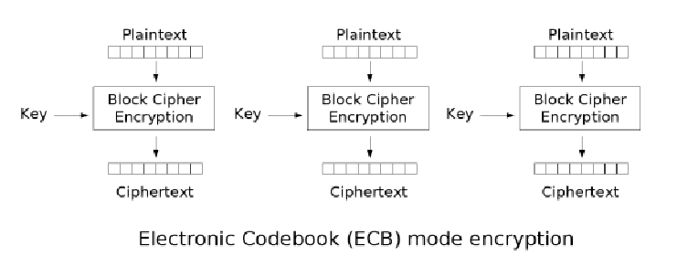
  

   ECB加密
  

  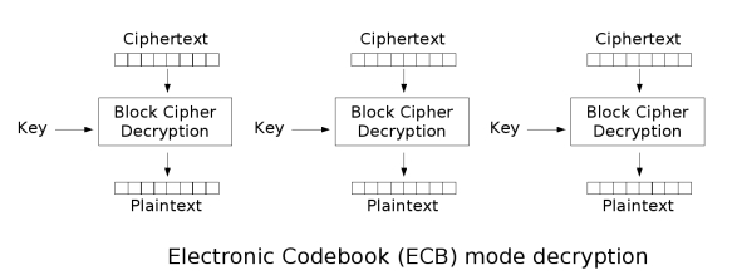
  

   ECB解密
  

##### 电码本(ECB, Electronic Codebook)模式

- [x] 直接应用密码算法的工作模式

- [x] 给定明文 $x=x_1x_2 \dots$ ,将它分为 $b$ 比特长的 $x_i$ ， $e_k$ 是加密算法，产生密文分组 $c_i = e_k(x_i)$ ，完整的密文 $c$ 按次序将 $c_i$ 连接起来：即 $c= c_1 c_2 \dots$ 。

- [x] **存在明显缺点：相同的明文加密后得到的密文是相同的** 。

##### 密码分组链接(CBC, Cipher-block chaining)模式

- [x] 给定明文的一个比特串 $x=x_1x_2 \dots$,  $x_i$ 是 $b$ 比特分组， $IV$ 是一个初始向量。
  > - $c_1 = e_k (x_1⊕IV)$ ，
  > - $c_2 = e_k (x_2⊕c_1)$ ，
  > - $c_i = e_k (x_i⊕c_{i-1})$

  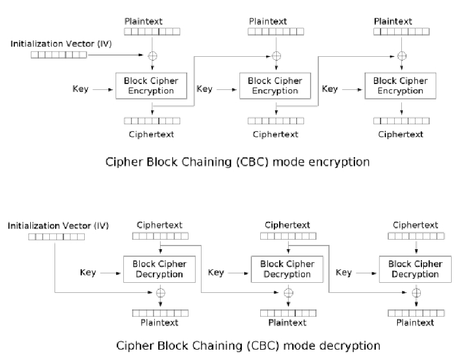
  

   CBC加解密
  

##### 密码反馈(CFB, Cipher FeedBack)模式

- [x] 给定明文的一个比特串 $x=x_1x_2 \dots$ ,  $x_i$ 是 $s$ 比特分组， $IV$ 是一个初始向量。
  > - $z_1 = e_k (IV)$ ， $c_1 = x_1⊕z_1$ 的 $s$ 位
  > - $z_2 = e_k (IV 移位||c_1的s位)$ ， $c_2 = x_2⊕z_2$ 的 $s$ 位
  > - $z_i = e_k (上个移位寄存器内容移位||ci-1 的s位)$ ， $c_i= x_i⊕z_i$ 的 $s$ 位

  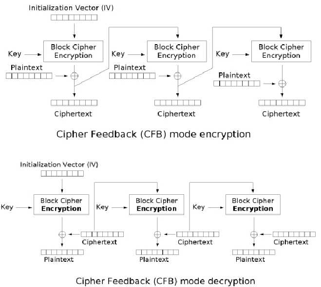
  

   CFB加解密
  

##### 输出反馈(OFB, output-Feedback)模式

- [x] $z_1 = e_k (IV),c_1 = x_1⊕z_1$
- [x] $z_2 = e_k (z_1),c_2 = x_2⊕z_2$
- [x] $z_i = e_k (z_{i-1}),c_i = x_i⊕z_i$

  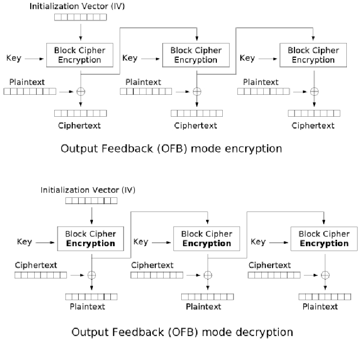
  

   OFB加解密
  

- [x] $z_1 ,…, z_i,…$ 可以提前计算

##### 计数器(CRT, CounTeR)模式

- [x] 给定计算器初始值 `counter`
  > - $z_1 = e_k (couter),c_1 = x_1⊕z_1$
  > - $z_2 = e_k (couter+1),c_2 = x_2⊕z_2$
  > - $z_i = e_k (couter+i-1),c_i = x_i⊕z_i$

  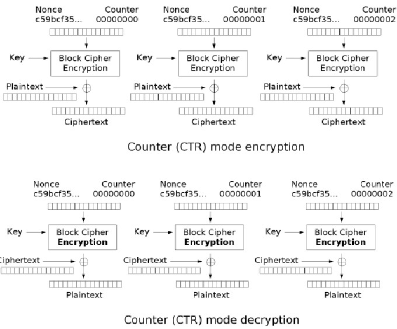
  

   CRT加解密
  

### 3. 公开密钥算法

- [x] 对称密码算法问题：
  > - 密钥管理量问题：潜在通信的两两分别用一对密钥，当用户量增大时，密钥空间急剧增大。
  > - 对称算法无法实现抗否认需求——数字签名

- [x] 非对称密码体制的基本原则
  > - 加密能力与解密能力是分开的
  > - 密钥分发简单
  > - 需要保存的密钥量大大减少，N个用户只需要N个，除了个人私钥之外，公钥均可以公开保存
  > - 可满足不相识的人之间保密通信
  > - 可以实现数字签名

  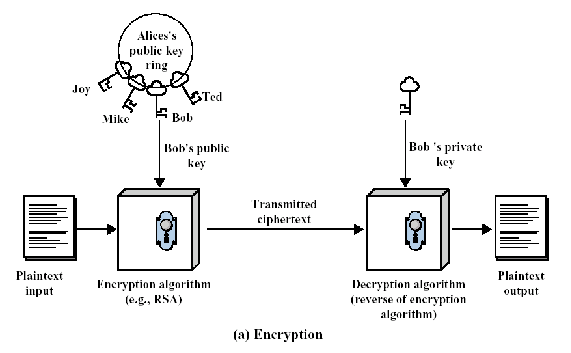
  

   公开密钥算法加密
  

  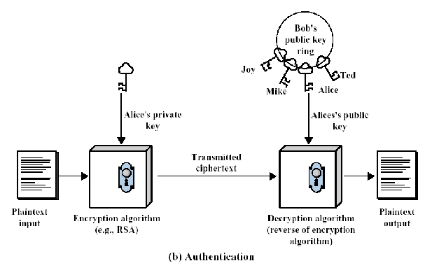
  

   公开密钥算法认证
  

#### 公开密钥算法基本思想

- [x] 公钥密码又称为双钥密码和非对称密码，1976年由Diffie和Hellman在其邀搞论文“密码学新方向”（ New Directions in Cryptography ）一文中提出的。(2016年图灵奖)

- [x] RSA是1978年MIT的Rivist, Shamir 和Adlemar开发的第一个公钥密码体制，最早提出的满足要求的公钥算法之一。(2002年图灵奖)

#### RSA密码体制基本原理

- [x] A. 密钥的生成
  > - 选择 $p, q$ ， $p, q$ 为互异素数，计算 $n=p×q$ , $φ(n)=(p-1)(q-1)$ , 选择整数 $e$ 与 $φ(n)$ 互素，即 $gcd(φ(n),e)=1,1<e<φ(n)$ 计算 $d$ ,使 $d=e^{-1}(modφ (n))$ ,公钥 $Pk=\lbrace e, n\rbrace$ ; 私钥 $Sk=\lbrace d, n\rbrace$

- [x] B. 加密 (用 $e, n$ )，
  > - 明文是以分组方式加密的，每一个分组的比特数应小于n的二进制表示，即每一个分组的长度应小于 $\log _2n$
  > - 明文 $M<n$ ， 密文 $C=M^e(mod n)$ .

- [x] C. 解密 (用 $d, n$ )
  > - 密文C， 明文 $M=C^d (mod n)$

##### RSA的安全分析

- [x] 选取的素数 $p, q$ 要足够大，使得给定了它们的乘积 $n$ , 在不知道 $p, q$ 情况下分解 $n$ 在计算上是不可行的。

- [x] 1999年, 一个292台计算机组成的网络花了5.2个月时间分解了一个155位的十进制数 (512比特)。基于短期安全性考虑, 要求n的长度至少应为1024比特, 而长期安全性则需n至少为2048比特。

#### 其它公钥算法

- [x] ELGamal密码
  > - 1985年ELGamal设计的密码算法，该算法是基于有限域上离散对数问题求解的困难性。

- [x] 椭圆曲线密码
  > - 1985年N. Koblitz和V. Miller分别独立提出了椭圆曲线密码体制(ECC), 其依据就是定义在椭圆曲线点群上的离散对数问题的难解性。

- [x] Diffie-Hellman密钥交换

### 4. Diffie-Hellman密钥交换(DH密钥交换)

  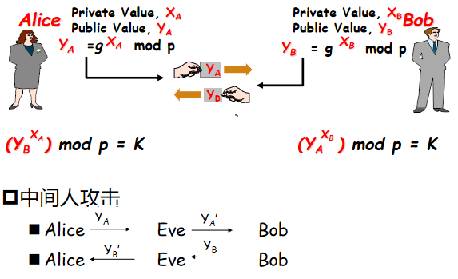
  

   DH密钥交换
  

> - 考研常考或者期末常考。

- [x] 防止中间人攻击
  > - 1. 数字签名，对自己的Y用自己的私钥签名，但是这个不常用，这个可能导致公私钥被窃取重用；
  >   2. HMAC\用户认证：A向B发一个随机数，B对随机数用私钥签名，然后发给A，或者用公钥加密，发给A。A进行验证即可，但是有可能被中间人向B发起验证，在中间截取随机数，然后让B证明自己是B，B对随机数签名后重用这个数据此时可以冒充B，这个时候可以采用对随机数特殊定义的方法进行处理。
  >   3. 双向验证，这个也防不了重用。

## 1.5 数字签名与认证技术

- [x] 通信中潜在的威胁
  > - 消息伪造
  > - 内容篡改(如何判断有没有篡改:对明文添加校验位，校验位是明文的哈希对应，但是实际上都是用HMAC做)
  > - 延迟或重播
  > - 否认
 
- [x] 数字签名————消息的不可否认性

- [x] 消息认证————消息的完整性(不能提供消息的不可否认性)

### 1. 数字签名

- [x] 公钥密码学的一个重要应用就是数字签名，数字签名就是利用私钥生成签名，而用公钥验证签名。

- [x] 一个数字签名方案时是由签名算法和验证算法组成
  > - 签名算法利用私钥生成签名，称消息 $m$ 的签名为 $sig(m)$ ，然后将 $(m，sig(m))$ 发给接收方
  > - 验证算法利用签名者的公钥对 $sig(m)$ 进行解密，如果解密输出与 $m$ 一致，则为合法数据。

> - **对于大文件传输的签名，如果对整个文件签名，则有三个巨大开销，也就是源端签名的开销，传输巨大密文还有明文（这个是用于对端解密后比对的）的开销，验证端(目的端)的解密和对比的开销。所以实际应用中，对文件进行一个哈希，对比特数进行减少，再进行签名，对端只用对明文也进行哈希，对传输过来的签名后的密文进行公钥解密，比对就可以。这个时候开销就很小。实际上不管是不是大文件，只要是签名的，都是这么做的，开销小了两个数量级左右。**

- [x] 由于无法识别数字签名与其拷贝之间的差异，所以，在数字签名前应加上时间戳。

- [x] 数字签名标准(DSS)
  > - DSA(数字签名算法，是Elgamal公钥算法的一种变体)
  > - RSA

### 2. 消息认证

- [x] 提供数据源认证能力

- [x] 可用来做消息认证的函数有三类(合计4种方法)
  > - 直接用加密函数(通常不这么用)
  > > -  `用对称密钥加密` ，信息的一致作为对信息的认证
  > > -  `用公钥密码中的私钥加密` ，但加密速度太慢，实际使用时结合散列函数构成实用化的签名。
  > 
  > -  消息认证码MAC (Message Authentication Code)
	> > - 是对信源消息的一个编码函数, 以消息和密钥作为输入，定长输出，
	> - 散列函数 (Hash Function)+签名
	> > - 是一个公开的函数它将任意长的信息映射成一个固定长度的信息，需要结合公钥签名一起使用。

> - 开销： $非对称 >> 对称 >> 哈希 >> 异或$
> - 非对称协议一般情况： $协商参数 \rightarrow 非对称加密 \rightarrow DH交换密钥 \rightarrow 建立安全通道$

#### 消息认证码MAC

- [x] 利用函数 $f$ 和密钥 $k$ , 对要发送的明文 $x$ 或密文 $y$ 变换成 $r \ bit$ 的消息认证码 $f(k,x)$ (或 $f(k,y)$ ), 将其称为认证符附加在 $x$ (或 $y$ )之后发出, 接收者收到发送的消息序列后，按发方同样的方法对接收的数据(或解密后)进行计算, 应得到相应的 $r \ bit$ 数据

  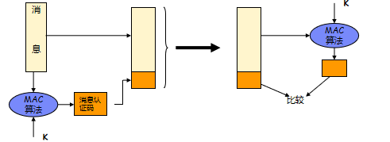
  

   消息认证码MAC
  

> - HMAC就是先哈希后MAC的协议

#### 散列函数

- [x] 单向散列函数(hash，杂凑函数)可以从一段很长的报文中计算出一个固定长度的比特串，这种散列函数通常称为报文摘要(message digest)，用于消息的完整性检验。

- [x] 单向散列函数H有以下特性：
  > 1. $H$ 能够应用于任何大小的数据块
  > 2. $H$ 产生固定长度的输出
  > 3. 对于任意给定的数据 $X$ ，易于计算 $H(X)$
  > 4. 对于任何给定的数据 $h$ ，计算 $H(X)=h$ 是不可行的
  > 5. 对于任意给定的数据 $X$ ，寻找满足 $H(Y)=H(X),Y≠X$ ,在计算上是不可行的。这也称为 <kbd>弱碰撞抵抗</kbd> 
  > 6. 寻找满足 $H(Y)=H(X)的(X,Y)$ 对，在计算上是不可行的。这也称为 <kbd>强碰撞抵抗</kbd>

- [x] **满足前5个性质的hash函数称为弱hash函数，如果6条都满足就称为强hash函数。**

- [x] 标准： `MD5` ( <kbd>128比特</kbd> )， `SHA-1` ( <kbd>160比特</kbd> )， `SHA-2` (包括6种)

> - ~~"派生"也就是从一个密钥发展多个，"拓展"就是多个变一个~~

##### 采用散列函数认证消息

  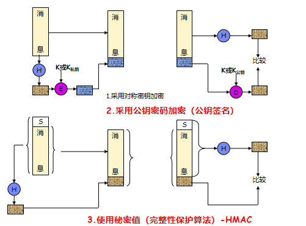
  

   采用散列函数认证消息
  

> - 第一个不常用

## 1.6 网络安全的标准组织

- [x] 国际组织
  > - 国际标准化组织（ISO）
  > - 国际电信联盟（ITU-T）
  > - 国际电工委员会（IEC）
  > - 互联网协会 (ISOC)
  > > - 因特网工程任务组 (IETF)
  > > - 互联网研究任务组 (IRTF)
  > 
  > - 欧洲计算机制造商协会（ECMA）
  > - 美国国家标准技术研究所(NIST)
  > - 美国国家计算机安全中心（NCSC）
  > - 美国国防部（DOD） 

- [x] 国内组织
  > - 信息技术安全标准化委员会（CITS）
  > - 通信标准化协会 (CCSA)-TC260 全国信息安全标准化技术委员会

# 第二章：公钥基础设施PKI 

## 2.1 PKI基本概念

- [x] 什么是PKI呢？
	> - 公钥基础设施(Public Key Infrastructure, PKI)
	> - PKI是一个用 `非对称密码算法原理和技术` 来实现并提供安全服务的具有通用性的 `安全基础设施` 。是一种遵循标准的利用公钥加密技术为电子商务的开展提供安全基础平台的 `技术和规范` 。能够为所有网络应用提供采用加密和数字签名等密码服务所需要的 `密钥和证书管理` 。

- [x] 为什么需要PKI？
	> - 对可信第三方的需要（Certificate Authority, CA）
	> - 电子政务、电子商务对信息传输的安全需求， `统一标准`
	> - 在收发双方建立信任关系，提供身份认证、数字签名、加密等安全服务
	> - 收发双方不需要事先共享密钥，通过公钥加密传输会话密钥

- [x] 非对称密码体制

  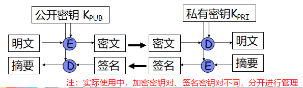
  

   非对称密码体制
  

### 证书的基本结构(最简构成)

- [x] ***通过可信CA的签名实现主体身份和主体公钥之间的绑定关系***

  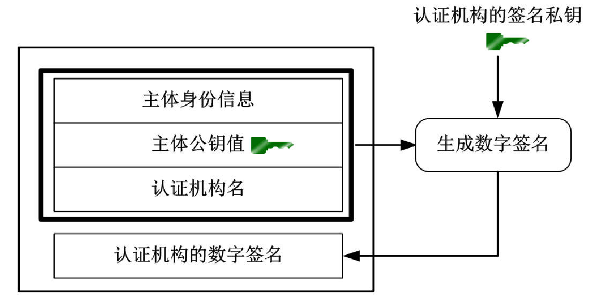
  

   证书的基本结构
  

## 2.2 PKI和电子商务中常用的密码技术

## 2.3 PKI功能操作

## 2.4 PKI体系的互通性与标准化

## 2.5 X.509标准

## 2.6 认证机构CA系统

# 第三章：IPSec-AH和ESP 
# 第四章：IPSec-IKE   
# 第五章：SSL/TLS协议  
# 第六章：防火墙与NAT
# 第七章：虚拟专用网VPN   
# 第八章：应用层安全协议  
# 第九章：无线局域网安全  
