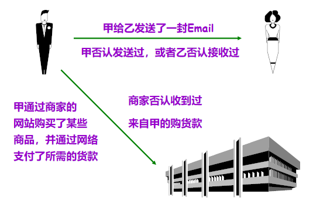
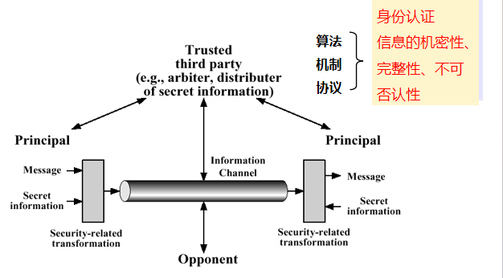
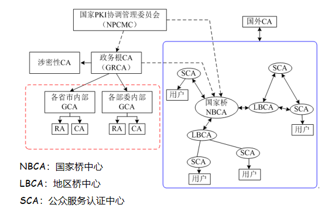
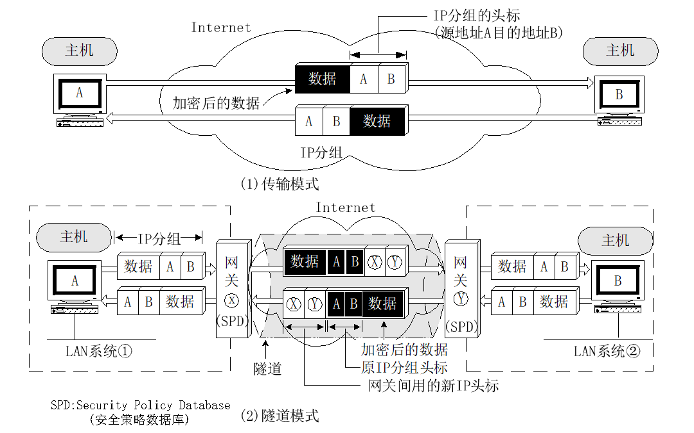
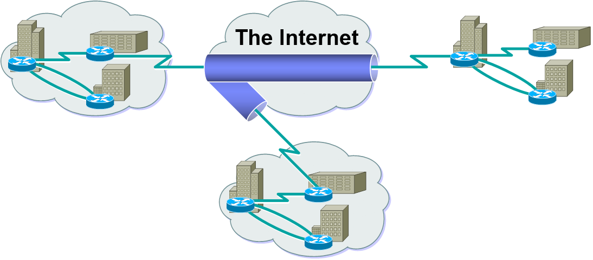
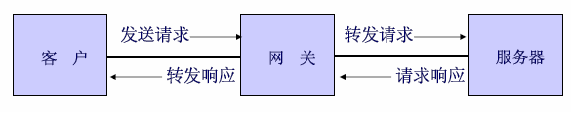
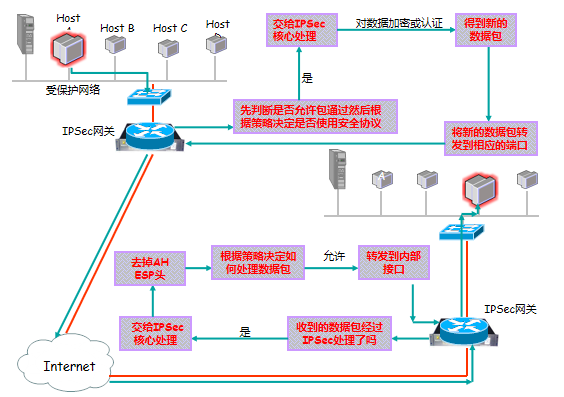
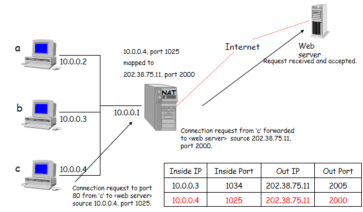
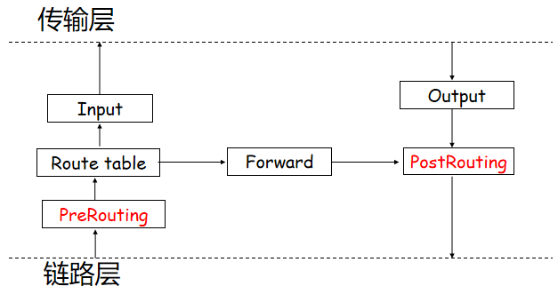

# 课前须知

> [课程主页](https://faculty.ustc.edu.cn/kpxue/zh_CN/zhym/108944/list/index.htm)

- [x] 课程安排：50学时授课+6学时研讨+2学时复习
- [x] 成绩评定：
  > - 期末考试60%
  > - 平时作业25% (Project 15%，各章节作业10%)
  > - 课堂等平时表现5%+课堂测试10%(2-3次)

# 第一章：网络安全综述 

## 1.1 网络安全概述

### 网络安全事件举例

- [x] 网络监听

<p align="center">
  
  <p align="center">
   <span>网络监听</span>
  </p>
</p>

- [x] 假冒站点phishing

<p align="center">
  
  <p align="center">
   <span>假冒站点phishing</span>
  </p>
</p>

- [x] 不安全Email

<p align="center">
  
  <p align="center">
   <span>不安全Email</span>
  </p>
</p>

- [x] 抵赖

<p align="center">
  
  <p align="center">
   <span>抵赖</span>
  </p>
</p>

### 网络安全概述

- [x] 网络安全的重要性
  > - 政务、商务、金融、军事等

- [x] 网络安全是一个跨多门学科的综合性科学
  > - 包括：通信技术、网络技术、计算机软件、硬件设计技术、应用密码学、密码学数学基础等
  > - 在理论上，网络安全是建立在 `密码学以及协议设计` 的基础上的
  > - 从技术上，网络安全取决于两个方面：网络设备的硬件和软件的安全，以及设备的访问控制

### 常见的不安全因素

- [x] 物理因素：设备在物理防护上不安全，电磁波泄漏等

- [x] 系统因素：系统软、硬件漏洞，病毒感染，漏洞入侵

- [x] `网络因素` ：网络协议流程漏洞，会话劫持，数据篡改，故意的网络拥塞，(分布式)拒绝服务

- [x] 管理因素：(管理员)安全意识淡漠，误操作

### 导致不安全的原因

- [x] `自身的缺陷` ： ***系统软硬件缺陷、网络协议的缺陷等***
- [x] `开放性`
  > - **系统开放** ：计算机及计算机通信系统是根据行业标准规定的接口建立起来的。
  > - **标准开放** ：网络运行的各层协议是开放的，并且标准的制定也是开放的。
  > - **业务开放**：用户可以根据需要开发新的业务。
- [x] `黑客攻击`
  > - **基于兴趣的入侵 (传统意义上的Hacker)**
  > - **基于利益的入侵**
  > - **国与国、企业与企业之间的信息战**

### 六大网络安全的特征

- [x] `机密性Confidentiality` 信息不泄漏给非授权的用户、实体或者过程的特性。

- [x] `完整性Integrity`  数据未经授权不能进行改变的特性，即信息在存储或传输过程中保持不被修改、不被破坏的特性

- [x] `可用性Availability` 可被授权实体访问并按需求使用的特性，即当需要时应能存取所需的信息，也包括引入的安全功能不能明显影响用户对服务的使用

- [x] `可认证性Authenticity` 与完整性存在关联，要求数据来自所声称的实体，或者合法用户

- [x] `不可否认性Non-repudiation` 做过的行为和接受过的信息不能抵赖，该能力有时又被称为 `可审计性Accountability` ，要求可事后追溯，不可否认

- [x] `可控性Controllability`  对网络信息的传播及内容具有控制能力(也就是在信息发生冲突或者矛盾时，信息源可以各抒己见)

> 前三种特征是公认的( `CIA` )，后三个是根据不同教材有不同的说法。

### 常见攻击手段

- [x] `社会工程Social Engineering` 攻击者可通过各种社交渠道获得有关目标的结构、使用情况、安全防范措施等有用信息从而提高攻击成功率。

- [x] `口令破解password cracking` 攻击者可通过获取口令文件，然后运用口令破解工具获得口令，也可通过猜测或窃听等方式获取口令

- [x] `地址欺骗IP Spoofing` 攻击者可通过伪装成被信任的IP 地址，邮件地址等方式来骗取目标的信任

- [x] `会话劫持Session Hijacking` 在合法的通信连接建立后，攻击者通过阻塞或摧毁通信的一方来接管已经过认证建立起来的连接，从而假冒被接管方与对方通信

- [x] `网络窃听Network Eavesdropping` 网络的开放性使攻击者可通过直接或间接窃听获取所需信息

- [x] `数据篡改Data Tampering` 攻击者可通过截获并修改数据或重放数据等方式破坏数据的完整性

- [x] `恶意扫描Malicious scan` 攻击者可编制或使用现有扫描工具发现目标的漏洞，进而发起攻击

- [x] `基础设施破坏Infrastructure destruction` 攻击者可通过破坏DNS 或路由信息等基础设施，使目标陷于孤立

- [x] `数据驱动攻击Data-driven attack` 攻击者可通过施放病毒、特洛伊木马、数据炸弹等方式破坏或遥控远程目标

- [x] `拒绝服务Deny of Service` 攻击者可直接发动攻击，也可通过控制其它主机发起攻击，使目标瘫痪，如发送大量的数据洪流阻塞目标

#### 常见攻击小结

- [x] $\text{中断(Interruption)} \leftarrow \rightarrow \text{可用性(Availability)}$

- [x] $\text{窃听(Interception)} \leftarrow \rightarrow \text{机密性(Confidentiality)}$

- [x] $\text{修改(Modification)} \leftarrow \rightarrow \text{完整性(Integrity)}$

- [x] $\text{伪造(Fabrication)} \leftarrow \rightarrow \text{可认证性(Authenticity)}$

<p align="center">
  
  <p align="center">
   <span>常见攻击小结</span>
  </p>
</p>

### 信息安全分类

<p align="center">
  
  <p align="center">
   <span>信息安全分类</span>
  </p>
</p>

### 网络安全的主要任务

- [x] 保障网络与系统
  > - 安全、可靠、高效、可控、持续地运行和被访问

- [x] 保障信息
  > - 机密、完整、可认证、不可否认地传输和使用

### 需要保护的对象

- [x] 硬件
  > - 服务器、路由器、用户终端、物联网设备等

- [x] 软件
  > - 操作系统、应用软件等

- [x] 数据
  > - 电子商务、电子政务、电子邮件、信息发布、社交媒体等场景下的可能导致隐私泄露的敏感数据

## 1.2 网络参考模型与安全模型

- [x] 网络的体系结构
  > - 采用分层原则
  > - 分层、协议与接口的集合

- [x] 网络参考模型
  > - ISO - OSI (国际标准化组织-开放系统互连)模型
  > - TCP/IP模型(IETF)

- [x] 安全体系结构：ITU-T的X.800(ISO安全框架)和IETF的RFC2828
  > - 安全攻击 Security Attacks
  > - 安全机制 Security Mechanisms
  > - 安全服务 Security Services

- [x] 安全模型
  > - `网络安全模型Model for Network Security` : 涉及信息在网络传输中的安全(公网上的私有性保护)
  > - `网络访问安全模型Network Access Security Model` ：涉及网络或者系统本身的安全(访问控制)

### ISO-OSI模型

<p align="center">
  
  <p align="center">
   <span>ISO-OSI模型</span>
  </p>
</p>

- [x] 1. 物理层：缆线，信号的编码，网络接插件的电、机械接口

- [x] 2. 数据链路层：成帧，差错控制、流量控制，物理寻址，媒体访问控制

- [x] 3. 网络层：路由、转发，拥塞控制

- [x] 4. 传输层：为会话层提供与下面网络无关的可靠消息传送机制

- [x] 6. 表示层：在两个应用层之间的传输过程中负责数据的表示语法

- [x] 7. 应用层：处理应用进程之间所发送和接收的数据中包含的信息内容。

### 数据的封装

<p align="center">
  
  <p align="center">
   <span>数据的封装</span>
  </p>
</p>

### TCP/IP模型

<p align="center">
  
  <p align="center">
   <span>TCP/IP模型</span>
  </p>
</p>

### OSI与TCP/IP模型的比较

- [x] 相同点：
  > - 1. 都是基于独立的协议栈概念。
  > - 2. 两者都有功能相似的应用层、传输层、网络层(后者是前者的协议基础上总结出来的)。

- [x] 不同点：
  > - 1. 在OSI模型中，严格地定义了服务、接口、协议；在TCP/IP模型中，并没有严格区分服务、接口与协议。
  > - 2. OSI模型支持非连接和面向连接的网络层通信，但在传输层只支持面向连接的通信；TCP/IP模型只支持非连接的网络层通信，但在传输层有支持非连接和面向连接的两种协议可供用户选择。(对于电信ATM结构模型我国当前使用OSI模型，互联网一般都是TCP/IP模型，所以如果手机打电话由4G转为2G，也是因为语音通信为2G技术所以会回退)
  > - 3. TCP/IP模型中不区分、甚至不提起物理层和数据链路层。

### 安全体系结构

- [x] RFC 2828 (Internet Security Glossary)
- [x] X.800 (Security Architecture for OSI)
  > - `安全攻击Security Attacks` 损害机构所拥有信息的安全的任何行为
  > - `安全服务Security Services` 系统提供的对资源进行特殊保护的进程或者通信服务
  > - `安全机制Security Mechanisms` 设计用于检测、预防安全攻击或者恢复系统的机制
- [x] 用一种或多种 $\underline{安全机制}$ 来实现 $\underline{安全服务}$ ， $\underline{安全服务}$ 致力于抵御 $\underline{安全攻击}$ 。

### 安全体系结构————安全攻击

- [x] `主动攻击(active attack)` : 更改数据流, 或伪造假的数据流(相比被动攻击而言，主动攻击更容易被检测和监察)。
  > - 伪装 Masquerade
  > - 重放Replay
  > - 篡改Modification
  > - 拒绝服务Denial of Service

<p align="center">
  
  <p align="center">
   <span>主动攻击</span>
  </p>
</p>

- [x] `被动攻击(passive attack)` : 对传输进行偷听与监视, 获得传输信息, 但不对通信和数据做任何修改(有时候可以通过某些方法，将被动攻击变为主动攻击，比如在量子信道中窃听攻击为主动攻击)。
  > - 窃听攻击Eavesdrop
  > - 流量分析Traffic analysis
  > - 破解弱加密的数据流cracking of weakly-encrypted data streams

<p align="center">
  
  <p align="center">
   <span>被动攻击</span>
  </p>
</p>

### 安全体系结构————安全机制

- [x] 特定的安全机制(8种)
  > - `加密Encipherment` 用加密算法对信息加密, 保护信息的机密性
  > - `数字签名Digital Signature` 用签名算法对信息进行计算, 计算结果附加于信息单元。用于身份认证、数据完整性和非否认服务
  > - `访问控制Access Control` 用于实施资源访问权限的机制
  > - `数据完整性Data Integrity` 用于确保信息的完整性
  > - `认证交换Authentication Exchange` 确保信息交换的实体是所声称的实体，通过信息交换以确保实体身份，包括公知密码、特征、位置信息等
  > - `流量填充Traffic Padding` 填充信息，防止流量分析
  > - `路由控制Route Control` 能够为特定数据选择特定基于路由的安全通道
  > - `公证Notarization` 采用可信任的第三方以确保一些信息交换的属性

- [x] 另外有其他5种普通的安全机制
  > - 可信功能Trusted Functionality、安全标记Security Label、事件检测Event Detection、安全审计跟踪Security Audit Trail、安全恢复Security Recovery。

### 安全体系结构————安全服务

<p align="center">
  
  <p align="center">
   <span>安全体系结构————安全服务</span>
  </p>
</p>

> 对等实体认证是指两个人回话之间彼此对对方的身份的认证，数据源认证是对信息来源单方确认

### 基本的安全设计准则

- [x] 主要准则
  > - 机制的经济性：安全机制设计简单和短小，便于测试和验证
  > - 故障安全默认：基于许可而不是排除
  > - 完整的监察：根据访问控制机制进行检查
  > - 开放的设计：安全机制的设计公开而不是保密
  > - 权限分离：多个权限属性来实现对首先资源的访问，例如，多因素用户认证
  > - 最小权限：每个进程或者使用者执行任务所需的最小权限集。例如，基于角色的访问控制
  > - 隔离、封装、分层、模块化

### 安全服务与攻击的关系

<p align="center">
  
  <p align="center">
   <span>安全服务与攻击的关系</span>
  </p>
</p>

### 安全服务与机制的关系

<p align="center">
  
  <p align="center">
   <span>安全服务与机制的关系</span>
  </p>
</p>

### 网络安全模型：实现端到端的安全通信

<p align="center">
  
  <p align="center">
   <span>网络安全模型</span>
  </p>
</p>

> - 数字信封：先对信息签名, 然后用对称密钥加密，再把对称密钥用收方公钥加密, 附在信息后。总之, 收方公钥加密两个收方会话的对称密钥
> - 端到端安全通信
> > - 可信第三方制定规则约束信息发送接收和传输
> > - 信息通过安全可靠的方式进行转化后传输
> > - 保证身份认证, 信息机密性, 完整性, 不可否认性
> > - 双向认证

### 网络访问安全模型：保护信息系统免遭恶意访问

<p align="center">
  
  <p align="center">
   <span>网络访问安全模型</span>
  </p>
</p>

> - 保护信息系统免遭恶意访问
> > - 防火墙和安全网关
> > - 入侵检测系统
> > - 虚拟专用网
> > - 保证可用性, 可控性
> > - 强调用户这端的认证，淡化基站和服务器端的认证

## 1.3 网络各层的相关安全协议

- [x] 链路层：链路隧道协议, 加密技术

- [x] 网络层：包过滤机制, NAT, IPSec协议, VPN

- [x] 传输层：SSL/TLS 协议

- [x] 应用层：HTTPS, PGP, S/MIME, DNSSEC等

<p align="center">
  
  <p align="center">
   <span>网络各层的相关安全协议</span>
  </p>
</p>

<p align="center">
  
  <p align="center">
   <span>网络各层的相关安全协议</span>
  </p>
</p>

## 1.4 密码学基础知识

### 1. 密码学分类

- [x] 按发展进程或体制分
  > -  `古典密码Classical Cipher` 基于字符替换的密码，现在已很少使用了，但是它代表了密码的起源
  > -  `对称密钥体制Symmetric-Key System` 加密密钥和解密密钥相同，这些算法也叫作单钥密码体制(one-key system)
  > -  `非对称密钥体制Asymmetric-Key System` 加密密钥和解密密钥不同，也叫公钥密码体制(public key system)或双钥密码体制(two-key system)

- [x] 按加密模式分
  > -  `序列密码Stream cipher` 序列密码 $\underline{按位或字节加密}$ , 也可以称为流密码, 序列密码是手工和机械密码时代的主流。
  > -  `分组密码block cipher` 分组密码将明文分成 $\underline{固定长度的组}$ , 用同一密钥和算法对每一块加密, 输出也是固定长度的密文。

### 2. 古典密码

- [x] DES(数据加密标准，Data Encryption Standard) 
  > - 背景
  > > - 1973年，NBS(后来的NIST, National Institute of Standards and Technology)美国国家标准局 `征集数据加密标准方案`
  > > - 1974年，IBM的Tuchman和Meyers发明Luciffer加密算法, NBS公布了IBM公司提供的该密码算法，以标准建议的形式在全国范围内征求意见
  > > - 1977年1月15日, DES正式颁布，供商业界和非国防性政府部门使用，同年7月15日生效
  > 
  > - DES是一种对二元数据进行加密的算法，数据分组长度为 `64位` ，密文分组长度也是 `64位` ，使用的密钥为 `64位` ，有效密钥长度为 `56位` ，有 `8位` 用于奇偶校验，解密时的过程和加密时相似，但密钥的顺序正好相反，DES的整个体制是公开的，系统的安全性完全靠密钥的保密。

<p align="center">
  
  <p align="center">
   <span>DES算法流程</span>
  </p>
</p>

<p align="center">
  
  <p align="center">
   <span>Single Round of DES Algorithm</span>
  </p>
</p>

#### DES算法的破解

- [x] DES使用了近 25年时间，它具有很强的抗密码分析能力，但它的密钥长度只有 $56比特$ ， $56-bit$ 密钥有 $2^{56} = 72,057,584,037,927,936 ≈ 7.2亿亿$ 之多，随着计算机运算能力的增加，56比特长度的密码系统显得不安全了。

- [x] 1997年，RSA公司发起破译RC4、RC5、MD2、MD5，以及DES的活动，破译DES奖励10000美金。
  > - 由Roche Verse牵头的工程小组动用了70000多台通过因特网连接起来的 计算机系统，花费了96天找到了密钥。
  > - 1998年7月，电子前沿基金会花费25万美圆制造的一台机器在不到3天的时间里攻破了DES。
  > - 1999年在超级计算机上只要22小时！

#### 对称密码的性能

- [x] 安全性能
  > - 密钥长度
  > - 分组长度
  > - 轮数
  > - 密钥编排函数
  > - 对密码分析的抵抗能力

- [x] 实现性能
  > - 计算开销
  > - 内存利用

#### 对加密系统的攻击

- [x] `未知算法攻击` ：算法未知，仅从密文进行破译

- [x] `仅知密文攻击(Ciphtext Only Attack，COA)` ：根据加解密算法和密文进行破译

- [x]  `已知明文攻击(Known Plaintext Attack，KPA)` ：攻击者拥有部分密文和对应的明文，根据算法寻找密钥

- [x]  `选择明文攻击(Chosen Plaintext Attack，CPA)` ：有选择地使用任意明文和与之对应的密文信息，根据算法寻找密钥

- [x]  `选择密文攻击(Chosen Ciphertext Attack，CCA)` ：具有CPA的能力之外，还可以有选择地使用密文和与之对应的明文信息，根据算法寻找密钥

#### 其他算法

- [x] 三重DES
  > - 使用三个密钥对数据块进行三次DES操作，三重DES有四种模型：
  > > - DES-EEE3 使用三个不同密钥顺序进行三次加密变换(实际上连续几次加密等效于用另一个密钥进行一次加密，所以实际上不用)
  > > - **DES-EDE3** 使用三个不同密钥依次进行加密-解密-加密变换 ( **3DES标准，兼容性考虑** )
  > > - DES-EEE2 其中密钥K1=K3 顺序进行三次加密变换
  > > - DES-EDE2 其中密钥K1=K3 依次进行加密-解密-加密变换

- [x] 3DES问题所在
  > - 算法开销
  > - 采用64bits分组长度

- [x] AES的出现
  > - 1997年NIST征集高级加密标准
  > > - 要求与3DES等同或者更高的安全强度，且效率显著提高。要求块长度为 `128位` ，密钥长度可以是 `128、192、256位`
  > 
  > -2001年，两轮评估，最终选择比利时密码学家提出的Rijndael算法，成为正式标准。

- [x] IDEA
  > - IDEA是国际数据加密算法(International Data Encryption Algorithm)的缩写，是1990年由瑞士联邦技术学院X.J.Lai(来学嘉)和Massey提出的建议标准算法，称作PES(Proposed Encryption Standard)，Lai 和Massey 在1992 年进行了改进，强化了抗差分分析的能力，改称为IDEA ，它也是对 `64bit` 大小的数据块加密的分组加密算法，密钥长度为 `128位` ，它基于“ `相异代数群上的混合运算` ”设计思想算法，用硬件和软件实现都很容易，它比DES在实现上快得多。
  > - 被推荐使用在 `PGP (Pretty Good Privacy)` 软件中
  > - 64位明文经128位密钥加密成64位密文，穷举分析需要 $10^{38}$ 次试探，按每秒100万次计算说，则需要 $10^{13}$ 年。
  > - 加密密钥与解密密钥不同，但是从一个主密钥派生出来，因此仍是对称的加密体制，目前尚无可验证的破译方法。算法本身倾向于软件实现，加密速度快。

- [x] Blowfish
  > - 1993年开发，密钥长度可变，最长可达448位，实际中常采用128位，块长度64

- [x] RC5
  > - 提出者：Ronald L. Rivest
  > - 1994年开发，可变轮数，可变长密钥
  > - 其后续版本RC6是作为AES的候选方案之一
  > -  `RC4是流密码算法` (密钥生成伪随机比特流，与明文按bit异或)

- [x] CAST-128
  > - 密钥长度40-128bits可变，每轮的函数互相不同，CAST-256提供更长的密钥长度

#### 几种对称加密算法的比较

<div align="center">
  <table>
  <thead>
    <tr>
      <th>算法</th>
      <th>密钥长度</th>
      <th>轮数</th>
      <th>数学计算</th>
      <th>应用</th>
    </tr>
  </thead>
  <tbody>
    <tr>
      <td>DES</td>
      <td>56</td>
      <td>16</td>
      <td>异或、固定S盒</td>
      <td>SET，Kerberos</td>
    </tr>
    <tr>
      <td>Triple DES</td>
      <td>112或168</td>
      <td>48</td>
      <td>异或、固定S盒</td>
      <td>PGP，S/MIME</td>
    </tr>
    <tr>
      <td>IDEA</td>
      <td>128</td>
      <td>8</td>
      <td>异或、加法、乘法</td>
      <td>PGP</td>
    </tr>
    <tr>
      <td>Blowfish</td>
      <td>可变至448</td>
      <td>16</td>
      <td>异或、变长S盒、加法</td>
      <td></td>
    </tr>
    <tr>
      <td>RC5</td>
      <td>可变至2048</td>
      <td>可变至255</td>
      <td>加法、减法、异或、旋转</td>
      <td></td>
    </tr>
    <tr>
      <td>CAST-128</td>
      <td>40至128</td>
      <td>16</td>
      <td>加法、减法、异或、旋转、固定S盒</td>
      <td>PGP</td>
    </tr>
  </tbody>
</table>
</div>

#### 分组密码的工作模式

- [x] 分组密码一次处理一个数据分组。

- [x] 对于较长的明文，在分解成若干个分组之后，采用相同的密钥进行加密，NIST定义了5种工作模式
  > - 电码本(ECB，Electronic Codebook)模式
  > - 密码分组链接(CBC，Cipher-block chaining)模式
  > - 密码反馈(CFB，Cipher feedback)模式
  > - 输出反馈(OFB，Output Feedback)模式
  > - 计数器(CRT， Counter)模式

##### 电码本(ECB, Electronic Codebook)模式

- [x] 直接应用密码算法的工作模式

- [x] 给定明文 $x=x_1x_2 \dots$ ,将它分为 $b$ 比特长的 $x_i$ ， $e_k$ 是加密算法，产生密文分组 $c_i = e_k(x_i)$ ，完整的密文 $c$ 按次序将 $c_i$ 连接起来：即 $c= c_1 c_2 \dots$ 。

- [x] 解密为 $x_i=d_k(c_i)$

- [x] **存在明显缺点：相同的明文加密后得到的密文是相同的** 。

<p align="center">
  
  <p align="center">
   <span>ECB加密</span>
  </p>
</p>

<p align="center">
  
  <p align="center">
   <span>ECB解密</span>
  </p>
</p>

##### 密码分组链接(CBC, Cipher-block chaining)模式

- [x] 给定明文的一个比特串 $x=x_1x_2 \dots$,  $x_i$ 是 $b$ 比特分组， $IV$ 是一个初始向量。
  > - $c_1 = e_k (x_1⊕IV)$ ，
  > - $c_2 = e_k (x_2⊕c_1)$ ，
  > - $c_i = e_k (x_i⊕c_{i-1})$

- [x] 解密：
	> - $x_1 = d_k (c_1)⊕IV$
	> - $x_i = d_k (c_i)⊕c_{i-1}$

<p align="center">
  
  <p align="center">
   <span>CBC加解密</span>
  </p>
</p>

> - 当解密时某一密文分组出现错误，只会影响当前分组和下一分组的解密；而加密时，明文分组出错会影响当前分组和后续所有分组的加密，但是接收方解密时会正确解密，得到的明文除了出错的一组都是正确的。
> - 使用IV是为了使得同明文和同密钥情况下输出不同的密文。

##### 密码反馈(CFB, Cipher FeedBack)模式

- [x] 给定明文的一个比特串 $x=x_1x_2 \dots$ ,  $x_i$ 是 $s$ 比特分组， $IV$ 是一个初始向量。
  > - $z_1 = e_k (IV)$ ， $c_1 = x_1⊕z_1$ 的 $s$ 位
  > - $z_2 = e_k (IV 移位||c_1的s位)$ ， $c_2 = x_2⊕z_2$ 的 $s$ 位
  > - $z_i = e_k (上个移位寄存器内容移位||ci-1 的s位)$ ， $c_i= x_i⊕z_i$ 的 $s$ 位

- [x] 解密：
	> - $z_1 = e_k (IV)$ ， $x_1 = c_1⊕z_1$ 的 $s$ 位
	> - $z_i = e_k (上个移位寄存器内容移位||ci-1 的s位)$ ， $x_i= c_i⊕z_i$ 的 $s$ 位

<p align="center">
  
  <p align="center">
   <span>CFB加解密</span>
  </p>
</p>

<p align="center">
  
  <p align="center">
   <span>CFB加解密</span>
  </p>
</p>

> 参考下面的图，上面那个并不太准确，也就是第一次加密时，移位寄存器中存储 $b$ 位(一般是64)的初始向量 $IV$ 先进行加密，然后舍弃后面的 $b-s$ 位，取最前 $s$ 位与明文分组加密得到密文，第二次加密也就是对移位寄存器中 $b$ 位的初始向量前移 $s$ 位(原来的前 $s$ 位)舍弃，将第一组密文放在最后 $s$ 位填充进去，补到 $b$ 位。依次重复即可，所以到 $\frac{b}{s}$ 次后加密，移位寄存器中的 $b$ 位也就不含初始向量的任何部分了。同理密文传输错误时，也最多影响后 $\frac{b}{s}$ 个分组。

##### 输出反馈(OFB, output-Feedback)模式

- [x] $z_1 = e_k (IV),c_1 = x_1⊕z_1$
- [x] $z_2 = e_k (z_1),c_2 = x_2⊕z_2$
- [x] $z_i = e_k (z_{i-1}),c_i = x_i⊕z_i$

- [x] 解密：
	> - $z_1 = e_k (IV),x_1 = c_1⊕z_1$
	> - $z_i = e_k (z_i),x_1 = c_1⊕z_1$

<p align="center">
  
  <p align="center">
   <span>OFB加解密</span>
  </p>
</p>

- [x] $z_1 ,…, z_i,…$ 可以提前计算

##### 计数器(CRT, CounTeR)模式

- [x] 给定计算器初始值 `counter`
  > - $z_1 = e_k (counter),c_1 = x_1⊕z_1$
  > - $z_2 = e_k (counter+1),c_2 = x_2⊕z_2$
  > - $z_i = e_k (counter+i-1),c_i = x_i⊕z_i$

- [x] 解密：
	> - $z_i = e_k (counter+i-1),x_i = c_i⊕z_i$

<p align="center">
  
  <p align="center">
   <span>CRT加解密</span>
  </p>
</p>

### 3. 公开密钥算法

- [x] 对称密码算法问题：
  > - 密钥管理量问题：潜在通信的两两分别用一对密钥，当用户量增大时，密钥空间急剧增大。
  > - 对称算法无法实现抗否认需求——数字签名

- [x] 非对称密码体制的基本原则
  > - 加密能力与解密能力是分开的
  > - 密钥分发简单
  > - 需要保存的密钥量大大减少，N个用户只需要N个，除了个人私钥之外，公钥均可以公开保存
  > - 可满足不相识的人之间保密通信
  > - 可以实现数字签名

<p align="center">
  
  <p align="center">
   <span>公开密钥算法加密</span>
  </p>
</p>

<p align="center">
  
  <p align="center">
   <span>公开密钥算法认证</span>
  </p>
</p>

#### 公开密钥算法基本思想

- [x] 公钥密码又称为双钥密码和非对称密码，1976年由Diffie和Hellman在其邀搞论文“密码学新方向”（ New Directions in Cryptography ）一文中提出的。(2016年图灵奖)

- [x] RSA是1978年MIT的Rivist, Shamir 和Adlemar开发的第一个公钥密码体制，最早提出的满足要求的公钥算法之一。(2002年图灵奖)

#### RSA密码体制基本原理

- [x] A. 密钥的生成
  > - 选择 $p, q$ ， $p, q$ 为互异素数，计算 $n=p×q$ , $φ(n)=(p-1)(q-1)$ , 选择整数 $e$ 与 $φ(n)$ 互素，即 $gcd(φ(n),e)=1,1<e<φ(n)$ 计算 $d$ ,使 $d=e^{-1}(modφ (n))$ ,公钥 $Pk=\lbrace e, n\rbrace$ ; 私钥 $Sk=\lbrace d, n\rbrace$

- [x] B. 加密 (用 $e, n$ )，
  > - 明文是以分组方式加密的，每一个分组的比特数应小于n的二进制表示，即每一个分组的长度应小于 $\log _2n$
  > - 明文 $M<n$ ， 密文 $C=M^e(mod n)$ .

- [x] C. 解密 (用 $d, n$ )
  > - 密文C， 明文 $M=C^d (mod n)$

##### RSA的安全分析

- [x] 选取的素数 $p, q$ 要足够大，使得给定了它们的乘积 $n$ , 在不知道 $p, q$ 情况下分解 $n$ 在计算上是不可行的。

- [x] 1999年, 一个292台计算机组成的网络花了5.2个月时间分解了一个155位的十进制数 (512比特)。基于短期安全性考虑, 要求n的长度至少应为1024比特, 而长期安全性则需n至少为2048比特。

#### 其它公钥算法

- [x] ELGamal密码
  > - 1985年ELGamal设计的密码算法，该算法是基于有限域上离散对数问题求解的困难性。

- [x] 椭圆曲线密码
  > - 1985年N. Koblitz和V. Miller分别独立提出了椭圆曲线密码体制(ECC), 其依据就是定义在椭圆曲线点群上的离散对数问题的难解性。

- [x] Diffie-Hellman密钥交换

### 4. Diffie-Hellman密钥交换(DH密钥交换)

<p align="center">
  
  <p align="center">
   <span>DH密钥交换</span>
  </p>
</p>

> - 考研常考或者期末常考。
> - $g$ 称为本原根， $K=(g^{X_A})^{X_B}=(g^{X_B})^{X_A} mod \ B$ 。

- [x] 防止中间人攻击
  > - 1. 数字签名，对自己的Y用自己的私钥签名，但是这个不常用，这个可能导致公私钥被窃取重用；
  >   2. HMAC\用户认证：A向B发一个随机数，B对随机数用私钥签名，然后发给A，或者用公钥加密，发给A。A进行验证即可，但是有可能被中间人向B发起验证，在中间截取随机数，然后让B证明自己是B，B对随机数签名后重用这个数据此时可以冒充B，这个时候可以采用对随机数特殊定义的方法进行处理。
  >   3. 双向验证，这个也防不了重用。

## 1.5 数字签名与认证技术

- [x] 通信中潜在的威胁
  > - 消息伪造
  > - 内容篡改(如何判断有没有篡改:对明文添加校验位，校验位是明文的哈希对应，但是实际上都是用HMAC做)
  > - 延迟或重播
  > - 否认
 
- [x] 数字签名————消息的不可否认性

- [x] 消息认证————消息的完整性(不能提供消息的不可否认性)

> - 挑战应答（挑战响应）：双方对话时，A要B向其证明自己的身份。
> - 基于对称加密，A向B发一个随机数，B用会话密钥进行加密，然后将其发回A，A进行解密，验证是否为该随机数。但是该方法，不能抗重放，一般建议用私钥签名以后再传输。

### 1. 数字签名

- [x] 公钥密码学的一个重要应用就是数字签名，数字签名就是利用私钥生成签名，而用公钥验证签名。

- [x] 一个数字签名方案时是由签名算法和验证算法组成
  > - 签名算法利用私钥生成签名，称消息 $m$ 的签名为 $sig(m)$ ，然后将 $(m，sig(m))$ 发给接收方
  > - 验证算法利用签名者的公钥对 $sig(m)$ 进行解密，如果解密输出与 $m$ 一致，则为合法数据。

> - **对于大文件传输的签名，如果对整个文件签名，则有三个巨大开销，也就是源端签名的开销，传输巨大密文还有明文（这个是用于对端解密后比对的）的开销，验证端(目的端)的解密和对比的开销。所以实际应用中，对文件进行一个哈希，对比特数进行减少，再进行签名，对端只用对明文也进行哈希，对传输过来的签名后的密文进行公钥解密，比对就可以。这个时候开销就很小。实际上不管是不是大文件，只要是签名的，都是这么做的，开销小了两个数量级左右。**

- [x] 由于无法识别数字签名与其拷贝之间的差异，所以，在数字签名前应加上时间戳。

- [x] 数字签名标准(DSS)
  > - DSA(数字签名算法，是Elgamal公钥算法的一种变体)
  > - RSA

### 2. 消息认证

- [x] 提供数据源认证能力

- [x] 可用来做消息认证的函数有三类(合计4种方法)
  > - 直接用加密函数(通常不这么用)
  > > -  `用对称密钥加密` ，信息的一致作为对信息的认证
  > > -  `用公钥密码中的私钥加密` ，但加密速度太慢，实际使用时结合散列函数构成实用化的签名。
  > 
  > -  消息认证码MAC (Message Authentication Code)
	> > - 是对信源消息的一个编码函数, 以消息和密钥作为输入，定长输出，
	> - 散列函数 (Hash Function)+签名
	> > - 是一个公开的函数它将任意长的信息映射成一个固定长度的信息，需要结合公钥签名一起使用。

> - 开销： $非对称 >> 对称 >> 哈希 >> 异或$
> - 非对称协议一般情况： $协商参数 \rightarrow 非对称加密 \rightarrow DH交换密钥 \rightarrow 建立安全通道$

#### 消息认证码MAC

- [x] 利用函数 $f$ 和密钥 $k$ , 对要发送的明文 $x$ 或密文 $y$ 变换成 $r \ bit$ 的消息认证码 $f(k,x)$ (或 $f(k,y)$ ), 将其称为认证符附加在 $x$ (或 $y$ )之后发出, 接收者收到发送的消息序列后，按发方同样的方法对接收的数据(或解密后)进行计算, 应得到相应的 $r \ bit$ 数据

<p align="center">
  
  <p align="center">
   <span>消息认证码MAC</span>
  </p>
</p>

> - HMAC就是先哈希后MAC的协议

#### 散列函数

- [x] 单向散列函数(hash，杂凑函数)可以从一段很长的报文中计算出一个固定长度的比特串，这种散列函数通常称为报文摘要(message digest)，用于消息的完整性检验。

- [x] 单向散列函数H有以下特性：
  > 1. $H$ 能够应用于任何大小的数据块
  > 2. $H$ 产生固定长度的输出
  > 3. 对于任意给定的数据 $X$ ，易于计算 $H(X)$
  > 4. 对于任何给定的数据 $h$ ，计算 $H(X)=h$ 是不可行的
  > 5. 对于任意给定的数据 $X$ ，寻找满足 $H(Y)=H(X),Y≠X$ ,在计算上是不可行的。这也称为 <kbd>弱碰撞抵抗</kbd> 
  > 6. 寻找满足 $H(Y)=H(X)的(X,Y)$ 对，在计算上是不可行的。这也称为 <kbd>强碰撞抵抗</kbd>

- [x] **满足前5个性质的hash函数称为弱hash函数，如果6条都满足就称为强hash函数。**

- [x] 标准： `MD5` ( <kbd>128比特</kbd> )， `SHA-1` ( <kbd>160比特</kbd> )， `SHA-2` (包括6种)

> - ~~"派生"也就是从一个密钥发展多个，"拓展"就是多个变一个~~

##### 采用散列函数认证消息

<p align="center">
  
  <p align="center">
   <span>采用散列函数认证消息</span>
  </p>
</p>

> - 第一个不常用

## 1.6 网络安全的标准组织

- [x] 国际组织
  > - 国际标准化组织（ISO）
  > - 国际电信联盟（ITU-T）
  > - 国际电工委员会（IEC）
  > - 互联网协会 (ISOC)
  > > - 因特网工程任务组 (IETF)
  > > - 互联网研究任务组 (IRTF)
  > 
  > - 欧洲计算机制造商协会（ECMA）
  > - 美国国家标准技术研究所(NIST)
  > - 美国国家计算机安全中心（NCSC）
  > - 美国国防部（DOD） 

- [x] 国内组织
  > - 信息技术安全标准化委员会（CITS）
  > - 通信标准化协会 (CCSA)-TC260 全国信息安全标准化技术委员会

# 第二章：公钥基础设施PKI 

## 2.1 PKI基本概念

- [x] 什么是PKI呢？
	> - 公钥基础设施(Public Key Infrastructure, PKI)
	> - PKI是一个用 `非对称密码算法原理和技术` 来实现并提供安全服务的具有通用性的 `安全基础设施` 。是一种遵循标准的利用公钥加密技术为电子商务的开展提供安全基础平台的 `技术和规范` 。能够为所有网络应用提供采用加密和数字签名等密码服务所需要的 `密钥和证书管理` 。

- [x] 为什么需要PKI？
	> - 对可信第三方的需要(Certificate Authority, CA)
	> - 电子政务、电子商务对信息传输的安全需求， `统一标准`
	> - 在收发双方建立信任关系，提供身份认证、数字签名、加密等安全服务
	> - 收发双方不需要事先共享密钥，通过公钥加密传输会话密钥

- [x] 如何在通信双方间协商⼀个会话密钥
	> - 基于对称加密：通过选择⼀个密钥分发中心，为通信双⽅提供⼀个会话密钥。如 `Kerberos认证协议`
	> - 基于非对称加密：包括 `Diffie-Hellman密钥交换` ， `数字信封`

- [x] 什么是随机数？基于已学课程大致描述随机数的作⽤？
	> - 随机数是⼀种统计上独立且无偏的二进制数字序列
	> - 随机数作用:
	> > - 作为分组密码技术中的密钥
	> > - 作为流密码技术中的密钥或密钥流
	> > - ⽤于产生公钥密钥算法中的⼤素数、私钥等，如RSA中p和q的选取
	> > - ⽤于认证协议中防止重放攻击

> 重放攻击是⼀个攻击者得到了⼀个经过认证的包的副本，稍后又将其传送到其希望被传送到的⽬的站点的攻击。

- [x] 非对称密码体制(很多考试都有，还有小测)

<p align="center">
  
  <p align="center">
   <span>非对称密码体制</span>
  </p>
</p>

### 证书的基本结构(最简构成)(很多考试都有，还有小测)

- [x] ***通过可信CA的签名实现主体身份和主体公钥之间的绑定关系***
	> - 此时假设了 $CA$ 可信，这个是前提。

<p align="center">
  
  <p align="center">
   <span>证书的基本结构</span>
  </p>
</p>

> - 公钥证书由公钥、公钥所有者的主体身份信息、可信第三⽅的签名(、认证机构数字签名)(前三者利用认证机构的签名私钥生成的)这样的整个数据块组成。

### PKI的组成

<p align="center">
  
  <p align="center">
   <span>PKI的组成</span>
  </p>
</p> 

- [x]  `认证中心CA(Certificate Authority)` 证书的签发机构，它是PKI的 `核心构件` ，是PKI应用中权威的、可信任的、公正的第三方机构。

- [x]  `注册机构RA(Registration Authority)` 注册功能也可以由CA直接实现，但随着用户的增加，多个RA可以分担CA的功能，作为CA的延展，可以 `增强可扩展性` 。按照特定的政策和管理规范对用户的资格进行审查，并执行是否同意给该申请人发放证书。撤销证书等操作，应注意的是 `RA不容许直接颁发证书或CRL` ~~(因为涉及到签名，类似 `RA` 没有签名私钥)~~ 。

- [x]  `证书库(Certification Library)` CA颁发证书和 `证书撤销列表CRL` 的集中存放地，提供公众查询，常用目录服务器提供服务，采用 `LDAP(Lightweight Directory Access Protocol)` 目录访问协议。
	> - 得到与之通信的实体的公钥，在证书中
	> - 验证通信实体的证书是否在CRL中，也基于签名

- [x]  `密钥备份及恢复系统`
	> -  `签名密钥对` ：签名私钥相当于日常生活中的印章效力，为保证其唯一性、抗否认性， `签名私钥不作备份` 。签名密钥的生命期较长。
	> -  `加密密钥对` ：加密密钥通常用于分发会话密钥，为防止密钥丢失时无法解密数据， `解密密钥应进行备份` 。这种密钥应频繁更换。

- [x]  `证书作废处理系统` 证书由于某种原因需要作废, 终止使用, 这将通过 `证书作废列表` (CRL, Certificate Revocation List)来完成, 证书撤销列表作为文件结构，也需要由CA进行签发。

- [x]  `自动密钥更新` 无需用户干预, 当证书失效日期到来时, 启动更新过程, 生成新的证书

- [x]  `密钥历史档案`  由于密钥更新，每个用户都会拥有多个旧证书和至少一个当前证书, 这一系列证书及相应私钥（除签名私钥）组成密钥历史档案。
	> - 避免他人抵赖，若旧的证书失效被放入黑名单或者销毁，可以抵赖旧证书的使用行为。

- [x]  `PKI应用接口系统` 是为各种各样的应用提供安全、一致、可信任的方式与PKI交互, 确保所建立起来的网络环境安全可信,并降低管理成本。

- [x]  `交叉认证` 多个PKI独立地运行, 相互之间应建立信任关系
	> - 多个PKI独立运行相互建立信任关系
	> - 两个CA间互相认证颁发证书

### 建立标准化PKI体系的主要优势

- [ ] 节省费用

- [ ] 互操作性

- [ ] 开放性

- [ ] 一致的解决方案

- [ ] 可验证性

- [ ] 可选择性

### PKI基本服务

- [x]  `认证`
	> - **实体鉴别, 数据来源鉴别** ~~(前者是认证实体身份，后者是认证数据最初源头，也就是不管转发者是谁，只关心最初的来源)~~

- [x]  `完整性`
	> - **哈希+数字签名技术, 消息认证码(数字信封传输对称密钥)**
 
- [x]  `保密性`
	> - **采用数字信封, 传输会话密钥**

- [x]  `不可否认性服务`
	> - **收据(receipt)的数字签名**
	> - **安全时间戳**

- [x]  `公证服务`
	> - **由CA充当第三方进行数据验证**

## 2.2 PKI和电子商务中常用的密码技术

### 信息加密/解密

#### PKI提供的安全手段与传统方法的比较

<p align="center">
  
  <p align="center">
   <span>PKI提供的安全手段与传统方法的比较</span>
  </p>
</p> 

#### 信息加密/解密

<p align="center">
  
  <p align="center">
   <span>信息加密/解密</span>
  </p>
</p> 

> - 由于非对称密码的运算复杂、加/解密速度慢, 因此信息的加密采用对称密码算法, 其会话密钥的分发采用非对称密码算法, 即  **采用 `收方的公钥` 对随机产生的会话密钥进行加密(称为 `数字信封` )** ( **可能会考15字以内说明数字信封** )。

> 注：这里是对 <kbd>随机产生的会话密钥</kbd> 进行加密，需要表述清楚，而非对 `随机数` 或 `会话密钥` 加密。

### 数字签名

- [x] 数字签名: 对待发的数据首先基于 `Hash` 生成一段 `数据摘要` ，再采用 `己方私钥` 基于非对称加密算法进行加密，结果 `附在原文上` 一起发送，接收方对其进行验证，判断原文真伪。从计算开销的角度，这种数字签名方法适用于对大文件的处理。

- [x] 数字签名在PKI中提供 `数据完整性保护` 和提供 `不可否认性服务` 。

> 注：在考虑源端加密和签名(或进行 `HMAC` )的顺序时，会考虑开支，在本课程中这个顺序一般是一样的，只有一个特例，所以这两个场景(不同顺序的两个场景)考试的时候必会考一个。
> > 一般采取先采取加密，再进行 `HMAC` ( `sign(E(M))` ,反之为 `(E(sign(M))` )，因为此时目的端可以通过 `HMAC` 可以知道该消息是否正确，若错误就可以不进行解密，可以进行省略解密步骤(这个建立在加密和 `HMAC` 的开销一致的情况，或加解密的开销小于验证或进行 `HMAC` 的情况)。
> >
> > 经常性的/频繁触发/周期性的情况，是需要优化的。

#### 具有数据摘要的数字签名

<p align="center">
  
  <p align="center">
   <span>具有数据摘要的数字签名</span>
  </p>
</p> 

### 报文检验码

- [x]  `报文检验码` , 也称消息认证码,  `MAC(Message Authentication Code)` ，是一种需要密钥(称为完整性密钥)参与的单向哈希函数, 采用这种方法也可以实现 `数据完整性服务` 。

### 数字信封(重点)

- [x] 信息发送端采用 <strong><kbd>接收端的公钥</kbd></strong> ，将一个通信密钥（即对称加密使用的对称密钥）进行加密，生成一个 <strong><kbd>数字信封</kbd></strong> 。

- [x] 接收端用 <strong><kbd>己方私钥</kbd></strong> 对数字信封进行解密操作, 获取该 <strong><kbd>对称密钥</kbd></strong> , 用它来解密收到的基于对称加密的加密信息。

#### 数字信封的使用示例————发送方

<p align="center">
  
  <p align="center">
   <span>数字信封的使用示例-发送方</span>
  </p>
</p> 

> - (1) 将要 ***传输的信息进行 `hash` 操作*** 后，得到一个数据摘要 `MD` ， $MD=hash(信息)$
> - (2) 发送者 $A$ 用自己的 ***私钥 `PVA` 对数据摘要 `MD` 进行加密*** ，得到 $A$ 的数字签名 `DS`
> - (3) 发送者 $A$ 将信息明文、数字签名和它的证书上的公钥三项信息，通过对称算法，用 ***对称密钥 `SK` 进行加密*** ，得密文 `E` ( **根据上述的说法，考虑实际开销时，其实应该先加密再签名这个位置是有问题的** )
> - (4) 发送者在发送信息之前，必须事先得到接受方 $B$ 的证书公钥 `PBB` ，用 ***`PBB` 加密 `SK` ，形成一个数字信封 `DE`***
> - (5) $E+DE+CertA$ 就是将密文与数字信封连接起来，并可选地附带证书，既A所发送的内容

> **注：公钥为 `PU` ，私钥为 `PR`** 。

#### 数字信封的使用————接收方

<p align="center">
  
  <p align="center">
   <span>数字信封的使用-接收方</span>
  </p>
</p> 

> - (1) 接收者 $B$ 用自己的私钥 `PVB` 解密数字信封 `DE` , 获取对称加密密钥 `SK`
> - (2) 接收者 $B$ 用 `SK` 将密文 `E` 解密还原成信息明文、数字签名 `DS` 和 $A$ 的证书公钥 `PBA`
> - (3) 证书验证, 获得 `PBA`
> - (4) $B$ 将数字签名用 $A$ 的公钥 `PBA` 进行解密, 得到信息摘要 `MD`
> - (5) $B$ 再将已收到的信息明文, 用同样的 `hash` 函数计算, 得到信息摘要 `MD'`
> - (6) 比较 `MD` 与 `MD'` , 若相等, 则接收。

### 双重数字签名(在SET协议中讲述)

## 2.3 PKI功能操作

### PKI功能操作概述

- [x] **PKI的运行操作主要经过六个步骤：**
	> - 1. 端实体向证书机构(CA)提出数字证书申请；
	> - 2. CA验明端实体身份，并 `签发数字证书` ；
	> - 3.  `CA将证书公布到证书库` 中；
	> - 4. 假设为电子邮件应用，端实体对电子邮件数字签名作为发送认证，确保邮件完整性，不可否认性，并发送给接收方。
	> - 5. 接收方接收邮件，首先获得证书，到证书库查明端实体证书的状态和有效性(在线)，证书库返回证书检查结果( `CRL检查` 等)，验证证书和公钥的绑定关系；
	> - 6. 用端实体的 `公钥验证数字签名(离线)` 。

<p align="center">
  
  <p align="center">
   <span>PKI的运行操作主要经过六个步骤</span>
  </p>
</p> 

### 证书的初始化、使用和撤销

<p align="center">
  
  <p align="center">
   <span>证书的初始化、使用和撤销</span>
  </p>
</p> 

#### 初始化阶段

- [x]  `初始化阶段` ：在终端实体能够使用PKI支持的服务之前，它们必须初始化以进入PKI。初始化由以下几步组成：
	> - `终端实体注册`
	> - **`密钥对产生`**
	> - **`证书创建`**
	> - `证书分发`
	> - `密钥备份`

<p align="center">
  
  <p align="center">
   <span>证书的初始化</span>
  </p>
</p> 

> - **注：用户的公私密钥对的产生有三种方式，视策略而定：**
> > - **用户自己产生密钥对**
> > - **CA为用户产生密钥对**
> > - **CA之外的其他可信第三方产生密钥对**

> - 用户实体注册
> > - $实体 \xrightarrow{注册表格请求} RA$
> > - $RA \xrightarrow{注册表格应答} 实体$
> > - $实体 \xrightarrow{注册表格提交} RA$
> > - $RA \xrightarrow{注册建立请求} CA$
> > - $CA \xrightarrow{注册建立结果} RA$
> > - $RA \xrightarrow{注册结果} 实体$
	    
##### 证书创建 

- [x] 创建操作
	> - 认证机构签名私钥数字签名

<p align="center">
  
  <p align="center">
   <span>证书创建</span>
  </p>
</p> 

#### 使用阶段

- [x]  `使用阶段` ：一旦私钥和公钥证书已经产生并适当地分发，密钥/证书生命周期管理的颁发阶段即开始。这个阶段包括：
	> - `证书获取`
	> - `证书验证` ————确定一个证书的有效性
	> - 密钥恢复————对终端用户因为某种原因而丢失的 `加密密钥可` 以恢复，从CA或信任第三方处恢复。
	> - 密钥更新————当一个合法的密钥对将过期时，进行新的公/私钥的自动产生和相应证书的颁发

> - **证书获取的方式：**
> > - **发送者发送签名时，附加发送自己的证书**
> > - **单独发送证书**
> > - **从访问发布证书的目录服务器获得**
> > - **从其他公共站点的共享位置获得**

> - **验证证书的过程**
> > - **验证证书上的签名**
> > - **检查公钥证书是否已被撤销**
> > - **检查证书中所有的字段**

> - 公钥是由CA提供或保存，但是私钥的一般保存在本地，一般采用加密存储的形式，由自己的 `Password` 加一个随机数的进行哈希加密存储，便于恢复。
> - 对终端用户丢失的签名密钥, 不可恢复。

##### 证书的签名验证过程

<p align="center">
  
  <p align="center">
   <span>证书的签名验证过程</span>
  </p>
</p> 

##### 证书验证

- [x]  `拆封证书`
	> - 目的：一个证书的“ `拆封` ”是为了从中获得一个公钥，可表示为X1P.X1《X2》。如果用可信任的CA的公钥可以“拆封”（验证）一个用户的证书，那么这个证书是该CA签发的。

- [x]  `证书链的认证(直到信任锚点)` ( `信任锚点` 也就是指自己信任的 `CA` 机构(可信第三方)，假设A不相信当前的 `CA` 机构B，但是B的验证是由 `CA` 机构C签发的，而C正好为A信任的 `CA` 机构，那么C为信任锚点)
	> - 所谓证书链的认证是想通过证书链追溯到可信赖的 `CA` 的根(信任锚点)，确认公钥的有效性和可信性。

> - 证书链(Certificate Chain)是一系列数字证书的集合，其中每个证书都由下一个证书签名，直到达到最终的根证书。证书链的目的是建立信任路径，验证数字证书的有效性。
> - 通常，证书链包括以下几个部分：
> - 1. **服务器证书（或端点证书）**：服务器证书是数字证书链的起点，用于验证服务器的身份。它包含了服务器的公钥、组织信息以及数字签名等内容。
> - 2. **中间证书（Intermediate Certificate）**：中间证书由受信任的证书颁发机构（CA）签发，用于将服务器证书与根证书相连接。如果服务器证书是由受信任的 CA 签发的，那么中间证书就是该 CA 的根证书。
> - 3. **根证书（Root Certificate）**：根证书是数字证书链的最后一个证书，它是信任的根源。根证书由操作系统或浏览器内置，用于验证中间证书的有效性。
> - 在验证证书链时，客户端会逐级验证每个证书的签名，确保每个证书都是由上一个证书签发的，直到到达根证书。如果证书链中的每个证书都可以成功验证，并且根证书被客户端信任，则客户端将信任服务器证书，建立安全连接。如果任何一个证书验证失败，或者根证书不被客户端信任，连接就会失败，因为无法建立信任路径。

- [x]  `证书撤销列表查询`
	> - 黑名单查询”，向证书库查询 `证书撤销列表`

- [x]  `字段验证`
	> -  `序列号验证`
	> > - 检查证书中签名实体序列号是否与签发者证书的序列号一致。
	>   
	> -  `有效期验证`
	> > - 检查日期是否有效、合法：
	> > > - 1. 用户证书的有效期和私钥有效期是否在CA证书的有效期内。否则交易是不安全的。
	> > > - 2. 用户证书的有效期中的起始时间应在CA证书的私钥有效期内。否则证书是不安全的。
	> 	
	> - 证书使用策略的认证
	> - ……

#### 撤销阶段

- [x] 撤销阶段：密钥/证书生命周期管理以撤销阶段来结束。此阶段包括如下内容：
	> - 证书过期————证书生命周期的自然结束
	> - 证书撤销————证书在过期之前被撤销。比如私钥泄露、关系终止 ~~(也就是解除和CA的证书关系，换一个CA)~~ 、CA签名私钥泄露或者变更等(以上两个阶段是不需要归档的)
	> - 存档(归档)————维持一个CRL和有关历史证书的记录(一般是关于终端实体的)，以便被过期的密钥资料所加密的数据能够被解密
	> - 审计信息————出于对密钥历史恢复、审计和解决争议的考虑所进行的密钥资料的安全第三方长期储存(写入存储后不可更改)

> - **CA应维护与安全有关的审计信息，如：**
> > - **产生密钥对**
> > - **证书的请求**
> > - **密钥泄露的报告**
> > - **证书中包括的某种关系的终止等**
> > - **证书使用过程**

##### CRL格式和生成方式

<p align="center">
  
  <p align="center">
   <span>CRL格式和生成方式</span>
  </p>
</p> 

##### 证书是否撤销的查询方式

- [x] 1. 在线查询：

<p align="center">
  
  <p align="center">
   <span>证书是否撤销的查询方式</span>
  </p>
</p> 

- [x] 2. 离线下载，本地查询（技术难点：如何更新）

##### 密钥/证书生命周期管理

<p align="center">
  
  <p align="center">
   <span>密钥/证书生命周期管理</span>
  </p>
</p> 

## 2.4 PKI体系的互通性与标准化

> 多用户验证对方 `CA` 证书的时候需要找到自己 `CA` 到对方 `CA` 的信任路径(跨域认证)，也就是需要知道对方 `CA` 是否可信，此时互通性和标准化就十分重要，同时信任度的体现在很多方面，比如推荐算法也是基于可信度的一种。

- [x] **信任关系**
	> - 建立全球统一的根CA( **显然不现实** ) 
	> -  `交叉认证` 方式：对等关系的CA互相签发(双向)
	> - 建立基于 `层次化结构` 信任路径(单向)
	> -  `分布式CA` (单向双向混合)

- [x] **信任的相关概念**
	> - 当一个安全个体看到另一个安全个体出示的证书时，他是否信任此证书？
	> -  `信任(Trust)`  :(Entity “A” trust entity “B” when “A” assumes that “B” will behave exactly as “A” expects.)如果一个实体假定另一个实体会严格的像它期望的那样行动，就称它 `信任` 那个实体.
	> - ` 可信CA` :如果一个个体假设CA能够建立并维持一个准确的“个体-公钥属性”之间的绑定，则他可以信任该CA，该CA为 `可信CA` 。

> - 信任假设模型有很多种:"诚实并好奇(用的比较多)(就是诚实给信息，但是不一定按照期望行动)"、"完全信任"、"半信任"。

### 信任CA结构

#### 层次模型

##### 严格的层次模型

<p align="center">
  
  <p align="center">
   <span>严格的层次模型</span>
  </p>
</p> 

- [x] **优点** ：
	> -  `易于控制` , 可信根CA主宰下级CA的运营权
	> -  `信任路径明确`

- [x] **缺点** ：
	> -  `风险集中` , 根CA的破坏将导致整个体系的破坏
	> - 认证关系要在CA建立时就要确立

##### 多CA层次模型中证书链示例

<p align="center">
  
  <p align="center">
   <span>示例</span>
  </p>
</p> 

#### 分布式信任结构模型

<p align="center">
  
  <p align="center">
   <span>分布式信任结构模型</span>
  </p>
</p> 

- [x] **优点** ：
	> - 网状信任模型把信任分散到两个或多个CA上， `健壮性 (robustness)好` 。
	> - CA间通过 `交叉认证` 在不同的CA之间建立信任。
	> - 用户只需要与给其颁发证书的CA建立信任关系，容易接入新的群体， `可扩展性(Scalability)好`

- [x] **缺点** ：
	> - 证书链不确定，可能会很长。
	> - 存在多个选择，也可能存在环路。

##### 证书链————交叉认证

<p align="center">
  
  <p align="center">
   <span>证书链————交叉认证</span>
  </p>
</p> 

> - 假设在短时间内已经验证了公钥和证书的绑定关系，也就是建立了信任关系，那么如果在下一次该域中又有需要验证的节点，则在缓存表中查找，如果在缓存表中有这个信任关系，那么就不用进行重复绑定了，在上述分布式的结构下也是如此。

#### 桥式结构

<p align="center">
  
  <p align="center">
   <span>桥式结构</span>
  </p>
</p> 

- [x] 采用桥型结构首先要建立一个 `桥CA(Bridge Certificate  Authority, BCA)`

- [x] 桥CA在不同的PKI体系之间起 `信任桥梁` 的作用，它不直接向用户签发证书，也不作为PKI体系中用户的一个信任锚点，只用来建立一个端到端的信任关系

#### 混合结构

<p align="center">
  
  <p align="center">
   <span>混合结构</span>
  </p>
</p> 

#### 分布式信任模型的特点

- [x] CA中心相对独立

- [x] 风险分散

- [x] 桥式CA的作用的只是认证范围的扩展或收缩，可以兼容已有CA中心

#### 美国金融领域联邦桥电子认证

<p align="center">
  
  <p align="center">
   <span>美国金融领域联邦桥电子认证</span>
  </p>
</p> 

#### 加拿大层次结构PKI体系

<p align="center">
  
  <p align="center">
   <span>加拿大层次结构PKI体系</span>
  </p>
</p> 

#### 国家PKI的具体发展思路

<p align="center">
  
  <p align="center">
   <span>国家PKI的具体发展思路</span>
  </p>
</p> 

##### 国家PKI组织结构

<p align="center">
  
  <p align="center">
   <span>国家PKI组织结构</span>
  </p>
</p> 

## 2.5 X.509标准

### PKI标准化

- [x] `X.509` ：是ISO和CCITT/ITU-T的X.500标准系列中的一部分，为了解决X.500目录中的身份鉴别和访问控制问题而设计的。同时本身也采用目录的形式进行管理和访问。在X.509中采用了大量的篇幅来定义证书和CRL的数据格式。

- [x] `PKIX工作组` ： IETF负责制定、标准化PKI及X.509研究的工作组。成立于1995年，旨在使得X.509标准中所做的证书和证书撤销列表工作适用于Internet中的需要。
	> - **证书和证书撤销列表、证书管理、操作、策略和认证管理陈述结构**

- [x] `LDAP(Lightweight Directory Access Protocol)` ：是轻量级目录访问协议，是X.500标准中的目录访问协议DAP的一个子集。还包含兼容性的内容。

- [x] `ANSI X9F` ：美国国家标准协会(ANSI)X9委员会(负责金融服务)开发的金融服务工业标准。

- [x] `ISO TC68` ：第8工作组，隶属于ISO中第68技术委员会下属的第2子委员会(记作ISO TC68/SC2/WG8，简称TC68)，从事公钥技术的标准化，主要服务于金融业。

- [x] `S/MIME` ：(Multipart Internet Mail Extensions，多用途互联网邮件扩展)Email的加密规范增加了PKI概念，如证书格式、证书整理及证书撤消。

- [x] `SET` ：安全电子交易(the Secure Electronic Transaction),保证电子交易的安全性。

### PKI标准化主要内容

- [x] `基本安全算法` 各种公钥通信安全协议、对称DES算法、非对称RSA算法、散列函数及数字签名标准(DSS)等

- [x] `公钥基础设施` ASN.1规范、CA证书格式、Internet X.509 PKI标准、PKIX的主要内容、SET安全协议标准等

- [x] `E-mail安全` 安全电子邮件标准、加密报文语法、协议、报文规范、增强安全服务等。S/MIME、PEM、PGP等

- [x] `Web安全` S/HTTP协议及安全套接层协议SSL标准

### 中国PKI现状

- [ ] 中国的CA中心建设从1998年底开始。第一个电信行业CA————CTCA

- [ ] 2001年成立中国PKI论坛

- [ ] 三类CA中心
	> - `行业性CA中心` 中国金融认证中心(CFCA,http://www.cfca.com.cn/)
	> > - 金融：建行、招商、中行、工行、农行、交行
	> 
	> - `区域性CA中心` 
	> > - 北京、上海、广东、山东、湖北、安徽CA中心
	> > - 上海CA中心（ http://www.sheca.com/default.aspx)
	> > - 安徽CA中心（ http://www.aheca.cn/ ）
	> 
	> - `商业性CA中心` 企业创办的认证机构

- [ ] 截止2018年，上海CA累计发放数字证书1475万张，在用证书用户近500万。

- [ ] 截止2007年底，全国CA认证中心一共有140余家，其中具有信产部颁发的资质有24家， 2017年具有资质的企业达到43 家，一共颁发证书3.41 亿份

### 国内有关PKI法规方面的建设

- [ ] 02年，国务院信息办组织成立《国家PKI体系研究》，制定国家PKI总体框架，02年6月提交《国家PKI总体框架》

- [ ] 国内关于电子签名法的立法： 
	> - 2000年人大第一号提案
	> - 2002年信息产业部《电子签章法规》
	> - 2003年国务院法制办立法项目：名称《电子签名法》
	> - 2004年8月28日十届全国人大常委会第十一次会议表决通过电子签名法， 05年4月1日起施行。该法首次赋予电子签名与文本签名具有同等法律效力，并明确电子认证服务市场准入制度，保障电子交易安全。

- [ ] 09年2月4日，工业和信息化部第6次部务会议审议通过《电子认证服务管理办法》，作为第一号令进行颁发，自09年3月31日起施行。

- [ ] 16年11月，第十二届全国人民代表大会常务委员会第二十四次会议通过《中华人民共和国网络安全法》

- [ ] 18年，全国信息安全标准化技术委员会发布《电子认证2.0白皮书 》。

- [ ] 21年6月，第十三届全国人民代表大会常务委员会第二十九次会议通过《数据安全法》

- [ ] 21年8月20日，第十三届全国人民代表大会常务委员会第三十次会议通过《中华人民共和国个人信息保护法》

### 面临的问题

- [x] 仍然缺少相关法律的有效支持

- [x] 缺乏统一的行业技术标准

- [x] 与国外CA的交叉认证问题

- [x] 相关应用软件开发较少，已有开发应用还不够广泛

- [x] 实际使用过程中的可信度仍不完全被看好

### 解决措施

- [ ] 出台相关法规和统一技术标准

- [ ] 建立CA联盟，实现交叉认证

- [ ] 建设相应的应用系统，拓展市场

### X.509标准

- [x] ITU-T X.509 

- [x] 也是是信息技术-开放系统互连-目录-第8部分：鉴别框架(ISO/IEC 9594-8)

- [x] 目前使用最多的为V3版本，V4版本还在标准化当中，PKI是在X.509基础上发展起来的

- [x] 内容包括
	> - OSI参考模型安全体系结构定义-引用X.800的定义(安全假设)
	> - 目录模型定义-引用X.501对目录模型的定义(维护和管理)
	> - 公钥证书框架-对应认证
	> - 属性证书框架-对应访问控制中的权限管理
	> - CRL框架

> - 后三者也就是证书和CRL

- [x] 数字证书也叫电子证书，简称证书。数字证书、电子证书和证书都是X.509公钥证书的同义词，目前在用的要求符合 `ITU-T X.509 V3标准` 。

- [x] 版本更替
	> - X.509v1最早于1988年颁布
	> - X.509v2在1993年引入主体和签发者唯一标识符的概念
	> - X.509v3发布于1997年，支持扩展
	> - X.509v4&v5支持更多的扩展，并对CRL进行扩展，引入属性证书的概念，提出特权管理基础设施和授权模型。

> - `3A` 中有 `计费` ，而不是 `审计`

- [x] X.509标准的⽬的是什么？
	> - X.509：是ISO和CCITT/ITU-T的X.500标准系列中的⼀部分，为了解决X.500⽬录中的身份鉴别和访问控制问题⽽设计的。同时本身也采⽤⽬录的形式进⾏管理和访问。在X.509中采⽤了⼤量的篇幅来定义证书和CRL的数据格式。

### 证书的表示

- `CA《A》＝CA{V, SN, AI, CA, UCA, A, UA, Ap, TA，EXT}`
	> - `V` 证书版本号
	> - `SN` 证书 **序列号**
	> - `AI` 用于对证书进行签名的算法的 **标识符**
	> - `CA` CA名称
	> - `UCA` CA可选的唯一 **标识符**
	> - `A` 用户名称
	> - `UA` 用户A可选的唯一 **标识符**
	> - `Ap` 用户A的公钥
	> - `TA` 指出证书的有效期，包含两个日期，只有处于这两个日期之间才有效。
	> - `EXT` 扩展项 

#### 证书包含的内容

<p align="center">
  
  <p align="center">
   <span>证书包含的内容</span>
  </p>
</p> 

#### X.509证书格式

<p align="center">
  
  <br>
  <br>
  
  <p align="center">
   <span>X.509证书格式</span>
  </p>
</p> 

### X.509v3证书中的扩展项

- [ ] 密钥扩展
	> - 主体公钥标识、密钥用途、私钥有效期

- [ ] 策略扩展
	> - CA承认的证书策略、策略映射

- [ ] 主体和签发者信息扩展
	> - 主体代用名、CA代用名、用户主体目录属性

- [ ] 认证路径扩展
	> - 基本约束、名称约束、策略约束

- [ ] CRL扩展
	> - CRL分布点地址

### 密钥管理问题和对对称密码的影响

- [x] 密钥管理是指在加密通信或加密数据存储中，有效地生成、分发、使用和存储密钥的过程。密钥管理是信息安全中的关键问题，因为密钥的泄露或不当使用可能导致数据泄露、信息被篡改、身份验证失败等安全问题。

- [x] 密钥管理对对称密码算法的影响尤为重要，因为对称密码算法使用相同的密钥来加密和解密数据。以下是密钥管理问题如何影响对称密码的一些方面：
	> - 生成强密钥：对称密码算法需要使用高强度的密钥才能提供足够的安全性。因此，密钥管理系统必须能够生成足够强度的密钥，以防止被暴力破解或推导出明文。
	> - 安全地分发密钥：对称密码算法要求通信双方共享相同的密钥。在实际应用中，安全地将密钥分发给通信方是至关重要的。传统上，这通常通过安全信道或密钥交换协议来实现。
	> - 保护密钥的存储和传输：密钥在存储和传输过程中容易受到攻击。密钥管理系统必须能够保护密钥免受未经授权的访问或篡改。这可能涉及使用加密算法对密钥进行加密、访问控制和密钥审计等措施。
	> - 密钥更新和轮换：密钥可能会因为泄露或失效而需要更新或轮换。密钥管理系统必须能够有效地管理密钥的生命周期，包括定期更新或轮换密钥，以确保系统的安全性。
	> - 密钥丢失和备份：密钥丢失可能会导致数据无法解密或访问。因此，密钥管理系统需要提供密钥备份和恢复机制，以防止密钥丢失或损坏。

## 2.6 认证机构CA系统

### 认证机构CA

- [x] PKI核心实体是 `认证机构CA` ，为各个实体颁发电子证书，对实体身份信息和相应公钥数据进行 `数字签名` ，用以 `绑定该实体的公钥和身份` ，以证明各实体在网上身份的真实性；并负责在交易中检验和管理证书。同时也是 `CRL的签发者` 。

### CA系统功能

- [ ] 处理证书申请，在线申请和离线申请

- [ ] 证书审批( `可以由RA来承担` )

- [ ] 证书颁发，在线发放和离线发放

- [ ] 证书撤消
	> - 密钥泄露、从属关系变更、终止使用、CA本身原因

- [ ] 证书更新，人工方式和自动方式

- [ ] 证书撤销列表(CRL)管理

- [ ] 证书的归档

- [ ] CA自身的维护管理

- [ ] CA自身密钥管理

### OpenCA介绍

- [x] 开源项目，旨在构建一个功能强大的、健壮的CA 系统

- [x] 环境：Linux，Perl，OpenSSL，Apache Web Server，MySQL，OpenSSL 

<p align="center">
  
  <p align="center">
   <span>OpenCA</span>
  </p>
</p> 

### 其他开源方案

- [x] EJBCA CE
	> - https://www.ejbca.org/

- [x] Dogtag Certificate System
	> - https://www.dogtagpki.org

- [x] OpenXPKI
	> - https://www.openxpki.org/

- [x] Step-ca
	> - https://smallstep.com/docs/step-ca/

# 第三章：IPSec:AH和ESP 

## 3.1 IPSec协议的引入

### IP Security Protocols

- [x] `IPSec(IP Security)` 是Internet的网络层安全协议, 于1995年8月发布IPSec1.0, 1998年11月发布了IPSec2.0, 同时支持IPv4和IPv6, 它规定了：
	> - IPSec的整体结构(RFC4301, 2401)
	> - IPSec协议AH和ESP(认证与加密)(RFC4302, 4303, 4305, 2401-2406)
	> - 密钥管理协议IKE(RFC4304，4306，2412)

### IPSec RFCs

<p align="center">
  
  <p align="center">
   <span>IPSec RFCs</span>
  </p>
</p> 

### 为什么需要IPSec（IPSec的作用）？

- [x] 传统计算机网络没有考虑安全需求，安全性能差，存在众多安全隐患。
	> - 如伪造、篡改、重放、窃听

- [x] 可以在网络层建立 `端到端` 保护的 `安全隧道(Secure Tunnel)` ，可以对上层应用，或者对用户透明
	> - 保护IP数据包的保密性(via，分组的对称加密)
	> - 验证IP包的来源以及是否完好无损(via，HMAC)
	> - 防止IP数据包被重放(via，随机数、时间戳)

- [x] 安全保护的可能范围
	> - `点到点(链路)` ：由于IP分组头要用来寻路，在路由器上需要相应的安全操作(如认证或加解密)
	> - `端到端` ：只需要在收发两端进行安全操作

### IPSec优点

- [x] 对上层应用透明

- [x] 可以构建可靠的虚拟专用网

- [x] 对边界所有流量强制实现安全性，内部网络无需关注开销

### Security Protocol Layers

<p align="center">
  
  <p align="center">
   <span>Security Protocol Layers</span>
  </p>
</p> 

## 3.2 IPv4和IPv6协议

### IPv4协议—Internet的网络层协议

- [x] IPv4协议—Internet的网络层协议(IPv4地址为32位)

<p align="center">
  
  <p align="center">
   <span>IPv4协议—Internet的网络层协议</span>
  </p>
</p> 

### IPv6协议的引入

- [x] IPv6是由于地址空间不足以及路由表急剧膨胀而引入的过渡机制
	> - 新增功能
	> > - 实时应用支持
	> > - 自动配置
	> > - 移动性
	> > - 安全性
	>
	> - 新特性
	> > - 扩展地址空间, 32bit扩展到128bit
	> > - 简化了头标
	> > - 改善了选项功能, 提供了安全功能
	> > - 修订了参数, 增加了流标记域

<p align="center">
  
  <p align="center">
   <span>IPv6协议的引入</span>
  </p>
</p> 

#### IPv6协议

<p align="center">
  
	<br>
	<br>
	
  <p align="center">
   <span>IPv6协议</span>
  </p>
</p> 

#### IPv6扩展头标顺序

<p align="center">
  
  <p align="center">
   <span>IPv6扩展头标顺序</span>
  </p>
</p> 

- [x] 指明在IPv6报头的所有域中，哪些是不可变的，哪些是可变但可预测的，哪些是可变的(0优先级ICV计算)？
	> - 不可变：Version, Payload Length, Next Header (This should be the value forAH.), Source Address, Destination Address (without Routing Extension Header)
	> - 可变但可预测：Destination Address (with Routing Extension Header)
	> - 可变：Class, Flow Label, Hop Limit


#### Data in TCP/IP

<p align="center">
  
  <p align="center">
   <span>Data in TCP/IP</span>
  </p>
</p> 

#### Data in TCP/IPSec/IP

> - 相较之前多了个加密功能

<p align="center">
  
	<br>
	<br>
	
  <p align="center">
   <span>Data in TCP/IPSec/IP</span>
  </p>
</p> 

## 3.3 IPSec中的安全组合(SA)

- [x] `需求` ：认证、加密算法及其参数、密钥取值、生存周期、正在使用的序列号等

- [x] `SA` ：为使通信双方的认证/加密算法及其参数、密钥的一致，相互间建立的联系(协商一致的信息)被称为 `安全组合或安全关联(Security Association)` 。数据传输是双向的，但不同方向可能存在不同的策略，即使同一方向，针对不同功能也可能存在不同策略，因此 `SA是单向(由目的端确定)` 的，在 `双向通信时至少要建立两个SA` 。对于某一主机来说，某个会话的输出数据和输入数据流处理需要两个独立的SA。
	> - 一般而言会话所需的SA个数为偶数。

- [x] **SA是通过密钥管理协议在通信双方之间进行协商，协商完毕后，双方都 `在它们的安全关联数据库(SAD)中存储该SA参数` 。**

- [x] **SA由一个 `三元组` 唯一地标识，该三元组为 `安全参数索引SPI` 、一个用于输出处理的 `目的IP地址` 和 `协议(如AH或ESP)` 。**

### 安全参数索引(SPI)

- [x] **SPI是为了 `唯一标识SA而生成的一个32位整数` ，由 `目的端` 确定(不是由源端确定是因为，其根据SAD确认，而由源端确定，则其会根据五元组进行实现，但是每次发送报文的时候，五元组中的源端也会在报文中)。包含在AH头标和ESP头标中，其值 $1～255$ 被IANA留作将来使用，0被保留，目前有效的值为 $256$ ～ $2^{32}-1$**
	> - 源端通过 $SPI$ 和源端地址 $Addr_S$ ，去 $SAD$ 库中找到唯一的 $SA$ 标头。

- [x] 有了SPI，相同源、目的节点的数据流可以建立多个SA，也可以方便地各自被唯一标识

<p align="center">
  
  <p align="center">
   <span>安全参数索引(SPI)</span>
  </p>
</p> 

### IP安全策略

- [x] IPSec安全策略本质上由两个交互的数据库决定
	> - `安全策略数据库(Security Policy Database，SPD)`
	> - `安全关联数据库(Security Association Database，SAD)`

<p align="center">
  
  <p align="center">
   <span>IP安全策略</span>
  </p>
</p> 

#### 安全策略数据库

- [x] `安全策略数据库(Security Policy Database，SPD)`
	> - SPD中包含一个 **策略条目的有序表(自上而下)，类似于防火墙的规则表** ，通过使用一个或多个选择符来确定每一个条目。
	> - 选择符可以是五元组(目的/源地址，协议，目的/源端口号)，或其中几个，理论上可以根据数据包的任何一个域来确定。

- [x] 条目中包含：
	> - `策略(是否需要IPSec处理)` ：丢弃，绕过不使用IPSec，加载IPSec
	> - SA规范
	> - IPSec协议(AH or ESP)
	> - 操作模式
	> - 算法
	> - 对外出处理， **应在SPD中查找指向SAD中SA的指针** 

#### 安全关联数据库

- [ ] `安全关联数据库(Security Association Database，SAD)`
- [ ] **SAD包含现行的一系列SA条目，每个SA由 `三元组` 进行索引，一个SA条目包含下面域：**
	> - `序列号计数器` ：32位整数，用于生成AH或ESP头中的序列号
	> - `序列号溢出` ：一个标志，标识是否对序列号计数器的溢出进行审核。
	> - `抗重放窗口` ：使用一个32位计数器和位图确定一个输入的AH或ESP数据包是否是重放包
	> - `AH的认证算法和所需密钥`
	> - `ESP的认证算法和所需密钥`
	> - `ESP加密算法，密钥，初始向量(IV)和IV模式`
	> - `IPSec操作模式：传输模式或者隧道模式`
	> - `路径最大传输单元(Path Maximum Transfer Unit，PMTU)`
	> - `SA生存期`

### IPSec体系结构

<p align="center">
  
  <p align="center">
   <span>IPSec体系结构</span>
  </p>
</p> 

### 内核中的IPSec模块

<p align="center">
  
  <p align="center">
   <span>内核中的IPSec模块</span>
  </p>
</p> 

## 3.4 认证头标AH(Authentication Head)

- [x] **AH协议提供 `无连接的数据完整性` 、 `数据源认证` 和 `抗重放保护服务`**
	> - 数据源认证，是指能确定数据确实是该源头生成，但是无法证明当前是否为该源头发出。所以AH只保证数据的完整性和源端生成还有抗重放。

- [x] **不提供保密性服务**

- [x] **AH使用消息认证码(MAC)提供源认证**

### 认证头标

<p align="center">
  
  <p align="center">
   <span>认证头标</span>
  </p>
</p> 

- [x] `序列号(Sequence Number Field)` ：单调增加的32位无符号整数，利用该域 `抵抗重发攻击(Replay Attack)` 。每个IPSec分组依次将序列号加1，但不用来对数据包进行排序。

- [x] `认证数据(Authentication Data Variable)` ：是一个长度可变的域，长度为32比特的整数倍。具体长度因采用的不同认证算法而异。该认证数据也被称为IP数据包的完整性校验值(Integrity Check Value, ICV)

#### 序列号的使用————防止重放

<p align="center">
  
</p> 

> - **接收到包含在窗口中的新包，且验证通过，则直接进行标记；**
> - **接收包超过了窗口右边界，且验证通过，则窗口右移，使得新包成为右边界；**
> - **接收包超过了左边界或者没有通过验证，丢弃该包。**

- [x] 假设当前的重放窗⼝由120扩展到530：
	> - a.如果下⼀个进来的已认证包有序列号105，则接收 者需如何处理该包？处理后的窗⼝参数是什么？
	> - b.如果下⼀个进来的已认证包有序列号是440，则接 收者⼜当如何处理？处理后的窗⼝参数⼜是什么？
	> - c.如果下⼀个进来的已认证包有序列号是540，则接 收者⼜当如何处理？处理后的窗⼝参数⼜是什么？
	> > - a.丢弃；窗⼝不变；
	> > - b.标记，窗⼝不变；
	> > - c.接受，窗⼝右移。参数130~540。

### AH处理

- [x] **`源端外出处理`**
	> - 使用相应的 `选择符(目的IP地址、端口号和传输协议等)` 查找 `安全策略数据库SPD` 获取策略。如需要对分组进行IPSec处理，且到目的主机的SA已经建立，那么符合分组选择符的SPD将指向 `外出SA数据库(SAD)` 的 `一个或者多个SA` 。如果SA还未建立，IPSec将调用 `IKE` 协商一个SA，并将其连接到SPD条目上。
	> - 产生或增加序列号，当一个新的SA建立时，序列号计数器初始化为0，以后每发一个分组，序列号加1
	> - 计算ICV(完整性校验值)
	> - 转发分组到目的节点

- [x] **`目的端进入处理`**
	> - 如IP分组中无IPSec选项，则分组中的选择符进入SPD查找一条与选择符匹配的策略， $\color{red}{检查策略是否相符}$ 。如果无需进行IPSec处理则放行，否则丢弃
	> - 使用IP分组头中的 **SPI值** 、目的IP地址以及IPSec协议在进入的SA数据库中查找SA，如果查找失败，则抛弃该分组，并记录事件。
	> - 使用已查到的SA进行IPSec处理。
	> - 检查序列号，确定是否为重放分组
	> - 使用SA指定的MAC算法计算ICV，并与认证数据域中的ICV比较，如果两值不同，则抛弃分组

### 完整性校验值ICV的计算

- [x] 根据SA指定的认证算法和密钥对IP分组计算出消息认证码(MAC)。

- [x] MAC的计算包括 `IP头标` ，计算前先将 `可变域` 置0， **不变域和可预测域保持不变** 。但在隧道模式下，内部IP头标的可变域不用设为0。

- [x] ICV的长度依赖于使用的MAC算法，例如，`HMAC-MD5` 的 `ICV` 是 `128位` ， `HMAC-SHA1` 的 `ICV` 是 `160位` 。如果 `ICV` 不是 `32的整数倍` ，需要 `填充成32的整数倍` 。

> - AH是要从IP头开始认证的，但是ESP是从数据部分开始认证。AH对IP头的认证不需要认证完整的IP头，不可变域和可预测域是可以进行验证的

## 3.5 封装安全载荷头标ESP

- [x]  `ESP， Encapsulating Security Payload`

- [x] ESP提供 `数据保密` 、 `无连接完整性(可选，不覆盖IP头标)` 、 `数据源认证` 、 `抗重放攻击`

- [x] ESP采用 `对称密码体制` 加密数据

- [x] ESP使用 `消息认证码(MAC)` 提供认证和完整性保护服务

### ESP加密和认证的范围

<p align="center">
  
  <p align="center">
   <span>ESP加密和认证的范围</span>
  </p>
</p> 

### 封装安全载荷头标

<p align="center">
  
</p> 

> - `填充域` ：是可选的字段，为了对齐待加密数据、掩盖实际长度而根据需要将其填充到4字节边界。
> > - 加密算法要求明文为某个数目字节的整数倍；
> > - 32位对齐；
> > - 隐藏实际载荷⻓度，提供流量保密性
>
> - `填充长度` ：以字节为单位指示填充项长度，范围为\[0，255]。保证加密数据的长度适应分组加密算法的长度，也可以用以掩盖载荷的真实长度对抗流量分析。
> - `下一头标` ：表示紧跟在ESP头部后面的协议，其中值为6表示后面封装的是TCP。
> - `认证数据` ：可变长字段，只有选择了认证服务时才需要有该字段(覆盖ESP头标和除了认证数据的数据部分，区别于AH，不包括IP头标)

### 网络和网络安全协议中填充的主要目的

- [x] **32位对齐；**

- [x] **加密算法要求明文为某个数目字节的整数倍；**

- [x] **分组特定域数值的固定单位需要为某个数目字节的整数倍；**

- [x] **隐藏实际载荷长度，一定程度上抵御流量分析攻击。**

### ESP处理

- [x] 源端外出处理
	> - 使用分组的相应 `选择符(目的IP地址、端口、传输协议等)` 查找 `安全策略数据库(SPD)` 获取策略，如分组需要IPSec处理，且其SA已建立，则与选择符相匹配的SPD项将指向 `安全关联数据库(SAD)` 中的相应SA，否则则使用IKE建立SA。
	> - 生成或增加序列号
	> - 加密分组，SA指明加密算法，一般采用对称密码算法
	> - 计算完整性校验值(可选)

- [x] 目的端进入处理
	> - 使用 `目的IP地址` 、 `IPSec协议` 、 `SPI` 进入SAD检索特定SA，如果查找失败，则丢弃分组
	> - `策略验证` ：使用分组的选择符进入SPD中查找与之匹配的策略，根据策略检查该分组是否满足IPSec处理要求
	> - 检查抗重放功能
	> - 如SA指定需要认证，则检查数据完整性
	> - 解密

<p align="center">
  
</p> 

### 关于加密与认证顺序

- [x] IPSec的体系结构文档规定：当两个传输模式的SA被捆绑在⼀起以允许AH协议和ESP协议可以在同⼀个端对端流中实现时，仅有⼀个顺序看起来是较为合理的————先执⾏ESP协议再执行AH协议。请问：为什么推荐这种顺序而不是先认证后加密？
	> - **在解密前对包进⾏筛选，减少计算开销**

## 3.6 IPSec的传输模式与隧道模式

- [ ] <kbd>传输模式</kbd>
	> - 在传输模式中，AH和ESP头标被插在IP头标及其他选项(或扩展头标)之后，但在传输层协议之前。为IP载荷提供 `认证、完整性和机密性`

<p align="center">
  
</p> 

- [ ] <kbd>隧道模式</kbd>
	> - 在隧道模式下，AH或ESP头标插在IP头标之前，另外生成一个新的IP头放在前面，隧道的起点和终点的网关地址就是新IP头的源/目的IP地址（比如在很多IPv6的局域网内，想要IPv6之间通信，则在网关处进行配置，加入一个新的IP头为IPv4的IP头，这样就可以进行通信）
	> - 保护整个IP分组，提供 `认证、完整性和机密性`

<p align="center">
  
</p> 

<p align="center">
  
	<br>
	<br>
	
  <p align="center">
   <span>IPSec的传输模式与隧道模式</span>
  </p>
</p> 

> 传输模式主要为上层协议提供保护；隧道模式对整个IP包提供保护

<p align="center">
  
  <p align="center">
   <span>两种模式示例</span>
  </p>
</p> 

### IPSec 用例

<p align="center">
  
</p> 

- [x] 优点：
	> - 对边界所有流量强制实现安全性，内部网络无需关注开销
	> - 对上层协议、终端用户透明
	> - 构建安全的虚拟专用网

## 3.7 IPSec与NAT

- [x] `NAT(Network Address Translation)`
	> - 其中的NAT-PT通常在防火墙或网关上实现，对过往的IP地址、端口号进行转换

- [x] **具有AH头标或ESP头标的的IP分组不能穿越NAT和NAT-PT**
	> - 地址的修改使得接收端的AH认证失败
	> - 上层端口号信息的ESP加密，使得端口无法被得知，无法进行NAT-PT
	> - 上层TCP/UDP中校验和计算涉及伪头标，包括IP地址和端口，通过ESP认证，校验和字段不能被修改，上层会校验验证失败
	> - 针对ESP问题，IETF的可行解决方案（建议）：在ESP头标前插入一个UDP头标

## 3.8 IPSec隧道模式的应用————VPN

- [x] <kbd>VPN(Virtual Private Networks)</kbd> `虚拟专网`

- [x] 在虚拟专网中，任意两个节点之间的连接并没有传统专网所需的端到端的物理链路，而是利用某种公众网的资源动态组成的。

- [x] IETF草案理解基于IPSec的VPN为：使用IPSec机制在公共IP网络上仿真出一个私有的广域网

- [x] 是通过隧道技术在公共数据网络上仿真一条点到点的专线技术。

- [x] 所谓虚拟，是指用户不再需要拥有实际的专用线路，而是使用Internet公共线路。所谓专用网络，是指用户可以为自己制定一个最符合自己需求的网络。

- [x] `IPSec VPN` 就是利用 `IPSec` 技术在 `Internet` 上建立的 `VPN` 

### 虚拟专网的用途

<p align="center">
  
</p> 

> - **背景** ：
> - 跨国(地区)公司分支机构的LAN互连

> - **实现** ：
> - 通过隧道技术(协议)和一些认证、加密机制，实现跨越Internet的互连

### LAN间VPN

<p align="center">
  
  <p align="center">
   <span>LAN间VPN</span>
  </p>
</p> 

## 3.9 IPSec的实现

- [x] **FreeBSD，OpenBSD**
	> - `KAME`：www.kame.net (不再更新)
	> - `OpenBSD Doc` ：https://man.openbsd.org/ipsec (继续更新)

- [x] **Linux**
	> - `FreeS/Wan` ： https://www.freeswan.org/ (不再更新)
	> - `OpenSwan和StrongsWan` 是 `FreeS/Wan` 的延续:
	> > - https://www.strongswan.org/ (持续更新)
	> > - https://www.openswan.org/ (持续更新)

- [x] **Solaris**

- [x] **Cisco IOS (PIX and Routers)**

- [x] **Windows** 

# 第四章：IPSec-IKE   

## 4.1 什么是IKE?

- [x] IKE(Internet Key Exchange, v2： `RFC4306-> RFC5996->RFC7296` )：因特网密钥交换协议，是一个以受保护的方式 `动态协商IPsec SA` 的协议。
	> - 其他进一步的更新：RFC 8983, RFC 9370, RFC 7427, RFC 7670, RFC 8247

- [x] IKE的功能：使用某种 `长期密钥` 进行双向认证并建立 `短期会话密钥`
	> - 协商：通信参数，安全特性(可选)(也就是给定几个参数，然后选择其组合，但是这样做比较麻烦，所以后续很多协议相当于只给几种选择，而不给组合)
	> - 认证通信对端
	> - 保护实体的标识等(可选)(是否匿名，如果匿名则只需要知道其为合法用户，但是可以不知道是谁，只用认证合法性，并且会话不被第三者发现)
	> - 用安全的方法产生、交换、建立密钥
	> - 管理，删除安全关联(SA)
	> - 长期密钥包括：共享秘密密钥、只用于签名的密钥、用于加密的密钥

### IKE的组成和实现

- [x] 目前存在两个版本
	> - `第一版本` ， **本质上是一个混合协议(一个框架，两个协议)**
	> > - Internet 密钥交换协议(IKEv1，RFC2409)
	> > - Internet安全关联和密钥管理协议(ISAKMP，RFC2408)
	> > - SKEME: A Versatile Secure Key Exchange Mechanism for Internet
	> > - IPSec Domain of Interpretation ，(IPSec DOI，RFC2407)
	> > - Oakley密钥确定协议(RFC2412)
	> 
	> - `第二版本` ， **原理和功能基本相同，协议设计上极大优化**
	> > - Internet密钥交换协议(IKEv2，RFC4306)
	> > - IKEv2 Clarification and Implementation Guidelines(RFC4718)
	> > - 后续修订版本： `RFC5996` ，RFC7296
	> > - 功能细化或者扩展：RFC7427, 7670, 8247, 8983，9370

> 工作在 `应用层` ，现在一般在用 `IKEv3`

### IKE Network Placement

<p align="center">
  
  <p align="center">
   <span>IKE Network Placement</span>
  </p>
</p> 

> - 为应用层协议。
> - <a href="https://blog.csdn.net/weixin_42767604/article/details/104248421"><kbd>路由协议</kbd></a>
> - <a href="[https://blog.csdn.net/weixin_42767604/article/details/104248421](https://blog.csdn.net/weixin_45843450/article/details/105756097#:~:text=IP%EF%BC%89%E5%B7%A5%E4%BD%9C%E5%9C%A8%E7%BD%91%E7%BB%9C%E5%B1%82%EF%BC%8C%E8%80%8CRouting%20Protocol%EF%BC%88eg.BGP%EF%BC%89%E5%B7%A5%E4%BD%9C%E5%9C%A8%E4%BC%A0%E8%BE%93%E5%B1%82%E6%88%96%E5%BA%94%E7%94%A8%E5%B1%82%EF%BC%8C%E4%BB%96%E4%BB%AC%E4%B9%8B%E9%97%B4%E7%9A%84%E5%85%B3%E7%B3%BB%E4%B8%BA%EF%BC%9ARouting,Protocol%E8%B4%9F%E8%B4%A3%E5%AD%A6%E4%B9%A0%E6%9C%80%E4%BD%B3%E8%B7%AF%E5%BE%84%EF%BC%8C%E8%80%8CRouted%20Protocol%E6%A0%B9%E6%8D%AE%E6%9C%80%E4%BD%B3%E8%B7%AF%E5%BE%84%E5%B0%86%E6%9D%A5%E8%87%AA%E4%B8%8A%E5%B1%82%E7%9A%84%E4%BF%A1%E6%81%AF%E5%B0%81%E8%A3%85%E5%9C%A8IP%E5%8C%85%E9%87%8C%E4%BC%A0%E8%BE%93%E3%80%82)"><kbd>其中距离矢量路由协议工作在网络层(OSPF)，链路状态路由协议工作在传输层或应用层(BGP(这个为TCP的一种),RIP)</kbd></a>

### IPSec体系结构

<p align="center">
  
  <p align="center">
   <span>IPSec体系结构</span>
  </p>
</p>

### IKE与AH协议和ESP协议的关系

- [x] IKE与AH协议和ESP协议的关系： AH（Authentication Header）协议和ESP（Encapsulating Security Payload）协议是IPSec协议中的两种安全协议，用于提供IP层的数据保护和安全性。 IKE协议与AH和ESP协议密切相关，因为它们一起用于建立和管理IPSec安全关联。 在IKE协议的过程中，双方进行身份验证、交换加密算法、认证算法和其他相关参数等信息。 这些参数包括了AH和ESP所需的配置信息。 通过IKE协议，双方可以协商并确定使用哪种加密算法和认证算法，并生成用于AH和ESP协议的密钥材料。
	- <kbd><a  href="https://wenku.csdn.net/answer/51daa5b230b043d6bd72a24111f27140#:~:text=IKE%E4%B8%8EAH%E5%8D%8F%E8%AE%AE%E5%92%8CESP%E5%8D%8F%E8%AE%AE%E7%9A%84%E5%85%B3%E7%B3%BB%EF%BC%9A%20AH%EF%BC%88Authentication%20Header%EF%BC%89%E5%8D%8F%E8%AE%AE%E5%92%8CESP%EF%BC%88Encapsulating%20Security,Payload%EF%BC%89%E5%8D%8F%E8%AE%AE%E6%98%AFIPSec%E5%8D%8F%E8%AE%AE%E4%B8%AD%E7%9A%84%E4%B8%A4%E7%A7%8D%E5%AE%89%E5%85%A8%E5%8D%8F%E8%AE%AE%EF%BC%8C%E7%94%A8%E4%BA%8E%E6%8F%90%E4%BE%9BIP%E5%B1%82%E7%9A%84%E6%95%B0%E6%8D%AE%E4%BF%9D%E6%8A%A4%E5%92%8C%E5%AE%89%E5%85%A8%E6%80%A7%E3%80%82%20IKE%E5%8D%8F%E8%AE%AE%E4%B8%8EAH%E5%92%8CESP%E5%8D%8F%E8%AE%AE%E5%AF%86%E5%88%87%E7%9B%B8%E5%85%B3%EF%BC%8C%E5%9B%A0%E4%B8%BA%E5%AE%83%E4%BB%AC%E4%B8%80%E8%B5%B7%E7%94%A8%E4%BA%8E%E5%BB%BA%E7%AB%8B%E5%92%8C%E7%AE%A1%E7%90%86IPSec%E5%AE%89%E5%85%A8%E5%85%B3%E8%81%94%E3%80%82%20%E5%9C%A8IKE%E5%8D%8F%E8%AE%AE%E7%9A%84%E8%BF%87%E7%A8%8B%E4%B8%AD%EF%BC%8C%E5%8F%8C%E6%96%B9%E8%BF%9B%E8%A1%8C%E8%BA%AB%E4%BB%BD%E9%AA%8C%E8%AF%81%E3%80%81%E4%BA%A4%E6%8D%A2%E5%8A%A0%E5%AF%86%E7%AE%97%E6%B3%95%E3%80%81%E8%AE%A4%E8%AF%81%E7%AE%97%E6%B3%95%E5%92%8C%E5%85%B6%E4%BB%96%E7%9B%B8%E5%85%B3%E5%8F%82%E6%95%B0%E7%AD%89%E4%BF%A1%E6%81%AF%E3%80%82%20%E8%BF%99%E4%BA%9B%E5%8F%82%E6%95%B0%E5%8C%85%E6%8B%AC%E4%BA%86AH%E5%92%8CESP%E6%89%80%E9%9C%80%E7%9A%84%E9%85%8D%E7%BD%AE%E4%BF%A1%E6%81%AF%E3%80%82%20%E9%80%9A%E8%BF%87IKE%E5%8D%8F%E8%AE%AE%EF%BC%8C%E5%8F%8C%E6%96%B9%E5%8F%AF%E4%BB%A5%E5%8D%8F%E5%95%86%E5%B9%B6%E7%A1%AE%E5%AE%9A%E4%BD%BF%E7%94%A8%E5%93%AA%E7%A7%8D%E5%8A%A0%E5%AF%86%E7%AE%97%E6%B3%95%E5%92%8C%E8%AE%A4%E8%AF%81%E7%AE%97%E6%B3%95%EF%BC%8C%E5%B9%B6%E7%94%9F%E6%88%90%E7%94%A8%E4%BA%8EAH%E5%92%8CESP%E5%8D%8F%E8%AE%AE%E7%9A%84%E5%AF%86%E9%92%A5%E6%9D%90%E6%96%99%E3%80%82">见此链接</a></kbd>

## 4.2 IKEv1协议过程

### IKEv1

- [x] 两个阶段
	> - 第一阶段，为建立IKE本身使用的安全信道而相互交换SA(采用ISAKMP)————ISAKMP SA(双向)
	> - 第二阶段，利用第一阶段建立的安全信道交换IPSec通信中使用的SA————IPSec SA(单向)

- [x] 一个框架，两个协议
	> - 使用了ISAKMP框架，希望独立于具体的密钥协商算法
	> - 部分使用了Oakley协议和SKEME协议(更新时可以不动框架，只用更新两个协议就可以)

### ISAKMP协议

- [x] Internet Security Association and Key Management Protocol ( `RFC 2408` )

- [x] 提供密钥管理架构

- [x] 定义SA的建立、协商、修改、删除规程和分组格式

- [x] 独立于密钥交换协议、加密算法和认证方法（由Oakley密钥确定协议来密钥交换算法）

- [x] 下层由UDP协议承载，端口号为500。

### IKEv1的第一阶段

- [x] 目的：
	> - 建立ISAKMP SA（安全通道）

- [x] 步骤(交换3、6个报文)
	> - 协商安全参数
	> - Diffie-Hellman 交换
	> - 认证实体

- [x] 交换模式(2种)：
	> - 主模式(Main Mode)：在 IKE中必须配置主模式
	> - 野蛮模式(Aggressive Mode)：用来简化规程和提高处理效率

- [x] 认证方式(4种)(基于挑战应答)
	> - 预先共享密钥(不是对称加密，是 `HMAC` )
	> - 数字签名(DSS或RSA)
	> - 公钥加密(RSA或EI-Gamal)
	> - 修订的公钥加密方式(和上面其实差不多是一种)
 	> - **没有对称加密方法**

#### IKEv1第一阶段属性

- [x] **群(group)描述(预先定义)**

- [x] **群类型(协商)**
	> - 模指数群 MODP(modular exponentiation group)
	> - 在有限域 $GF[2^N]$ 上定义的椭圆曲线群 `EC2N` (elliptic curve group over  $GF[ 2^N]$ )

- [x] **加密算法**
	> - 密钥长度
	> - 分组大小

- [x] **哈希算法**

- [x] **生存时间(秒和/或千字节)**

#### 主模式(Main Mode)

<p align="center">
  
  <p align="center">
   <span>主模式</span>
  </p>
</p>

#### 野蛮模式(Aggressive Mode)

<p align="center">
  
  <p align="center">
   <span>野蛮模式</span>
  </p>
</p>

#### 符号说明

- [x] $HDR$ ：一个 `ISAKMP` 头， `HDR*` 表明 `ISAKMP` 后面的载荷是 `加密` 的

- [x] $SA$ ：带有一个或多个建议的安全关联载荷

- [x] $KE$ ：密钥交换载荷

- [x] $IDX$ ：标识载荷， $X=i$ 表示发起者， $X=r$ 表示响应者

- [x] $HASH$ ：杂凑载荷

- [x] $SIG$ ：签名载荷

- [x] $CERT$ ：证书载荷

- [x] $N_X$ ： $X$ 的 `nonce` 载荷， $X$ 为i(发起者)或 $r$ (响应者)

- [x] $<P>\underline{}b$ ：载荷 $P$ 的主体，就是没有通用头的载荷

- [x] $CKY-I(CKY-R)$ ： `ISAKMP` 头中的发起者(响应者) `cookie`

- [x] $gXi$ 或 $gXr$ ：发起者或响应者的 $D-H$ 公开值

- [x] $Prf(key,msg)$ ：使用密钥 $key$ 和输入信息 $msg$ 的伪随机数函数，如 $HMAC$ 。

- [x] $\color{red}{SKEYID}$ ：一个衍生自仅有通信双方知道的秘密密钥信息的密钥串。

- [x] $\color{red}{SKEYID\underline{}e}$ : `ISAKMP` 用来保护它的消息保密性的密钥信息

- [x] $\color{red}{SKEYID\underline{}a}$ : `ISAKMP` 用来认证它的消息的密钥信息

- [x] $\color{red}{SKEYID\underline{}d}$ :用来在第二阶段协商中为非 `ISAKMP SA` 生成密钥的密钥信息

#### IKE payload format

- [ ] IKE head				IKE头(HDR)

- [ ] Generic Payload Header	 	通用载荷头

- [ ] Transform Payload 	 	转换载荷

- [ ] Proposal Payload			提议载荷

- [ ] Security Association Payload	安全关联载荷(SA)

- [ ] Key Exchange Payload		密钥交换载荷

- [ ] Identification Payload    		标识载荷

- [ ] Certificate Payload		证书载荷(CERT)

- [ ] Certificate Request Payload	证书请求载荷

- [ ] Hash Payload			散列载荷

- [ ] Signature Payload		签名载荷

- [ ] Nonce Payload 			Nonce载荷

- [ ] Notification Payload、Delete Payload

#### IKE 缩写

<p align="center">
  
  <p align="center">
   <span>IKE 缩写</span>
  </p>
</p>

#### 主模式：用预共享密钥认证

- [x] 假设A和B进行挑站应答，若只用随机数加密，另一侧解密传回，这样只能进行 `数据源认证` ，不能做到 `用户/实体认证` ，可以加上当前时间戳或者签名信息就可解决。
- [x] 假设A将数据存在云端，那么由于本地没有数据，怎么确认云端有该数据或者有没有要求删除？
	- 该问题很矛盾，以往都是云端将要求数据的哈希值传回，认证已经存储，但是在后续，这个哈希是可以提前算并且存储的，所以不能确认当前云端还保留该数据，按理说是可以对其添加时间戳再进行哈希认证，应该是可以解决的。

<p align="center">
  
  <p align="center">
   <span>主模式：用预共享密钥认证</span>
  </p>
</p>

> **上图中 $ID$ 是由另一个密钥进行计算的，而不是两者之间的密钥进行计算。**

- [x] 1和2协商了 `CKY-I,CKY-R` ； `SA` 带有一个或多个建议载荷、变换载荷，确定了加密、认证算法等

- [x] 3和4交换了 $g^i,g^r$ 和 $Ni,Nr$ 生成密钥：
	- $SKEYID=PRF(preshared key, Ni|Nr)$
	- $SKEYID\underline{}d =PRF(SKEYID, g^ir|CKY-i|CKY-r|0)$
	- $SKEYID\underline{}a =PRF(SKEYID, SKEYID\underline{}d|g^ir|CKY-I|CKY-R|1)$
	- $SKEYID\underline{}e = PRF(SKEYID, SKEYID\underline{}a|g^ir|CKY-I|CKY-R|2)$

- [x] **由于该密钥是与协商的，所以存在中间人时，是不能用的。**

> - `HDR contains CKY-I | CKY-R` ，是 `ISAKMP` 头标
> - `SA` 带有一个或多个建议的安全关联载荷。 `Ni/Nr` 是 `nonce` 值(也就是类似初始向量 `IV` 值，也就是 **随机数** )
> - $KE = g^i (Initiator) \ or \ g^r (Responder)$ ，是密钥交换载荷
> - `IDii/IDir` 是发起者/响应者的标识载荷
> - `HASH` 是杂凑载荷

##### 哈希值计算

- [ ] $HASH\underline{}I$ :
	- $HMAC\underline{}H(SKEYID, g^i | g^r | CKY-I | CKY-R | SA | IDii)$

- [ ] $HASH\underline{}R$ :
	- $HMAC\underline{}H(SKEYID, g^r | g^i | CKY-R | CKY-I | SA | IDir)$

#### 主模式：用数字签名认证

<p align="center">
  
  <p align="center">
   <span>主模式：用数字签名认证</span>
  </p>
</p>

- [x] 3和4交换了 $g^i,g^r$ 和 $Ni,Nr$ 生成密钥，但是此时是可以由中间人攻击的，所以有5和6：
	- $SKEYID=PRF(g^ir, Ni|Nr)$
	- $SKEYID\underline{}d =PRF(SKEYID, g^ir|CKY-i|CKY-r|0)$
	- $SKEYID\underline{}a =PRF(SKEYID, SKEYID\underline{}d|g^ir|CKY-I|CKY-R|1)$
	- $SKEYID\underline{}e =PRF(SKEYID, SKEYID\underline{}a|g^ir|CKY-I|CKY-R|2)$

- [x] 5和6是基于签名的，否则还是存在 `中间人攻击` 。

> - `HDR contains CKY-I | CKY-R`
> - $KE = g^i (Initiator) \ or \ g^r (Responder)$
> - `SIG_I/SIG_R = digital sig of HASH_I/HASH_R`
> - `CERT` 是证书载荷

#### 主模式：用公钥加密认证

<p align="center">
  
  <p align="center">
   <span>主模式：用公钥加密认证</span>
  </p>
</p>

> 使用数字信封，不用对端公钥直接加密，是因为这个导致该过程为标准的非对称加密，而非数字信封。

- [x] 3和4交换了 $g^i,g^r$ 和 $Ni,Nr$ 生成密钥，但是此时是可以由中间人攻击的，所以有5和6：
	- $SKEYID=PRFPRF(hash(Ni|Nr), CKY-i|CKY-r)$
	- $SKEYID\underline{}d =PRF((SKEYID, g^ir|CKY-i|CKY-r|0)$
	- $SKEYID\underline{}a =PRF(SKEYID, SKEYID\underline{}d|g^ir|CKY-I|CKY-R|1)$
	- $SKEYID\underline{}e =PRF(SKEYID, SKEYID\underline{}a|g^ir|CKY-I|CKY-R|2)$
 
> - `HDR contains CKY-I | CKY-R`
> - $KE = g^i (Initiator) \ or \ g^r (Responder)$
> - 这里 `nonce` 是通过加密传输的，因此可作为共享密钥，HASH值就可以直接用来认证对方的身份，抵抗中间人攻击。

##### 用公钥加密认证中存在的问题

- [x] 问题
	- 采用了四次公钥加/解密操作(加密ID和随机数)，耗费计算资源，与签名认证算法相比，多了两次加/解密

- [x] 修改方法
	- 采用修正的公钥加密认证

#### 主模式: 改进的公钥加密认证

<p align="center">
  
  <p align="center">
   <span>主模式：改进的公钥加密认证</span>
  </p>
</p>

> - `HDR contains CKY-I | CKY-R`
> - $KE = g^i (Initiator) or g^r (Responder)$
> - `Ki = prf(Ni, CKY-I), Kr = prf(Nr, CKY-R)`

##### 密钥推导

- [x] **SKEYID**
	> - **Pre-shared keys**
	> > - $SKEYID=PRF(preshared key, Ni|Nr)$
	> > - SKEYID是从预共享密钥推导得到，并且总是与Ni/Nr有关，这样即使采用相同的预共享密钥，不同的Ni/Nr产生的SKEYID是不同的。
	>
	> - **Digital signatures** 
	> > - $SKEYID=PRF(Ni|Nr, g^{ir})$
	> 
	> - **Public key encryption**
	> > - $SKEYID=PRF(hash(Ni|Nr), CKY-i|CKY-r)$

- [x] **SKEYID_d (used to derive keying material for IPsec SA)**
	> - $SKEYID\underline{}d =PRF(SKEYID, g^{ir}|CKY-i|CKY-r|0)$

- [x] **SKEYID_a (auth key for ISAKMP SA)**
	> - $SKEYID\underline{}a =PRF(SKEYID, SKEYID\underline{}d|g^{ir}|CKY-i|CKY-r|1)$

- [x] **SKEYID_e (enc key for ISAKMP SA)**
	> - $SKEYID\underline{}e =PRF(SKEYID, SKEYID\underline{}a|g^{ir}|CKY-i|CKY-r|2)$

### IKEv1第二阶段

- [x] **目的** ：
	- 建立IPSec SA(双向)，一个第1阶段的SA可以用于建立多个第2阶段的SA。

- [x] **步骤(3报文交换)**
	- 协商安全参数
	- 可选的Diffie-Hellman交换(前向安全性，保证之前密钥的安全性)
	- 可选的身份(Identity)交换

- [x] **快速模式(Quick Mode)(主要使用)**

- [x] **新群模式(New Group Mode)，需要时才使用**

#### 阶段二属性

- [x] 群描述(for PFS，perfect forward secrecy)

- [x] 加密算法
	> - 密钥长度
	> - Key rounds

- [x] 认证算法

- [x] 生存时间(秒和/或千字节)

- [x] 加密模式(传输或隧道)

#### 快速模式

<p align="center">
  

> - `HDR contains CKY-I|CKY-R`
> -  $KE (for \ PFS) = g^I (Initiator) or g^r (Responder)$
> - `HASH(1)=PRF(SKEYID_a|Message_ID|SA|Ni[|KE][|IDi2|IDr2])`
> - `HASH(2)=PRF(SKEYID_a|Message_ID|Ni|SA|Nr[|KE][|IDi2|IDr2])`
> - `HASH(3)=PRF(SKEYID_a|0|Message_ID|Ni|Nr)`

##### 密钥推导

- [x] $KEYMAT(no \ PFS)=PRF(SKEYID\underline{}d, protocol | SPI | Ni | Nr)$

- [x] $KEYMAT(with \ PFS)=PRF(SKEYID\underline{}d, g^{ir} | protocol | SPI | Ni | Nr)$

#### 新群模式

- [x] 用于在第一阶段后协商新的群参数信息

<p align="center">
  
</p>

### IKEv1 总结

<p align="center">
  
  <p align="center">
   <span>IKEv1 总结</span>
  </p>
</p>

## 4.3 IKEv2协议过程

### 第二版本出现的原因

- **新的考虑**
	- [x] NAT穿越(源自RPC3947)
	- [x] EAP中使用的Legacy Authentication(password-based)
	- [x] 移动场景下的远程地址获取(MOBIKE协议)

- **旧的重新思考**
	- [x] 原有的标准所提供的部分功能在实际中很少使用，甚至根本就未使用， $\color{red}{数据结构和协议存在进一步简化的空间}$
	- [x] 高强度的密钥在提供高安全性的同时，对计算也带来了负担，有必要在是实现时考虑尽量 $\color{red}{避免使用大强度的密钥和减少频繁协商的次数}$
	- [x] 安全关联建立需要经过多轮协商，为节省通信资源， $\color{red}{应该减少和简化交互次数}$ ，从而提供IKE的效率

### IKEv2的组成与实现

- **RFC4306，修订版：RFC5996，RFC7296**

- **在V1基础的修改**
	- [x] 继续尝试以一个文档来描述方案，但实际也未完全做到
	- [x] 将IKEv1中的第一阶段的8种交换(4种认证方式*2种交换模式)简化为IKEv2中初始交换只包含 `4个消息`
	- [x] 两个阶段，但名称和方式有所改变(IKE：IKE SA，Child SA2)，消息精简
	- [x] 优化认证方式，证机制中的修改只影响单一的一个认证载荷，而非重构整个交换
	- [x] 去掉一些不需要的字段，定义了新的载荷，并对部分载荷进行重新定义
	- [x] 通过 $\color{red}{消息成对(请求和确认)+使用序列号}$ ，使得协议更加可靠，从而降低可能的错误状态
	- [x] 无SA生存时间的协商，每个节点上各自强制执行自身的生存时间策略
	- [x] Rekey的操作可以由任意一方在任何时候发起， `IKE SA` 和 `Child SA` 均可以 `Rekey`
	- [x] Cookie实现机制被修改
	- [x] 支持NAT-T、扩展认证、远程地址获取等等	

- **基本概念**
	- **所有的IKE通信都是由 $\color{red}{\mathbf{消息对组成}}$ ：请求和应答**。消息对被称为“ **交换** ”。这样设计的好处是可以保证可靠性。如果响应在一个超时间隔内没有收到的话，请求者可以重新发送该请求，或者断开链接。

- **IKEv2包含三个阶段**：
	- **初始交换阶段** ：建立IKE本身使用的安全信道而相互交换 `SA——IKE SA` (双向)和最初的 `CHILD_SA` ，包含两对消息： `IKE_SA_INIT` 、 `IKE_AUTH`
	- **CREATE_CHILD_SA阶段** ：更新 `IKE SA` ，或者更新和创建一个新的 `CHILD_SA` ，一对消息
	- **INFORMATIONAL交换阶段** ：用于删除 `SA` ，发送错误通知，检查 `IKE_SA` ，一对消息的存活性等。

<p align="center">
  
</p>

#### 初始交换

- [x] IKE通信过程总是从 `IKE_SA_INIT` 交换和 `IKE_AUTH` 交换开始，这两个初始交换包含4个消息。

- [x] 第一对消息用于 `IKE_SA_INIT` 交换，用来协商加密算法、(可选地)指示信任的CA名字、交换现时值(Nonce))和实现 `Diffie-Hellman` 交换，该过程建立 `IKE_SA` 。
	- 如果响应者指示没有一个密码套件建议是可以接受的，或者发起者选择的Diffie-Hellman 组不是响应者选择的组等情况时，这对消息可以重发。

- [x] 第二对消息用于 `IKE_AUTH` 交换，用来认证先前的消息，交换标识符和证书，并且建立第一个 `CHILD_SA` 用于 `AH` 或者 `ESP` 中的 `IPSec SA` 。
	- 这对消息是通过 `IKE_SA_INIT` $\color{red}{交换建立的密钥来加密和完整性保护}$ ，因此标识符是可以被隐藏身份以防止窃听，并且在消息中的字段都是基于完整性保护的手段可以被认证的

##### 初始交换的三种认证方式

- **基于预共享密钥的MAC**

- **数字签名，包括RSA和DSS**

- **EAP(Extensible Authentication Protocol)方法**
	- [x] 涉及两种认证方法的组合
		> - EAP方法：实现作为服务器的一侧对作为客户端一侧的认证
		> - 公钥签名方法：实现作为客户端的一侧对作为服务器一侧的认证

#### Create_Child_SA交换

- [x] 用于创建新的 `Child_SA` 、或 `IKE_SA` 和 `Child_SA` 的密钥更新。

- [x] 由单一的请求/响应对构成，可在初始交换之后由 `IKE_SA` 的任何一端发起，因而这里的发起者指的是发送 `CREATE_CHILD_SA` 请求的端点。

- [x] 分类
	- `创建一个新的CHILD_ SA`
		> - $I \rightarrow R:  HDR, SK \lbrace SA, Ni,[g^i,]TSi, TSr\rbrace$
		> - $R \rightarrow I:  HDR, SK \lbrace SA, Nr, [g^r,]TSi, TSr\rbrace$
	- `IKE_SA重置密钥`
		> - $I \rightarrow R:  HDR, SK \lbrace SA, Ni, g^i\rbrace$
		> - $R \rightarrow I:  HDR, SK \lbrace SA, Nr, g^r\rbrace$
	- `CHILD_SA重置密钥`
		> - $I \rightarrow R:  HDR, SK \lbrace N(REKEY_SA), SA, Ni, [g^i,]TSi, TSr\rbrace$
		> - $R \rightarrow I:  HDR, SK \lbrace SA, Nr, [g^r,] TSi, TSr\rbrace$

- [x] 用于创建新的 `Child_SA` 、或 `IKE_SA` 和 `Child_SA` 的密钥更新。

- [x] 由单一的请求/响应对构成，可在初始交换之后由 `IKE_SA` 的任何一端发起，因而这里的发起者指的是发送 `CREATE_CHILD_SA` 请求的端点。

- [x] 对 `Child_SA` 密钥产生和更新
	> - $KEYMAT=prf+(SK_d, Ni|Nr)$ 相关密钥依次截取(无PFS)
	> - $KEYMAT=prf+(SK_d, g^ir(new)|Ni|Nr)$ (有PFS

- [x] 更新 `IKE_SA` 密钥
	> - $SKEYSEED=prf+(SK_d(old), g^ir(new)|Ni|Nr)$

> $\color{purple}{PFS(Perfect Forward Secrecy)完美的前向安全性，是一种安全特性，由于密钥间没有直接派生关系，即使一个密钥被破解，并不影响其他密钥的安全性。}$

#### Informational 交换

- [x] 用于在 `IKE_SA` 操作的任何阶段，由于错误或者事件通知的需要，任何一端都可能向另外一端发送控制消息。

- [x] 用于删除 `SA` ，发送错误通知，检查 `IKE_SA` 的存活性等。

- [x] 发生在初始交换之后，使用协商的密钥对消息进行加密保护
	- $I \rightarrow R:  HDR, SK \lbrace [N,] [D,] [CP,] ...\rbrace$
	- $R \rightarrow I:  HDR, SK \lbrace [N,] [D,] [CP,] ...\rbrace$

##### 改进的Deffie-Hellman交换

- [x] 传统的D-H交换存在DoS攻击(拥塞攻击)、重放攻击和中间人攻击的风险

- [x] DoS攻击的应对
	- `IKEv2的固定头标中包含各8字节的发起者SPI和响应者SPI` ，可以用来标识SA，也可以标识进行消息交换的一对节点。对于来自具有相同SPI值的节点的请求，一段时间内，系统将只处理一次，而把其他的请求作为重复数据丢弃
	- `通过定义携带Cookie的辅助交换` (Cookie包含在公告载荷中)来抵御常见的来自虚假地址的DoS攻击
	- `IKEv2中消息成对出现` ，在每对消息中，发起方负责重传事件，响应者不必对响应消息进行重传，除非受到重传请求。这样可以避免同时发生重传，造成资源的浪费，同时也可以防止攻击者截获消息后，伪装成发起者不断发起重传请求，耗费协商双方的资源
	- `IKEv2只通过两种情况判断对方是否失效` ：一种是重复尝试联系对方，直到应答时间过期；另外一种是受到对方的不同的IKE_SA加密保护的INITIAL_CONTACT通知消息

- [x] 重放攻击的应对
	- 现时载荷被加到第3和第4个消息(也就是 `IKE_AUTH` 交换的两个消息)中，来保持信息的更新。
	- 消息ID也主要设计用于防止重放攻击。

- [x] 中间人攻击的应对
	- 三种认证方式

# 第五章：SSL/TLS协议

## 5.1 SSL协议族概述

- [x] SSL (Secure Socket Layer)是一种在TCP协议之上为两个端实体(End Entity)之间提供安全通道的协议。包括SSLv2、SSLv3、TLS协议

<p align="center">
  
</p>

- [x] $HTTP/3 \rightarrow TLS1.3$

<p align="center">
  
</p>

- [x] 具有 **加密保护传输数据** 以及 **数据源认证** 和 **鉴别通信实体** 的功能。

- [x] 安全通道对应用层是透明的，独立于应用层；传输层采用TCP，提供可靠业务

- [x] 最先在1995年由Netscape公司开发，并被广泛应用于Web等安全服务；Microsoft在SSLv2基础上修补部分安全问题，提出类似的协议PCT(Private Communication Technology)；再之后Netscape的彻底改进，得到SSLv3

- [x] IETF 制定的TLS(Transport Layer Security)版本最初目标是对Netscape公司的SSL和Microsoft公司的PCT两个协议的综合和兼容。

- [x] 本章重点讨论SSLv3协议( $TLS1.0 \rightarrow TLS1.3$ ) 
	- TLS1.3： RFC 8446(2018)

### SSL解决的问题(实现的功能)

- **客户对服务器的身份认证**
	- SSL服务器允许客户的浏览器使用标准的公钥加密技术和一些可靠的认证中心(CA)的证书，来确认服务器的合法性。

- **服务器对客户的身份认证**
	- 可通过公钥技术和证书进行认证，也可通过 `用户名 + password` 来认证。

- **建立服务器与客户之间安全的数据通道**
	- SSL要求客户与服务器之间的所有发送的数据都被发送端加密、接收端解密，同时还提供数据完整性的保障。

### SSL提供的安全服务

- **用户和服务器的合法性认证**
	- using X.509v3 digital certificates

- **传输数据的机密性**
	- using one of AES, CHACHA20…

- **传输数据的完整性**
	- using MAC with SHA256，SHA384，SHA512， Poly1305

### 三种方案各有什么优点?

- 1. 网络层(IPSec)：对用户和应用程序是透明的，且提供了广泛的安全性。

- 2. 传输层(TL)：可以充分利用 TCP 协议可靠到达和流控制机制。更加灵活。

- 3. 应用层(Kerberos、S/MIME)：可以满足不同应用和应用场景自身的需要。

<p align="center">
  
</p>

### SSL/TLS概述

- **SSL协议分为两层**
	- 底层：记录协议(Record Protocol)
	- 上层：握手协议(Handshake Protoco)、密码变化协议(Change Cipher Spec Protocol)、告警协议(Alert Protocol)、 `用户数据(Application Data)`

- **握手协议：用于在客户与服务器之间建立安全连接之前交换安全信息**
	- 客户和服务器之间相互认证
	- 协商加密算法和密钥
	- 它提供连接安全性，有三个特点
		> - 身份认证，至少对一方实现认证（对服务器的），也可以是双向认证
  > - 协商得到的共享密钥是安全的，中间人不能够知道
  > - 协商过程本身是可靠的，抗截拼、重放等

- 记录协议
	- 建立在可靠的传输层协议(TCP)之上
	- 它提供连接安全性，有两个特点
		> - 保密性，使用了对称加密算法
		> - 完整性，使用HMAC算法
	- 用来封装上层的协议

### SSL/TLS协议栈

- [x] 为上层协议提供安全性
	- 保密性
	- 身份认证、数据源认证和数据完整性

<p align="center">
  
</p>

## 5.2 SSL体系结构与协议

### SSL的工作原理

- [x] 采用 $\underline{\color{red}{握手协议}}$ 建立客户与服务器之间的安全通道，该协议包括双方的相互认证，交换密钥参数

- [x] 采用 $\underline{\color{red}{告警协议}}$ 向对端指示其安全错误

- [x] 采用 $\underline{\color{red}{改变密码规格协议}}$ 告知改变密码参数

- [x] 采用 $\underline{\color{red}{记录协议}}$ 封装以上三种协议或应用层数据(记录类型：20=改变密码规格，21=告警，22=握手，23=应用层数据)

### 记录协议中的记录头(Head)

- [x] ContentType; —— 8位，上层协议类型

- [x] Major version; Minor version—— 各8位，主次版本

- [x] Compressed Length：16位— 加密后数据的长度，不超过 $2^{14}+2048$ 字节(SSL 几乎不用压缩,虽然支持)

- [x] EncryptedData fragment; —— 密文数据

<p align="center">
  
</p>

#### SSL记录协议保护方式

<p align="center">
  
</p>

##### 加密记录的产生方式

<p align="center">
  
</p>

> $\color{red}{注：序列号初始为0，随着数据包累加1，不需要进行传输！}$

### SSL 握手协议

- <kbd>allows server & client to</kbd> :
	- `authenticate each other`
	- `to negotiate encryption & MAC algorithms`
	- `to negotiate cryptographic keys to be used`

- <kbd>comprises a series of messages in phases</kbd>
	- `Establish Security Capabilities`
	- `Server Authentication and Key Exchange`
	- `Client Authentication and Key Exchange`
	- `Finish`

#### SSL 握手协议(RSA方式)

<p align="center">
  
</p>

#### 会话重用

- [x] SSL/TLS认为会话通常是具有较长生命期的，在此之上需要在会话基础上容易派生出多个连接(不用每次重新进行连接)。这是因为协议被设计为能够与HTTP协议协同工作，而HTTP协议能够在相同客户和服务器之间打开大量的TCP连接

- [x] 一次一密的会话主密钥是使用开销较大的公开密钥密码技术建立起来的，通过发送包括nonce握手消息的方式，能够 $\color{red}{在主密钥的基础上派生出多个连接中使用的相关密钥}$ 。

- [x] 会话重用的过程中减少了以下操作：
	- 连接建立和拆除的开销：在建立新的连接时，需要进行 TCP 握手等操作，而在重用会话时，这些操作可以省略，节省了时间和带宽。
	- 身份验证和授权的成本：某些应用程序可能需要在每次连接时进行身份验证和授权操作，而会话重用可以避免这些成本，因为客户端已经在之前的会话中进行了身份验证。
	- 网络延迟的影响：在重用会话时，避免了重新建立连接所带来的网络延迟，提高了通信的效率和响应速度。

##### SSL 连接和 SSL 会话直接的区别?

- `连接`：一种提供合适服务类型的传输。对于 SSL 来说这种点对点连接是 `短暂` 的。每一条连接都与一条会话相关联。

- `会话` ：是客户端和服务器之间的一种关联。通过握手协议相关联，并定义了密码安全参数关联。这些参数在多个连接中共享。通过使用 `会话重用` 机制来减少多次连接中协商密码学参数的额外开销。

##### 会话重用(未进行会话重用的情况)

<p align="center">
  
</p>

##### 会话重用(进行重用的情况)

<p align="center">
  
</p>

- Bob返回相同的Session代表同意会话重用，返回不同的Session则和未进行重用的情况一样操作

#### 密钥的计算

- [x] 秘密值 $S$ ：预主密钥(Pre-master secret)

- [x] 主密钥(Master secret) $K：K=f(S，Ra，Rb)$

- [x] 对于每个连接，每个方向上各三个密钥，分别为加密密钥、完整性保护密钥、 $IV：gi(K，Ra，Rb)$

##### 密钥派生流程和关系

<p align="center">
  
  <p align="center">
   <span>密钥派生流程和关系</span>
  </p>
</p>

#### SSL 中 Master Key(主密钥) 生成方式

- **`SSL 3.0`** ( $\color{red}{48字节}$ )

```SSL 3.0
master_secret =
MD5(pre_master_secret‖SHA-1('A'‖pre_master_secret||
         ClientHello.random ‖ServerHello.random)) ‖
MD5(pre_master_secret‖SHA-1('BB'‖pre_master_secret||
         ClientHello.random ‖ServerHello.random)) ‖
MD5(pre_master_secret‖SHA-1('CCC'‖pre_master_secret||
         ClientHello.random ‖ServerHello.random))
```

#### TLS 中 Master Key 生成方式

- **`TLS 1.0`** ( $\color{red}{48字节}$ )
	- <kbd><strong>master_secret = PRF(pre_master_secret, “master secret” , ClientHello.random+ ServerHello.random)[0..47]</strong></kbd>
	- **PRF(secret, label, seed)为伪随机函数**
		> - <kbd>P_hash(secret, seed)=HMAC_hash(secret, A(1)||seed)||HMAC_hash(secret, A(2)||seed)||HMAC_hash(secret, A(3)||seed)||…</kbd>
		> - <kbd>A(0)=seed;A(i)=HMAC_hash(secret, A(i-1))</kbd>
		> - <kbd>PRF(secret, label, seed) = P_MD5(secret, label||seed)XOR P_SHA-1(secret, label||seed)</kbd>

#### SSL中其他密钥的生成

- [x] 包括加密密钥、完整性保护密钥、IV(共6个)

- [x] 过程：
	- 首先由 `master secret` 计算 `Key Block` ；
	- 再由 `Key Block` 计算各个密钥。

- [x] **`Key Block` 计算**
	- <kbd>key_block = MD5(master_secret||SHA("A"||master_secret||ClientHello.random||ServerHello.random))||MD5(master_secret||SHA("BB"||master_secret||ClientHello.random||ServerHello.random))||MD5(pre_master_secret||SHA("CCC"||pre_master_secret||ClientHello.random||ServerHello.random))|| …</kbd>

- [x] **相关参数** 
	- <kbd>client_write_MAC_secret [CipherSpec.hash_size]</kbd>：Client完整性保护密钥长度
	- <kbd>server_write_MAC_secret [CipherSpec.hash.size]</kbd>：Server端完整性保护密钥长度
	- <kbd>client_write_secret [CipherSpec.key_material]</kbd>：Client加密密钥长度
	- <kbd>server_write_secret [CipherSpec.key_material]</kbd>：Server端加密密钥长度

##### SSL中其他密钥的生成(示例，有出口限制)

- [x] SSL_RSA_ `EXPORT` _WITH_RC2_CBC_40_MD5 

- [x] 选用密钥块的次序( `40bits` )
	- <kbd>client_write_MAC_secret = key_block[0,…,15]</kbd>
	- <kbd>server_write_MAC_secret = key_block[16,…,31]</kbd>
	- <kbd>client_write_key = key_block[32,…,36]</kbd>
	- <kbd>server_write_key = key_block[37,…,41]</kbd>

- [x] 相关密钥和参数生成( `128bits` )
	- <kbd>final_client_write_key=MD5(client_write_key||ClientHello.random||ServerHello.random)[0.…,15]</kbd>
	- <kbd>final_server_write_key=MD5(server_write_key||ServerHello.random||ClientHello.random)[0,…,15]</kbd>
	- <kbd>client_write_IV=MD5(ClientHello.random||ServerHello.random)[0,…,7]</kbd>
	- <kbd>server_write_IV=MD5(ServerHello.random||ClientHello.random)[0,…,7]</kbd>

#### 密钥交换算法

- [x] 在 **hello** 消息中，双方交换随机数以及各种算法

- [x] 两类密钥交换算法
	- **RSA** ，客户产生一个48字节的 `pre_master_secret` ，然后通过服务器的公钥传递给服务器
	- **Diffie-Hellman** ，双方协商得到的密钥被用作 `pre_master_secret` (包括固定、暂态、匿名三种)

- [x] 再从 `pre_master_secret` 计算得到 `master_secret`

- [x] `master_secret` **总是** $\color{red}{48字节长}$ ，而 `pre_master_secret` 长度不定，取决于密钥交换算法

#### 完整SSL会话握手协议

- [x] 建立安全连接请求，包括协议版本、会话ID、密码构建、压缩方法和初始随机数

- [x] 服务器发送证书、密钥交换证书和证书请求，最后发送hello消息阶段结束的信号

- [x] 如果有证书请求，客户端发送证书。之后客户端发送密钥交换数据，也可以发送证书验证消息

- [x] 更改密码构建和结束握手消息

<p align="center">
  
  <p align="center">
   <span>完整SSL会话握手协议</span>
  </p>
</p>

##### 第一阶段：建立起安全协商

<p align="center">
  
</p>

- [x] 客户发送一个client_hello消息，包括以下参数：版本、 `随机数` (32位时间戳+28字节随机序列，TLS1.3中为32字节随机数)、 `会话ID` 、客户支持的密码算法列表(CipherSuite)、客户支持的压缩方法列表

- [x] 然后，客户等待服务器的server_hello消息

- [x] 服务器发送server_hello消息，参数：客户建议的低版本以及服务器支持的最高版本、 `服务器端随机数` 、 `SessionID(考虑会话重用)` 、服务器从客户建议的密码算法中挑出一套、服务器从客户建议的压缩方法中挑出一个

###### CipherSuite

- **指定了密钥交换的方法，SSL支持以下一些方法** ：
	- RSA，要求服务器提供一个RSA证书
	- 固定DH(Fixed Diffie-Hellman)，要求服务器的证书中包含了由CA签名的DH公开参数。客户或者在证书中提供DH公开参数，或者在密钥交换消息中提供此参数
	- EDH(Ephemeral Diffie-Hellman)，产生临时的密钥，DH公开参数由发送者的私钥进行签名，接收者用对应的公钥进行验证(出口限制造成的)
	- 匿名的DH，不加鉴别。会受到中间人攻击

- **再指定以下信息**
	- 加密算法和类型(流还是分组密码算法)
	- HMAC： MD5还是SHA-1(SHA???)
	- 是否可出口
	- HashSize
	- Key Material
	- IV Size(CBC模式下初始向量的大小)

##### 第二阶段：服务器认证和密钥交换

- [x] 服务器发送 `certificate` 消息，消息包含一个 **X.509** 证书，或一条证书链
	- 除了匿名 **DH** 之外的密钥交换方法都需要

- [x] 服务器发送 `server_key_exchange` 消息
	- 可选的，有些情况下可以不需要(固定DH、使用RSA密钥交换)。
		> - 匿名DH
		> - 暂态DH
		> - 服务器长期密钥只能用于签名时，签发一个临时的长度较短的密钥
	- 消息包含签名，被签名的内容包括两个随机数以及服务器参数

- [x] 服务器发送 `certificate_request` 消息(可选)
	- 非匿名DH， `server` 可以向客户请求一个证书
	- 包含证书类型和 `CAs`

- [x] 服务器发送 `server_hello_done` , 然后等待应答

<p align="center">
  
</p>

##### 第三阶段：客户鉴别和密钥交换

- [x] 客户收到 `server_done` 消息后，它根据需要检查服务器提供的证书，并判断 `server_hello` 的参数是否可以接受，如果都没有问题的话，发送一个或多个消息给服务器。

- [x] 如果服务器请求证书的话，则客户首先发送一个 `certificate` 消息，若客户没有证书，则发送一个 `no_certificate` 警告。 然后客户发送 `client_key_exchange` 消息，消息的内容取决于密钥交换的类型(如果是RSA，则含加密的48字节的PreMasterSecret)。

- [x] 最后，客户发送一个 `certificate_verify` 消息(可选)，其中包含一个签名， $\color{red}{对从第一条消息以来的所有握手消息的计算HMAC值}$ ( **用 `master_secret` 作为完整性密钥** )

<p align="center">
  
</p>

##### 第四阶段：结束

- [x] 第四阶段建立起一个安全的连接

- [x] 客户发送一个 `change_cipher_spec` 消息，并且把协商得到的 `CipherSuite` 拷贝到当前连接的状态之中(目前只包含类型号)

- [x] 然后，客户用本次连接协商的算法、密钥参数发送一个 `finished` 消息，这条消息可以 $\color{red}{检查密钥交换和鉴别过程是否已经成功}$ 。其中包括一个校验值， $\color{red}{对所有以来的消息进行校验}$ ( **用 `master_secret` 作为完整性密钥** )。

- [x] 服务器同样发送 `change_cipher_spec` 消息和 `finished` 消息。

- [x] 握手过程完成，客户和服务器可以传送应用层数据。

<p align="center">
  
</p>

### SSL改变密码规格协议和告警协议

- <kbd>SSL Change Cipher Spec Protocol(SSL改变密码规格协议)</kbd>
	- 改变密码规格(参数)

- <kbd>SSL Alert Protocol(警告协议)</kbd>
	- 通知SSL对端有关安全错误警报，警报的级别有警告和致命两种(warning or fatal)，此外还有一种终止(closure)

### SSL记录协议(Record Protocol)

- **机密性(confidentiality)**
	- using symmetric encryption with a shared secret key defined by Handshake Protocol
	- IDEA, RC2-40, DES-40, DES, 3DES, RC4-40, RC4-128，AES, CHACHA20
	- message is compressed before encryption（TLS1.3去掉压缩功能）

- **报文完整性(message integrity)**
	- using a MAC with shared secret key，such as SHA256，SHA384，SHA512
	- similar to HMAC but with different padding，such as Poly1305

> SSL记录协议为SSL连接提供如下两种服务：
> - 1. 机密性：握手协议定义一个用于加密上层载荷的加密秘钥
> - 2. 完整性：握手协议定义一个提供完整性保护的完整性秘钥

#### SSL记录协议执行了那些过程?

- 1. 分段(将上层消息分割为不大于 $2^14bytes$ 的块)
- 2. 压缩(默认为空算法)
- 3. 添加MAC(完整性保护)
- 4. 加密(机密性保护)
- 5. 添加SSL记录协议头

#### SSL能对接受到的无序SSL记录协议进行重排吗?

- [x] **不行，SSL依赖与TCP协调提供的可靠传输，自身不提供流控制和重排技术。**

#### 记录数据(Payload)

- [x] 支持4种协议消息：application_data、alert、handshake、change_cipher_spec

- [x] `Alert` 协议消息：报警等级(warning/fatal)+具体报警编码(各1字节)

- [x] `change_cipher_spec` 协议消息： 类型(1字节)，将挂起状态变成当前状态，指示在此之后的所有消息都将使用刚刚商定的密码进行加密。

- [x] `handshake` 协议消息：类型(1字节)＋长度(3字节)＋消息，类型共10种

<p align="center">
  
</p>

## 5.3 SSL协议的安全性分析

- [x] SSL协议采用的加密和认证算法
	- 加密算法与会话密钥：算法有RC4，RC2，IDEA，DES，AES；密钥由消息散列函数MD5、SHA-1/2产生
	- 认证算法：采用X.509证书

- [x] 安全优势
	- 监听和中间人攻击(√)
	- 流量数据分析攻击(x) `TLS可以抵抗此类攻击`
	- 截拼攻击(√)
	- 重放攻击(√)
	- 密码回滚攻击CipherSuite Rollback attack(√): SSL3.0中新加的功能，可以防止对密码学算法协商过程的更改

<p align="center">
  
</p>

> - a.穷举密码分析攻击：对传统加密算法密钥空间的完全搜索。
> - b.已知明文字典攻击：很多消息包含一些可以预知的明文，例如命令<kbd>HTTP GET</kbd>。攻击者首先构建一个用不同密钥加密明文消息后得到所有可能的加密密文字典。当截获到加密消息时，攻击者就从该字典中查找这些明文所对应的密文以及相应的密朗。收到的密文应该与字典中相同密钥下的某个密文相匹配。如果发现多个匹配的情况，则可以对每一种情况进行全密文尝试，以发现正确的加密算法。这种攻击对于密销较小的算法特别有效(例如40比特的密钥)。
> - c.重放攻击：先前的TLS握手消息被重放。
> - d.中间人攻击：攻击者在密钥交换过程中，应对服务器时冒充客户端，应对客户端时又冒充服务器。
> - e.口令窃听：HTTP数据流或其他应用数据流中传输的口令被窃听。
> - f.IP地址假冒：使用伪造的IP地址欺骗主机接收伪造的数据。
> - g.IP劫持：中断两个主机间活动的、经过认证的连接，攻击者代替一方的主机进行通信。
> - h.SYN泛滥：攻击者发送TCPSYN消息请求建立连接，但是不回答建立连接的最后一条消息。被攻击的 TCP 模块通常为此预留几分钟的“半开放连接”，重复SYN消息可以阻塞TCP模块。

### SSL协议可能存在的问题

- **密钥管理问题**
	- [x] 许多实现，服务器的证书不是基于可信的CA颁发
		> - 无证书
		> - 证书替代，客户端用户通常不在意跳出的警告

- **加密强度问题**
	- [x] 低比特位数的加密算法(出口限制)

- **数字签名问题**
	- [x] 没有数字签名，不能抗抵赖

### 最新TLS1.3(RFC8446)的主要改进

- [x] 更快的协商过程
	- 减少握手过程的时间
	- 加快数据传输流程

- [x] 增强的安全性(举例)
	- RSA 密钥传输 —— 不支持前向安全性
	- CBC 模式密码 —— 易受 BEAST 和 Lucky 13 攻击
	- RC4 流密码 —— 在 HTTPS 中使用并不安全
	- MD5/SHA-1 哈希函数 —— 建议以 SHA-2 取而代之
	- 任意 `Diffie-Hellman` 组 —— CVE-2016-0701 漏洞
	- EXPORT输出密码 —— 易受 FREAK 和 LogJam 攻击

> - 参考 https://segmentfault.com/a/1190000012731888

- [x] 重组握手流程( $2RTT \rightarrow 1RTT$ )

- [x] 零往返时间(0-RTT)模式

- [x] 对称加密算法更新

- [x] 弃用静态RSA和DH密码套件

- [x] 更新密钥派生功能

- [x] 提供前向保密

- [x] 加密在Server-Hello之后的所有握手消息

- [x] 删除压缩

## 5.4 SSL的应用

- [x] 匿名SSL连接
使用SSL的基本模式——仅对服务器验证，用于用户注册等信息的保护

- [x] SSL VPN	
	- 服务器端需要验证证书，客户端可以验证证书或用户名加密码

- [x] 电子商务
	- 商家和银行必须相互有证书
	- 客户和商家之间的通信可以采用仅认证商户方式，兼顾了安全和易用性
	- 商家与银行之间传送的是顾客数据，通信双方必须先互相验证证书

# 第六章：防火墙与NAT

## 防火墙(Firewall)的定义

- [x] 防火墙是位于两个(或多个)网络间，实施网间访问控制的一组组件的集合，它满足以下条件：

$$
设计目标 \begin{cases}
内部和外部之间的所有网络数据流 \color{red}{必须} 经过防火墙；\newline
只有符合安全政策的数据流才能通过防火墙；\newline
防火墙自身能抗攻击；\newline
\end{cases}
$$

- [x] $防火墙 = 硬件 + 软件 + 控制策略$

### 企业网现状：危机四伏

- 1.程序不是考虑攻击者攻击情形下设计的

- 2.大多用户把安全看着麻烦的事情

- 3.多数企业网络不是针对安全而设计的

### 常见的威胁

- [x] 粗心大意或不满的员工
	- 社交工程攻击(Social Engineering)

- [x] 恶意代码(Malware)
	- 病毒、蠕虫、特洛伊木馬、恶作剧程序

- [x] 恶性的竞争对手

- [x] 黑客(Hacker)

- [x] 端口扫描 (Port Scanning)

- [x] 绝服务攻击(Denial of Service Attacks)
	- 磁拒盘空间(Disk Space)
	- 网络带宽(Bandwidth)
	- 缓存(Buffers)
	- 中央处理器 (CPU Cycles Usage)
	- 任何可用资源

### 安全的建议

- [x] 妥善的配置

- [x] 完善的管理

- [x] 持续的审计

### 防火墙的必要性

- [x] 基于主机的安全机制的有效补充

- [x] 保护内部不受来自Internet的攻击

- [x] 创建安全域，提供额外的防御层

- [x] 强化机构安全策略

### 防火墙的两大要求

$$
\color{blue}{存在矛盾性} \leftarrow \begin{cases}
保障内部网安全 \newline
保证内部网同外部网的连通
\end{cases}
$$

### 防火墙的控制能力

- **服务控制** ：确定哪些服务可以被访问；

- **方向控制** ：对于特定的服务，可以确定允许哪个方向能够通过防火墙；

- **用户控制** ：根据用户来控制对服务的访问；

- **行为控制** ：控制一个特定的服务的行为。

### 防火墙可以做的事情

- [x] 定义了一个必经之点
	- 挡住未经授权的访问流量
	- 禁止脆弱性的服务带来的危害
	- 实施保护，以避免各种IP欺骗和路由攻击

- [x] 防火墙定义了一个监视各种安全问题的位置，所以可以在防火墙上实现审计和报警；

- [x] 对于有些Internet功能而言，防火墙可以是一个理想的平台，比如NAT，IPSec/VPN，Internet日志、审计、计费等

### 具体的防火墙功能

- [x] 访问控制：隔断、过滤、代理

- [x] 状态检测

- [x] 加密

- [x] 授权认证

- [x] 地址翻译（NAT）

- [x] VPN

- [x]  `负载均衡`

- [x]  `内容安全` ：病毒扫描、URL扫描、HTTP过滤

- [x] 日志记帐、审计报警

- [x] 攻击防御

### 防火墙可以过滤的特性信息

- `IP地址和协议字段` ：根据源、目的地址和端口，入站出站方向、以及其他网络和传输层特征来控制访问。

- `应用程序协议` ：根据授权的应用程序协议数据来控制访问。

- `用户身份` ：根据用户身份来控制访问

- `网络活动` ：根据时间或者请求频度等因素来控制访问。

### 防火墙技术带来的好处

- [x] 强化安全策略 

- [x] 有效地记录Internet上的活动 

- [x] 隔离不同网络，限制安全问题扩散

- [x] 是一个安全策略的检查点，同时可赋予其他功能

### 防火墙的局限性

- [x] 不能阻止那些绕开防火墙的攻击

- [x] 不能防止内部攻击

- [x] 不能防止无安全策略应对的全新威胁

- [x] 不能防止病毒感染程序或文件的传输

- [x] 当使用端-端加密时，其作用会受到很大的限制

- [x] 对用户不完全透明，可能带来传输延迟、瓶颈及单点失效

- [x] 最新无线局域网、手持终端带来的冲击，内外数据可以绕过防火墙

### 防火墙性能指标

- [x] 功能指标
	- 防火墙类型(包过滤/电路层网关/应用代理)
	- 支持的网络接口类型(10M/100M/1000M)
	- 支持的协议(对于代理服务器)
	- 是否支持地址翻译(NAT)，虚拟专网(VPN)
	- 如何扩展，怎样实现负载平衡(Load Balancing)
	- 是否具有自动加固宿主机功能
	- 可靠性，稳定性，是否提供双机热备份功能
	- 用户身份验证方式：口令，RADIUS/Kerberos
	- 实时监控、审计、报警能力
	- 管理与维护的能力

- [x] 性能指标
	- 对不同大小的包的转发能力(pps)
	- 并发会话数目(对于状态包过滤、代理服务器)
	- 最大允许的规则数目

- [x] 防火墙测试的标准 RFC2979： `一切未被允许的就是禁止的`

## 防火墙的技术分类

- 包过滤型防火墙

- 状态检测防火墙

- 应用级网关型防火墙

- `代理服务型防火墙(电路级网关)`

- `复合型防火墙`

<p align="center">
  
</p>

### 包过滤型防火墙

#### 包过滤型防火墙示意图

<p align="center">
  
	<p align="center">
   <span>包过滤型防火墙示意图</span>
  </p>
</p>

#### 包过滤路由器

- [x] 基本思想
	- 对于每个进来的包，适用一组规则，然后决定转发或者丢弃该包
	- 往往配置成双向的(出站和入站)

- [x] 如何过滤
	- 过滤的规则以IP和传输层的头中的域(字段)为基础，通常包括 `源和目的IP地址、IP协议域、源和目标端口号(“五元组”)、接口`
	- 过滤器往往建立 `一组规则` ，根据IP包是否匹配规则中指定的条件来作出相应的决定。
		> - 如果匹配到一条规则，则根据此规则决定转发或者丢弃
		> - 如果所有规则都不匹配，则根据 `缺省策略`

##### 安全缺省策略

- [x] 两种基本策略，或缺省策略
	- `一切未被禁止的就是允许的`
		> - 管理员必须针对每一种新出现的攻击，制定新的规则
		> - 需要确定那些被认为是不安全的服务，禁止其访问；而其他服务则被认为是安全的，允许访问。这种方法构成了一种更为灵活的应用环境，可以为用户提供更多的服务，其缺点在于很难提供可靠的安全防护。
	- `一切未被允许的就是禁止的(RFC2979推荐)`
		> - 比较保守
		> - 根据需要，逐渐开放
		> - 需要确定所有可以被提供的服务以及它们的安全性，然后，开放这些服务，并将所有其他未被列入的服务排除在外，禁止访问。优点是可以造成一种十分安全的环境，其缺点在于用户所能使用的服务范围受到很大限制。

#### 包过滤防火墙

- [x] 在网络层上进行监测
	- 并没有考虑连接状态信息

- [x] 通常在路由器上实现
	- 实际上是一种网络层的访问控制机制

<p align="center">
  
</p>

- [x] 优点：
	- 实现简单
	- 对用户透明
	- 效率高

- [x] 缺点：
	- 正确制定完全符合安全特性的规则并不容易
	- `不可能引入认证机制`

- [x] 举例： ipchains and iptables

#### Linux中IP包处理的体系结构

<p align="center">
  
	<p align="center">
   <span>Linux中IP包处理的体系结构</span>
  </p>
</p>

##### Linux内核2.4中网络层的处理流程

<p align="center">
  
	<p align="center">
   <span>Linux内核2.4中网络层的处理流程</span>
  </p>
</p>

##### Linux内核中的包过滤

<p align="center">
  
	<p align="center">
   <span>Linux内核中的包过滤</span>
  </p>
</p>

#### 过滤规则举例

- [x] 第一条规则：内部主机10.1.1.1任何端口访问任何主机的任何端口，基于TCP协议的数据包都允许通过。

- [x] 第二条规则：任何主机的20端口访问主机10.1.1.1的任何端口，基于TCP协议的数据包允许通过。

- [x] 第三条规则：任何主机的20端口访问主机10.1.1.1小于1024的端口，如果基于TCP协议的数据包都禁止通过（与1、2作为规则集时 `该规则将不发挥作用` ）。

<p align="center">
  
</p>

#### 包过滤原理

<p align="center">
  
	<p align="center">
   <span>包过滤原理</span>
  </p>
</p>

#### 包过滤防火墙的设置

##### 从内往外访问telnet服务

<p align="center">
  
</p>

- [x] 往外包的特性(用户操作信息)
	- IP源是内部地址
	- 目标地址为server
	- TCP协议，目标端口23
	- 源端口>1023
	- 连接的第一个包ACK=0，其他包ACK=1

- [x] 往内包的特性(显示信息)
	- IP源是server
	- 目标地址为内部地址
	- TCP协议，源端口23
	- 目标端口>1023
	- 所有往内的包都是ACK=1

##### 从外往内访问telnet服务

<p align="center">
  
</p>

- [x] 往内包的特性(用户操作信息)
	- IP源是外部地址
	- 目标地址为本地server
	- TCP协议，目标端口23
	- 源端口>1023
	- 连接的第一个包ACK=0，其他包ACK=1

- [x] 往外包的特性(显示信息)
	- IP源是本地server
	- 目标地址为外部地址
	- TCP协议，源端口23
	- 目标端口>1023
	- 所有往外的包都是ACK=1

##### 包过滤防火墙的设置总结

<p align="center">
  
</p>

##### SMTP 例子

<p align="center">
  
</p>

#### ftp文件传输协议(主动模式)

<p align="center">
  
</p>

#### ftp文件传输协议(被动模式)

<p align="center">
  
</p>

#### FTP在主动模式和被动模式下，经过状态监测防火墙的行为

- 1. 主动模式：需要允许 in 方向的 x 端口的 TCP SYN 报文放行，需要防火墙与 FTP 服务器交换端口信息

- 2. 被动模式：只需要允许 out 方向建立连接的 TCP 报文放行即可

##### 针对ftp的包过滤规则注意事项

- [x] 建立一组复杂的规则集
	- 是否允许正常模式的ftp数据通道？

- [x] 动态监视ftp通道发出的port命令
	- 有一些动态包过滤防火墙可以做到(形成 `动态规则` )

- [x] 启示
	- 纯粹的包过滤防火墙比较适合于单连接的服务(比如smtp, pop3)，不适合于多连接的服务(比如ftp)

#### 针对包过滤防火墙的攻击

- [x] IP地址欺骗，例如，假冒内部的IP地址
	- 对策：在外部接口上禁止内部地址

- [x] 源路由攻击，即由源指定路由（通常针对路由器的攻击）
	- 对策：禁止这样的选项

- [x] 小碎片攻击，利用IP分片功能把TCP头部切分到不同的分片中
	- 对策：丢弃分片太小的分片

### 状态检测防火墙

- [x] 包过滤防火墙局限性
	- 包过滤防火墙只通过简单的规则控制数据流的进出，没考虑高层的上下文信息
	- 具有未授权用户可利用的漏洞
	- 两个方向上针对包处理的规则都需要说清楚往往非常不容易

- [x]  包过滤防火墙有哪些弱点
	1. 不能检查更高层数据，不能阻止利用了特定应用漏洞的攻击
	2. 可利用的信息有限，日志记录功能有限
	3. 不支持高级的用户认证功能
	4. 对利用 TCP/IP 协议栈的攻击，不能很好的防御(比如 IP 原地址冒充)
	5. 不恰当的设置可能导致安全性容易受到威胁

- [x] 包过滤防火墙和状态监测防火墙的区别是什么
	- 状态监测防火墙和包过滤防火墙检查的信息相同，通时还记录了有关TCP连接的相关信息

- [x] 通过建立一个出网的TCP连接目录而加强TCP数据流的检测规则( `连接记录` )

- [x] $\color{red}{报文过滤机制只允许那些和目录中某个连接匹配的数据流通过防火墙}$

<p align="center">
  
</p>

#### 状态检测原理

<p align="center">
  
	<p align="center">
   <span>状态检测原理</span>
  </p>
</p>

#### HTTP 例子

<p align="center">
  
	<br>
	<br>
	
	<p align="center">
   <span>HTTP 例子</span>
  </p>
</p>

### 应用级网关型防火墙

- [x] 应用级网关(Application Level Gateways)是在应用层上建立 `协议过滤和转发功能` 。它针对特定的网络应用服务协议使用指定的数据过滤逻辑，并在过滤的同时，对数据包进行必要的分析、登记和统计，形成报告。 

- [x] 包过滤和应用网关防火墙有一个 `共同的特点` ，就是它们仅仅依靠特定的逻辑判定是否允许数据包通过。 $\color{red}{一旦满足逻辑，则防火墙内外的计算机系统建立直接联系(区别于后面提到的代理服务型防火墙)}$ ，防火墙外部的用户便有可能直接了解防火墙内部的网络结构和运行状态，这有利于实施非法访问和攻击。

#### 应用级网关型防火墙结构示意和协议栈结构

<p align="center">
  
	<p align="center">
   <span>应用级网关型防火墙结构示意和协议栈结构</span>
  </p>
</p>

#### 应用级网关型防火墙

<p align="center">
  
	<p align="center">
   <span>应用级网关型防火墙</span>
  </p>
</p>

#### 可以实现基于应用层协议级别的安全

<p align="center">
  
	<p align="center">
   <span>可以实现基于应用层协议级别的安全</span>
  </p>
</p>

### 前三种防火墙的比较

<p align="center">
  
	<p align="center">
   <span>前三种防火墙的比较</span>
  </p>
</p>

### 代理服务型防火墙

- [x] 代理服务(Proxy Service)也称电路级网关或TCP通道(Circuit Level Gateways or TCP Tunnels)，也有人将它归于应用级网关一类。它是针对包过滤防火墙和应用级网关技术存在的缺点而引入的防火墙技术，其 `特点` 是，针对特定应用，将所有 `跨越防火墙的网络通信分为两段` 。防火墙内外计算机系统间应用层的“链接”，由两个终止代理服务器上的 “链接”来实现，外部计算机的网络链路只能到达代理服务器，从而起到了隔离防火墙内外计算机系统的作用。 

- [x] 此外，代理服务也可以对过往的数据包进行分析、注册登记，形成报告，同时当发现被攻击迹象时会向网络管理员发出警报，并保留攻击痕迹。 

- [x] 什么是应用层网关
	- 也称为代理服务器，起到了应用层流量缓冲的作用，通常情况下，网关进行身份认证并建立与远程主机直接的连接。

- [x] 什么是链路层网关
	- 也称为链路层代理，此网关建立两个 TCP 连接。一个典型的例子是 SOCKSv5 协议。

#### 代理服务型防火墙的优缺点

- [x] 优点
	- 允许用户“直接”访问Internet
	- 易于记录日志

<p align="center">
  
</p>

- [x] 缺点
	- 新的服务不能及时地被代理
	- 每个被代理的服务都要求专门的代理软件模块
	- 客户软件需要修改，重新编译或者配置
	- 有些服务要求建立直接连接，无法使用代理
	- 代理服务不能避免协议本身的缺陷或者限制

#### 代理服务型防火墙实现

- [x] 编写代理软件
	- 代理软件一方面是服务器软件
		> - 但是它所提供的服务可以是简单的转发功能
	- 另一方面也是客户软件
		> - 对于外面真正的服务器来说，是客户软件
	- 针对每一个服务都需要 `编写模块或者单独的程序`
	- 可以实现一个标准的框架，以容纳各种不同类型的服务
		> - 代理服务软件实现的可扩展性和可重用性

- [x] 客户软件
	- 软件需要定制或者改写
	- 如何对于最终用户的透明性？

- [x] 协议对于代理服务型防火墙的处理
	- 协议设计时考虑到中间代理服务器的存在，特别是在考虑安全性，比如数据完整性的时候

#### 代理服务型防火墙

- [x] 发展方向——智能代理
	- 不仅仅完成基本的代理访问功能
	- 还可以实现其他的附加功能，比如
		> - 对于内容的自适应剪裁
		> - 提供用户认证
		> - 增加计费功能
		> - 提供数据缓冲服务

- [x] 代理服务器的实现例子
	- MPS – Microsoft Proxy Server
	- Squid
	- SyGate、WinGate

### 复合型防火墙

- [x] 屏蔽路由器型结构（Screening Router）

- [x] 屏蔽主机结构(Screened Host)
	- 单宿主主机(Single Home Host)
	- 双宿主主机(Dual Home Host)

- [x] 屏蔽子网结构(Screened Subnet)

- [x] (双机热备)

#### 屏蔽路由器型结构

- [x] 屏蔽路由器(Screening Router)
	- 简单的包过滤功能
	- 优点：投资小，配置简单
	- 缺点：在ACL(Access-Control List)较多时，影响路由器的性能

- [x] 适用于如下环境
	- 网络内部的主机安全性比较好，规则简单
	- 对性能、可靠性要求比较高

<p align="center">
  
</p>

#### 屏蔽主机结构(单宿主主机)

- [x] 包过滤路由器和 `堡垒主机` 一起构成安全系统(逻辑隔离)

- [x] 堡垒主机
	- 一台暴露在外部网络的攻击之下的计算机
	- 要求安全性配置比较好的计算机。

- [x] 适用于
	- 只对外提供较少的服务，外部来的连接比较少
	- 内部主机安全性配置较好

<p align="center">
  
</p>

#### 双宿主主机

- [x] 双宿主机(Dual Home Host)
	- 至少有两块网卡的通用计算机系统
	- 可以是包过滤软件/硬件、应用层代理
	- 增加了单一故障点，影响网络吞吐量
	- 同时攻破路由器和堡垒主机，内部网络才是不安全的

- [x] 适用于如下应用环境
	- 去往Internet的流量比较小
	- 对可靠性要求不高
	- 不对外提供服务

<p align="center">
  
</p>
	
#### 屏蔽子网结构

- [x] DMZ(Demilitarized Zone)，非军事区或者停火区
	- 包含两个包过滤路由器
	- 在内部网络和外部网络之间创建了一个新的子网，可能只包含堡垒主机，也可能还包含一个或者多个信息服务器

<p align="center">
  
</p>
	
- [x] 外部路由器
	- 只允许对DMZ的访问
	- 拒绝所有以内部网络地址为目的地址的包进入内部网络

- [x] DMZ(Demilitarized zone)，不设防区
	- 通常放置DNS、Web 、 Email、 FTP、Proxy Server等

- [x] 什么是 DMZ 网关
	- 位于外部防火墙和内部防火墙之间的区域，对外提供可接入但是需要保护的系统

- [x] 内部路由器
	- 保护内部网络，防止来自Internet或DMZ的非法访问
	- 内部网络一般不对外部提供服务，所以拒绝外部发起的一切连接，只允许内部对外的访问
	- 在特定需要前提下，可以允许从堡垒主机来的访问
	- 从内部往外的访问也可以限制为必须通过堡垒主机

#### 双机热备保证稳定性

<p align="center">
  
	<p align="center">
   <span>双机热备保证稳定性</span>
  </p>
</p>

### 与防火墙联动的其他安全技术举例

- [x] 基于网络的入侵检测系统(IDS)

- [x] IPSec VPN网关

#### 与IDS(入侵检测系统)联动构成应急响应系统

<p align="center">
  
	<p align="center">
   <span>与IDS(入侵检测系统)联动构成应急响应系统</span>
  </p>
</p>

#### IPSec VPN网关

<p align="center">
  
	<p align="center">
   <span>IPSec VPN网关</span>
  </p>
</p>

### 内部防火墙和外部防火墙的区别

- [x] 外部防火墙连在WAN上，内部防火墙保护企业内网

## NAT(Network Address Translation)技术

- [x] 在RFC1597中定义了内部网地址(或称专网，Private Internet，Intranet)

- [x] 有部分IP地址被IANA组织定义用作内部网地址: 
	- <kbd>10.0.0.0 - 10.255.255.255</kbd>
 		> - `A single Class A network`
	- <kbd>172.16 .0.0- 172.31 .255.255</kbd>
		> - `16 contiguous Class B networks`
	- <kbd>192.168.0.0 - 192.168.255 .255</kbd>
 		> - `256 contiguous Class C networks` 

### NAT技术(RFC 1631，后被取代为RFC3022)

- [x] NAT技术可以在路由器(边界)、防火墙上实现内外地址的翻译工作

- [x] NAT可以划分为以下两种类型(从发起者的报文)：
	- 源网络地址转换(Source NAT，缩写为SNAT)，即IP伪装(masquerade)
	- 目的网络地址转换(Destination NAT，缩写为DNAT)。

- [x] 实现方式(从地址转换的对应关系看)：

$$
NAT\begin{cases}
静态NAT(static \ NAT) \leftarrow 对应 \newline
动态NAT(Dynamic \ NAT) \leftarrow 多对多 \newline
\end{cases}
$$

$$
NAT-PT:过载(Overloading) \newline 一对多
$$


- [x] 作用
	- SNAT
		> - 复用内部的全局地址，解缓IP地址不足的压力
		> - 向外部网络隐藏内部网络的IP地址
	- DNAT
		> - 在实现SNAT的环境下进行有效的服务访问
		> - 流量均衡

> - [`可参考资料`](https://juejin.cn/post/7145746071031906317)

#### NAT的工作原理

- [x] 客户机将数据包发给运行NAT的计算机设备(NAT设备)

- [x] NAT将数据包中的端口号和专用的IP地址换成它自己的某个端口号和公用的IP地址，然后将数据包发给外部网络的目的主机，同时会记录一个 `跟踪信息` (Netfilter中为/proc/net/ip_conntrack)在映射表中，以便向客户机发送回答信息时的反映射。

- [x] 外部网络发送回答信息给NAT设备

- [x] NAT设备将所收到的数据包的端口号和公用IP地址转换为客户机的端口号和内部网络使用的专用IP地址并转发给客户机。

<p align="center">
  
</p>

#### SNAT的工作原理

- **SNAT工作过程中的两次地址转换** ：
	- 对于来自NAT协议的传出数据包，源IP地址(专用地址)被映射到ISP分配的地址(公用地址)，并且TCP/UDP端口号也会被映射到不同的TCP/UDP端口号，建立 `映射表` 信息。
	- 对于到NAT协议的传入数据包，根据 `映射表` 信息，目标IP地址( $\color{red}{公用地址}$ )被映射到源Internet地址( $\color{red}{专用地址}$ )，并且TCP/UDP端口号被重新映射回源TCP/UDP端口号。

#### NAT技术举例

<p align="center">
  
	<p align="center">
   <span>NAT技术举例</span>
  </p>
</p>

#### Outgoing Web Client Through NAT

<p align="center">
  
	<br>
	<br>
	
	<p align="center">
   <span>Outgoing Web Client Through NAT</span>
  </p>
</p>

#### DNAT-端口映射

<p align="center">
  
	<p align="center">
   <span>DNAT-端口映射</span>
  </p>
</p>

#### Linux中网络层的处理流程

<p align="center">
  
	<p align="center">
   <span>Linux中网络层的处理流程</span>
  </p>
</p>

#### NAT中的内定规则链

<p align="center">
  
	<p align="center">
   <span>NAT中的内定规则链</span>
  </p>
</p>

# 第七章：虚拟专用网VPN(Virtual Private Network)

## 7.1 VPN概述

- [x] 虚拟专用网络可以实现不同网络的组件和资源之间的相互连接。虚拟专用网络能够利用Internet或其它公共互联网络的基础设施为用户创建 `隧道` ，并提供与物理专用网络一样的安全和功能保障。

- [x] 在虚拟专网中，任意两个节点之间的连接并没有传统专网所需的端到端的物理链路，而是利用某种公众网的资源动态组成的。

- [x] 是通过 `隧道技术` 在公共数据网络上 `虚拟` 出一条点到点的专线技术。

### VPN概述

- [x] 虚拟“Virtual” 指没有物理的连接存在于2个网络间；事实上，连接是通过Internet的路由完成的；

- [x] 专用“Private” 指传输的数据是保密的，不可篡改的 (通过加密、完整性保护，以及隧道技术)；

- [x] 网络“Network” 指利用各种网络（私有、公用、有线、无线等等）构成的通信手段

#### Tunneling through the Internet

<p align="center">
  
	<p align="center">
   <span>VPN的典型应用</span>
  </p>
</p>

### 为什么需要VPN

- [x] 资源访问限制于某些特定的IP地址

- [x] 通过防火墙不能访问某些资源

- [x] 内部人员或者在外地的雇员需要访问内部网络

- [x] 架设物理专有网太贵

- [x] 外地的雇员也可能不是定点的

- [x] ……

### 对VPN的需求

- **安全保障**
	- [x] VPN应保证通过公用网络平台传输数据的专用性和安全性，这是目前公共Internet所无法提供的功能 

- **服务质量(QoS)保证**
	- 对不同的用户提供不同的服务质量，如带宽、时延等保证，这取决于广域网上是否提供QoS保证

- **可扩展性和灵活性**
	- [x] 便于增加新的节点，支持多种类型的传输媒体

- **可管理性**
	- [x] 易于维护和管理：安全管理、设备管理、配置管理、访问控制列表管理等等

### VPN的优势

- [x] 不受地理位置的限制，实现完全控制主动权

- [x] 可扩展性强

- [x] 增强安全性

- [x] 节省大量费用

- [x] ……

### 建立VPN所需的安全技术

- [x] VPN主要采用五项技术来保证安全和提供所需要功能，这五项技术分别为
	- `隧道技术(Tunneling)`
		- [ ] 隧道协议将其它协议的数据帧或包重新封装在新的包头中发送。新的包头提供了路由信息，从而使封装的原始数据能够通过互联网络传递。
	- 加解密技术(Encryption & Decryption)
	- 密钥管理技术(Key Management)
	- 认证技术(Authentication)
	- 访问控制(Access Control)

### 隧道协议和VPN类型

- [x] 按隧道协议技术分类
	- 基于第二层隧道技术的VPN(层2发送协议(L2F)、层2隧道协议(L2TP)、点到点隧道协议(PPTP))
	- IPSec VPN
 - GRE VPN
 - MPLS VPN
 - SSL VPN

- [x] 按应用类型分类
	- 远程访问型
	- LAN间互连

### VPN

- [x] Two main kinds Applications
	- Lan-to-Lan VPN(LAN间VPN)
	- Firewall-To-Laptop VPN(远程访问型VPN)

<p align="center">
  
	<br>
	<br>
	
</p>

#### LAN间VPN

<p align="center">
  
	<p align="center">
   <span>LAN间VPN</span>
  </p>
</p>

#### 远程访问型VPN

<p align="center">
  
	<br>
	<br>
	
	<p align="center">
   <span>远程访问型VPN</span>
  </p>
</p>

#### 基于服务器的认证方式————RADIUS

- [x] RADIUS(Remote Authentication Dial In User Service)由朗讯开发，1997年1月公布在RFC2058，用于 `AAA(Authentication、Authorization and Accounting)` 认证，基于客户/服务器方式

<p align="center">
  
	<p align="center">
   <span>基于服务器的认证方式————RADIUS</span>
  </p>
</p>

## 7.2 隧道技术


## 7.3 IPSec VPN
## 7.4 MPLS VPN


# 第八章：应用层安全协议  
# 第九章：无线局域网安全  
